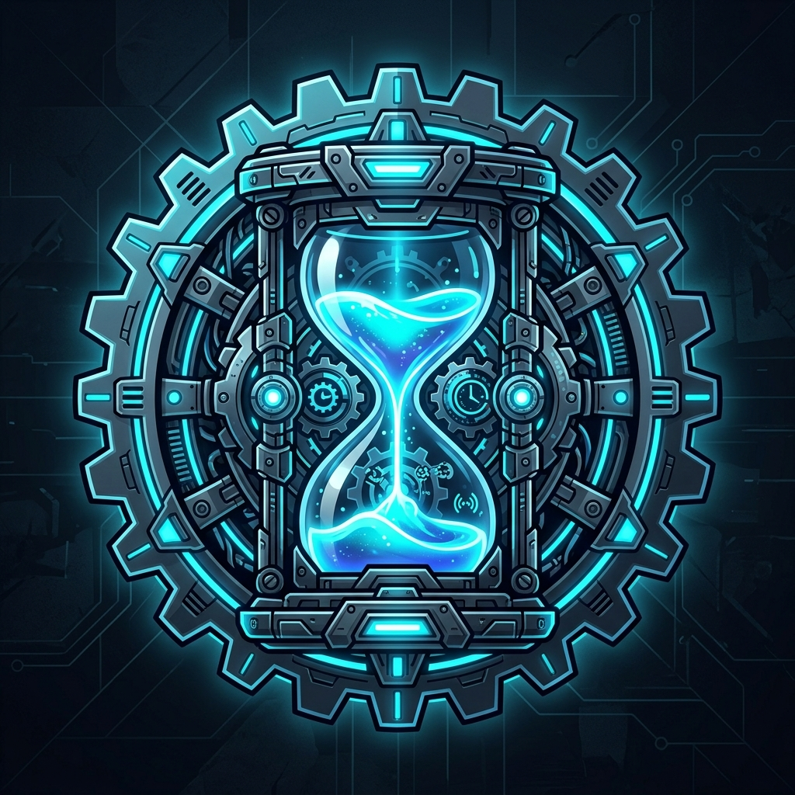
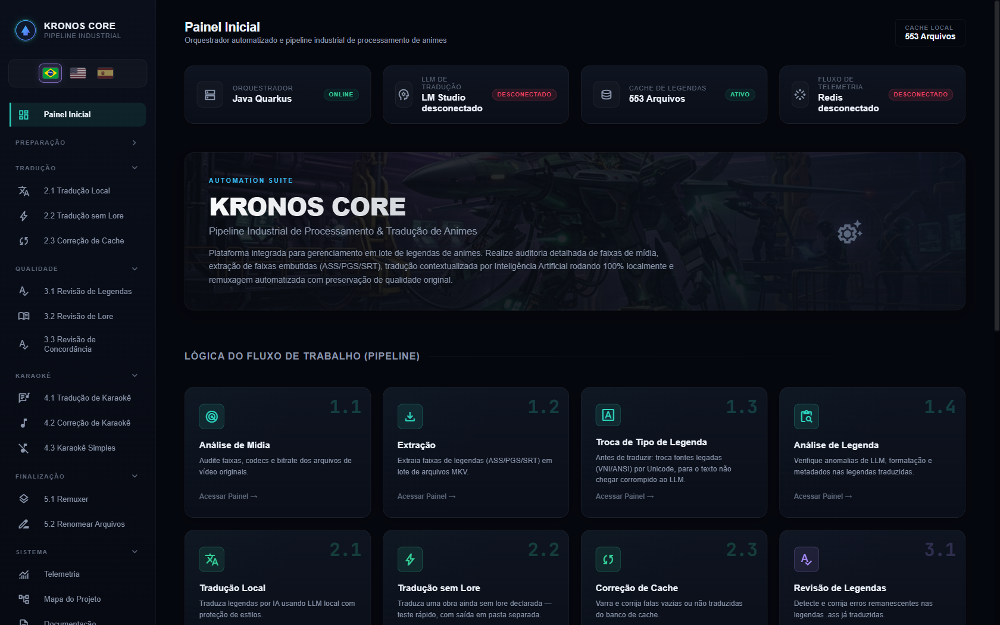
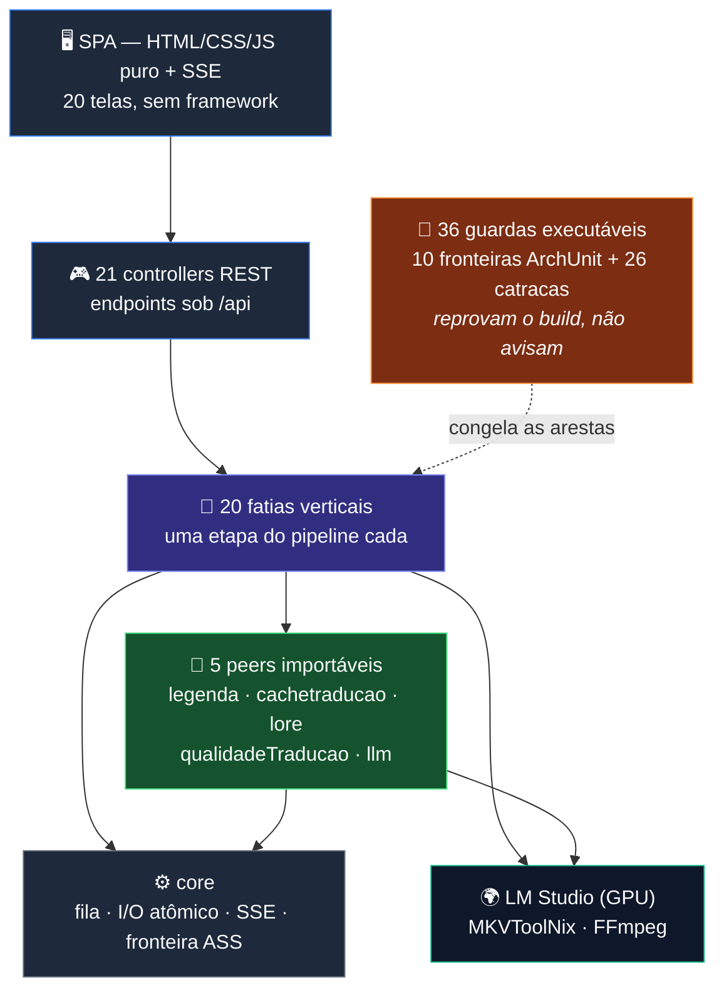
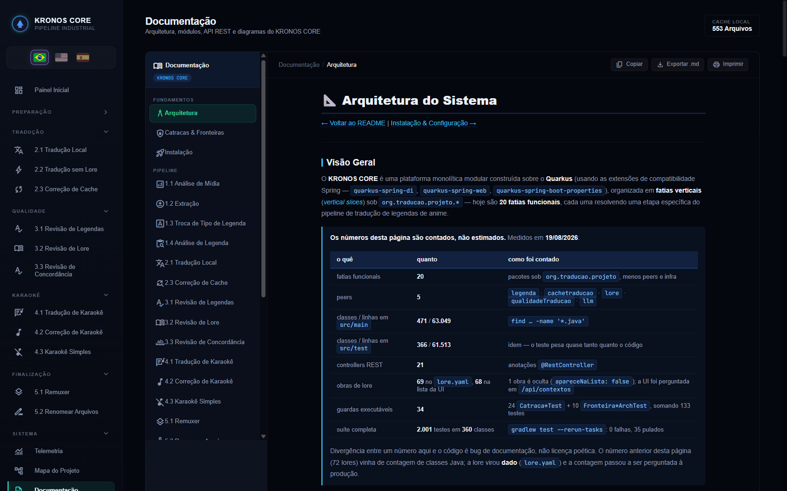

<div align="center">



# KRONOS CORE

### Pipeline Industrial de Processamento & Tradução de Animes
**Tradução de legendas por IA rodando 100% local — sem nuvem, sem custo por token**

---

[](https://openjdk.org/projects/jdk/25/)
[](https://quarkus.io/)
[](https://gradle.org/)
[](https://lmstudio.ai/)
[](https://mkvtoolnix.download/)
[](https://ffmpeg.org/)

[](https://github.com/carmipa/traducao_animes_llm_local_quarkus)
[](https://www.linkedin.com/in/paulo-andr%C3%A9-carminati-47712340/)
[](https://github.com/carmipa?tab=repositories)

</div>

---

## O que é o KRONOS CORE?

O **KRONOS CORE** é uma plataforma de automação para **tradução industrial de legendas de anime**, cobrindo o pipeline completo do fã-sub: da mídia crua ao MKV final remuxado. Ele combina:

- 🔍 **Auditoria técnica de mídia** (ffprobe) com classificação de traduzibilidade das legendas (texto vs. bitmap)
- ✂️ **Extração em lote** de faixas de legenda (ASS/SRT/PGS) de MKV/MP4/qualquer contêiner comum
- 🔎 **Análise de Conteúdo de legendas** — 5 regras de auditoria contra anomalias de LLM, efeitos vazados e karaokê danificado, antes e depois da tradução
- 🌐 **Tradução por LLM 100% local** (LM Studio) com cache persistente e lore por anime (**69 obras** no `lore.yaml`)
- 🩹 **Três fluxos de correção/revisão** (LLM, Google Translate, heurística de concordância PT-BR)
- 🧵 **Restauração estrutural de tags ASS** corrompidas por alucinação de IA (Aegisub/Kara Templater)
- 📖 **Revisão de Lore** pós-tradução — nomes, locais e termos de mundo validados contra a lore oficial da obra, com trilha de auditoria por fala
- 🔤 **Troca de fontes legadas** — detecta e substitui fontes TCVN3/VNI de fansubs (que corrompem a acentuação PT-BR na renderização) por fontes Unicode
- 🎵 **Karaokê Simples** — converte karaokê KFX (milhares de eventos por sílaba/frame) em uma linha limpa por frase, no mesmo tempo do efeito original
- 🎤 **Tradução de Karaokê** — romaji/japonês preservado na tela + camada inglesa da letra traduzida para PT-BR via LLM, tolerante a inglês misturado na letra japonesa
- 📦 **Remuxagem automatizada** com preservação total de qualidade original
- 🧹 **Renomeação em lote de arquivos** — nomes de tracker viram o padrão `Nome - S01E01`, com dry-run e undo
- 📊 **Telemetria em tempo real** (SSE) de todas as etapas do pipeline

Tudo rodando sobre **Java 25 + Quarkus** com uma SPA própria (HTML/CSS/JS puro, sem framework de frontend), pensado para operação **desktop-first e 100% offline** — a única dependência de rede é opcional (metadados de anime via Jikan/TMDB).



---

## Navegação da Documentação

> Clique em qualquer seção para ir à documentação detalhada.

[](docs/arquitetura.md)
[](docs/instalacao.md)
[](docs/ref-api-endpoints.md)
[](docs/ref-configuracao.md)
[](docs/ref-solucao-problemas.md)
[](docs/catracas-e-fronteiras.md)

A tabela segue a **ordem de execução do pipeline**, e desde 06/08/2026 o **nome do arquivo
carrega a etapa** (`etapa-1.3-troca-tipo-legenda.md`). O número no nome deixou de ser
histórico justamente porque numeração que não acompanha a ordem vira mentira silenciosa.

| Passo | Módulo | Descrição |
|---|--------|-----------|
| — 📐 | [**Arquitetura**](docs/arquitetura.md) | Visão geral, diagramas de componentes e fluxos de dados |
| — 🧬 | [**Esqueleto do Projeto**](docs/ref-esqueleto-projeto.md) | A árvore completa: todo pacote, toda pasta e o nome de **todas as 839 classes**. Gerada do disco e conferida por catraca |
| — 🚦 | [**Catracas & Fronteiras**](docs/catracas-e-fronteiras.md) | As **36** guardas executáveis que reprovam o build — como a regra sobrevive à troca de IA |
| — 🚀 | [**Instalação & Configuração**](docs/instalacao.md) | Pré-requisitos, setup local e primeiros passos |
| **1.1** 🔍 | [**Análise de Mídia**](docs/etapa-1.1-analise-midia.md) | Auditoria ffprobe e classificação de traduzibilidade das legendas (texto/bitmap) |
| **1.2** ✂️ | [**Extração de Legendas**](docs/etapa-1.2-extracao-legendas.md) | Extração em lote ASS/SRT/PGS via MKVToolNix/ffmpeg |
| **1.3** 🔤 | [**Troca de Tipo de Legenda**](docs/etapa-1.3-troca-tipo-legenda.md) | Troca fontes legadas (TCVN3/VNI) por Unicode — **antes** de traduzir, para o texto não chegar corrompido ao LLM |
| **1.4** 🔎 | [**Análise de Legenda**](docs/etapa-1.4-analise-conteudo.md) | Auditoria de anomalias: efeitos vazados, karaokê danificado, alucinações de LLM |
| **2.1** 🌐 | [**Tradução Local (LLM)**](docs/etapa-2.1-traducao-llm.md) | Núcleo: LM Studio, cache, proteção de tags, contextos |
| **2.2** ⚡ | [**Tradução sem Lore**](docs/etapa-2.2-traducao-sem-lore.md) | Para o anime recém-baixado: sai em `traducao_ptbr_sem_lore` e diz o que se perde sem lore |
| **2.3** 🗃️ | [**Correção de Cache**](docs/etapa-2.3-correcao-revisao.md) | Os 3 fluxos sobre o **cache**: limpeza de fallback, Google Translate e LLM |
| **3.1** 🩹 | [**Revisão de Legendas**](docs/etapa-3.1-revisao-legendas.md) | Sobre o `.ass` entregue: traduz o que ficou em inglês (LLM com Google em cascata) e corrige concordância com a lore |
| **3.2** 📖 | [**Revisão de Lore**](docs/etapa-3.2-revisao-lore.md) | Corrige nomes, locais e termos de lore comparando com o original em inglês. **Desde 18/08/2026 ela escreve na legenda** |
| **3.3** 🔤 | [**Revisão de Concordância**](docs/etapa-3.3-revisao-concordancia.md) | Gênero inequívoco em PT-BR, **sem inglês, sem cache e sem LLM**. Nasce em dry-run |
| **4.1** 🎤 | [**Tradução de Karaokê**](docs/etapa-4.1-traducao-karaoke.md) | Romaji preservado + letra em inglês traduzida para PT-BR, lado a lado |
| **4.2** 🧵 | [**Correção de Karaokê**](docs/etapa-4.2-cura-tags.md) | Restauração estrutural de tags ASS/Kara Templater |
| **4.3** 🎵 | [**Karaokê Simples**](docs/etapa-4.3-karaoke-simples.md) | Converte karaokê KFX em linhas simples, no tempo original. **Destrutivo — último do bloco** |
| **5.1** 📦 | [**Remuxer**](docs/etapa-5.1-remuxer.md) | Combina vídeo + legenda em MKV final |
| **5.2** 🧹 | [**Renomear Arquivos**](docs/etapa-5.2-renomear-arquivos.md) | Renomeação em lote para o padrão `Nome - S01E01`, com dry-run e undo |
| 🎭 | [**Contextos & Lore**](docs/modulo-contextos-lore.md) | Sistema de lore por anime — **69 obras** no `lore.yaml` (68 aparecem na lista da UI) |
| 📊 | [**Telemetria**](docs/modulo-telemetria.md) | Rastreamento de operações e métricas de JVM em tempo real |
| ⚡ | [**Desempenho do Pipeline**](docs/ref-desempenho.md) | Onde o tempo é gasto, por operação e por elo — medido sobre o acervo real, com caso-controle do relógio |
| 🎬 | [**Metadados de Anime**](docs/modulo-metadados-anime.md) | Integração Jikan/MAL e TMDB para pôster/sinopse na UI |
| 🗺️ | [**Mapa do Projeto**](docs/modulo-mapa-projeto.md) | Gerador automático do índice de código-fonte |
| 📋 | [**API REST — Referência**](docs/ref-api-endpoints.md) | Todos os endpoints documentados com exemplos |
| ⚙️ | [**Configuração**](docs/ref-configuracao.md) | Referência completa de `application.yml` |
| 🩺 | [**Solução de Problemas**](docs/ref-solucao-problemas.md) | Diagnósticos reais: dessincronismo, LM Studio, SSE |
| 🧠 | [**Memória de Decisões da IA**](docs/ref-memoria-decisoes-ia.md) | Registro das decisões de engenharia tomadas com assistência de IA |

> A mesma navegação está disponível **dentro da aplicação**, no menu **📖 Documentação** da interface web.

---

## Início Rápido

### Pré-requisitos

| Ferramenta | Versão mínima |
|------------|---------------|
| Java (JDK) | 25 |
| Gradle | Incluído via Wrapper |
| FFmpeg / FFprobe | Qualquer build recente |
| MKVToolNix | Qualquer build recente |
| LM Studio | Com servidor local ativo |

### Executar em modo desenvolvimento

```shell
git clone <url-do-repositorio>
cd traducao_animes_llm_local_quarkus

./gradlew quarkusDev
```

> O servidor sobe em **`http://127.0.0.1:8099`** e o navegador abre automaticamente. **Atenção:**
> o live reload vale para `.java`, **não** para os estáticos (`index.html`, `.js`, `.css`) — o
> `quarkusDev` serve o que existia no boot. Detalhes e a guarda que autoriza o reinício em
> [Instalação & Configuração](docs/instalacao.md).

### Antes de alterar qualquer coisa

```powershell
.\checar-portao.ps1
```

Endereço único das guardas, com **três estados**: `0` pode trabalhar · `1` defeito real ·
`2` **não deu para conferir**. O `2` existe porque "não verificou" não é aprovação. O script
força `--rerun-tasks` — verde de cache do Gradle é indistinguível de verde de execução.
Detalhes em [Catracas e Fronteiras](docs/catracas-e-fronteiras.md).

---

## Arquitetura em 30 Segundos



> **63.049 linhas de Java em 471 classes** em `src/main`, cobertas por **2.006 testes** em 362
> classes de teste (`--rerun-tasks`, 19/08/2026: 0 falhas, 35 pulados) — e o teste pesa quase
> tanto quanto o código: 61.513 linhas em `src/test`. Os números acima são contados, não
> estimados; se algum divergir do código, é bug de documentação.

> Diagrama completo com fluxo de dados e decisões de arquitetura em [docs/arquitetura.md](docs/arquitetura.md).

---

## Pipeline de Trabalho

A numeração `GRUPO.POSIÇÃO` é a mesma do menu da aplicação, e a cor de cada bloco aqui é a
cor daquele grupo na tela. O número **é** a ordem de execução — não é rótulo decorativo.

```mermaid
graph LR
    A["📼 Vídeo original"]:::midia

    subgraph P["1 · PREPARAÇÃO"]
        direction LR
        P1["1.1 Análise de Mídia"] --> P2["1.2 Extração"] --> P3["1.3 Troca de Tipo de Legenda"] --> P4["1.4 Análise de Legenda"]
    end

    subgraph T["2 · TRADUÇÃO"]
        direction LR
        T1["2.1 Tradução Local"] --> T3["2.3 Correção de Cache"]
        T2["2.2 Tradução sem Lore"] --> T3
    end

    subgraph Q["3 · QUALIDADE"]
        direction LR
        Q1["3.1 Revisão de Legendas"] --> Q2["3.2 Revisão de Lore"] --> Q3["3.3 Revisão de Concordância"]
    end

    subgraph K["4 · KARAOKÊ"]
        direction LR
        K1["4.1 Tradução de Karaokê"] --> K2["4.2 Correção de Karaokê"] --> K3["4.3 Karaokê Simples ⚠️"]
    end

    subgraph F["5 · FINALIZAÇÃO"]
        direction LR
        F1["5.1 Remuxer"] --> F2["5.2 Renomear Arquivos"]
    end

    A --> P1
    P4 --> T1
    T3 --> Q1
    Q3 --> K1
    K3 --> F1
    F2 --> Z["🎬 MKV final"]:::midia

    classDef prep fill:#134e4a,stroke:#2DD4BF,color:#F9FAFB
    classDef trad fill:#064e3b,stroke:#34D399,color:#F9FAFB
    classDef qual fill:#4c1d95,stroke:#A78BFA,color:#F9FAFB
    classDef kara fill:#831843,stroke:#F472B6,color:#F9FAFB
    classDef fin fill:#78350f,stroke:#FBBF24,color:#F9FAFB
    classDef midia fill:#1e293b,stroke:#3B82F6,color:#F9FAFB
    class P1,P2,P3,P4 prep
    class T1,T2,T3 trad
    class Q1,Q2,Q3 qual
    class K1,K2,K3 kara
    class F1,F2 fin
```



> **Por que a troca de fonte é `1.3` e não acabamento.** Fonte legada (`.VnTimes` e afins) não é
> problema de aparência: o arquivo guarda bytes que só viram letra quando renderizados com
> aquela fonte. Se isso chega ao LLM, ele traduz mojibake com toda a confiança e o defeito só
> aparece na tela. É pré-requisito da tradução. Estava em `5.1` até 06/08/2026.

Cada etapa é **independente e re-executável** — rode só a que precisar, sem repetir o pipeline
inteiro. O `2.2 Tradução sem Lore` é rota alternativa ao `2.1`, para obra ainda sem lore
declarada; escreve em pasta separada e não disputa a saída.

> ⚠️ **O `4.3 Karaokê Simples` é o último do bloco de propósito.** Ele apaga a animação KFX e o
> arquivo gerado não se desfaz — por isso traduzir (`4.1`) e corrigir (`4.2`) a letra vêm antes.
> Até 05/08/2026 ele era o "10.", primeiro do grupo, e o número dizia o oposto da regra seguida
> na prática. Hoje a ordem é cobrada por teste (`WebInterfaceTest`).

Detalhes em [Arquitetura — Pipeline Completo](docs/arquitetura.md#diagrama-de-fluxo--pipeline-completo-visão-de-negócio).

---

## Stack Tecnológica

```
Backend:    Java 25 + Quarkus 3.37 (compatibilidade Spring: DI, Web, Config)
Frontend:   HTML/CSS/JS puro (SPA sem build step), Server-Sent Events (SSE)
IA:         LM Studio (OpenAI-compatible local), qualquer modelo GGUF servido nele
Mídia:      FFmpeg/FFprobe (análise), MKVToolNix (extração + remux)
Metadados:  Jikan (MyAnimeList) + TMDB (opcional, com chave de API)
Build:      Gradle com Quarkus Plugin
```

---

## Estrutura do Projeto

```
traducao_animes_llm_local_quarkus/
├── src/main/java/org/traducao/projeto/
│   │   ── Fatias funcionais (não importam umas às outras) ──
│   ├── traducao/                ← NÚCLEO da Tradução Local
│   ├── legendasExtracao/        ← Extração ASS/SRT/PGS
│   ├── analisadorMidia/         ← Auditoria ffprobe
│   ├── auditorConteudoLegendas/ ← Análise de Conteúdo (anomalias de LLM/efeitos)
│   ├── revisaoConcordancia/     ← Revisão de concordância de gênero PT-BR
│   ├── revisaoLore/             ← Revisão de nomes/termos vs. lore oficial
│   ├── raspagemCorrecao/        ← Correção de cache via Google Translate
│   ├── raspagemRevisao/         ← Revisão de .ass finais (Google/LLM) + concordância
│   ├── correcaoLegendas/        ← Correção estrutural (original como referência)
│   ├── traducaoCorrige/         ← Limpeza de cache (entradas de fallback)
│   ├── trocaTipoLegenda/        ← Troca de fontes legadas por Unicode
│   ├── novoKaraoke/             ← Karaokê Simples (KFX → linha limpa)
│   ├── traducaoKaraoke/         ← Tradução de Karaokê (romaji + PT-BR juntos)
│   ├── remuxer/                 ← Combina vídeo + legenda
│   ├── renomearArquivos/        ← Renomeação em lote (S01E01) com undo
│   ├── telemetria/              ← Painel de telemetria + SSE
│   ├── mapaProjeto/             ← Gerador de mapa_projeto.md
│   ├── apiDadosAnime/           ← Metadados (Jikan/TMDB)
│   ├── mcp/                     ← Ferramentas MCP (Model Context Protocol)
│   ├── sistema/                 ← Encerramento gracioso (menu "Sair")
│   │   ── Peers (importáveis; superfície congelada por ArchUnit) ──
│   ├── legenda/                 ← Modelo + I/O .ass/.srt
│   ├── cachetraducao/           ← Dono único do cache (+ proveniência)
│   ├── contexto/                ← 72 lores + regras de concordância PT-BR (93 classes)
│   ├── qualidadeTraducao/       ← Máscara de tags + validação anti-alucinação
│   ├── llm/                     ← Contrato neutro do LLM (LlmPort)
│   │   ── Infra transversal ──
│   ├── core/                    ← Fila, I/O atômico, kernel web/SSE, fronteira ASS (16 tipos)
│   └── config/                  ← Bootstrap (modo WEB vs CLI)
│
├── src/main/resources/static/   ← SPA (HTML/CSS/JS por painel) + img/screenshots
├── src/main/resources/application.yml  ← Configuração principal
├── src/test/                    ← 2.006 testes em 362 classes, incluindo:
│   ├── **/arquitetura/          ←   catracas (Catraca*Test) — padrão perigoso não voltou
│   ├── **/Fronteira*ArchTest    ←   9 fronteiras ArchUnit por tipo exato
│   └── **/medicao/              ←   harnesses de medição sobre o acervo (desligados por padrão)
├── docs/                        ← Esta documentação
└── build.gradle
```

---

## Navegação Interna (dentro do app)

A barra lateral organiza os painéis em **6 grupos acordeão** (recolhíveis, com estado lembrado entre visitas), espelhando a ordem do pipeline:

| Grupo | Cor | Painéis |
|-------|-----|---------|
| 🎬 **Preparação** | teal | `1.1 Análise de Mídia` · `1.2 Extração` · `1.3 Troca de Tipo de Legenda` · `1.4 Análise de Legenda` |
| 🌐 **Tradução** | verde | `2.1 Tradução Local` · `2.2 Tradução sem Lore` · `2.3 Correção de Cache` |
| ✅ **Qualidade** | roxo | `3.1 Revisão de Legendas` · `3.2 Revisão de Lore` · `3.3 Revisão de Concordância` |
| 🎤 **Karaokê** | rosa | `4.1 Tradução de Karaokê` · `4.2 Correção de Karaokê` · `4.3 Karaokê Simples` |
| 📦 **Finalização** | âmbar | `5.1 Remuxer` · `5.2 Renomear Arquivos` |
| ⚙️ **Sistema** | índigo | `Telemetria` · `Mapa do Projeto` · **`Documentação`** · `Sobre` |

A numeração é `GRUPO.POSIÇÃO`, e a primeira casa identifica o bloco — a cor do cartão na tela
inicial repete essa mesma casa. O grupo **Sistema** não tem número de propósito: são telas de
consulta, não passos a executar, e numerá-las sugeriria um "6." que não existe.

> **Por que mudou (05/08/2026).** A numeração anterior era corrida de `1.` a `14.`, com um `4b.`
> — um item que não coube na régua e ganhou uma letra. Pior: conviviam **quatro** numerações
> diferentes no repositório (rótulos do menu, comentários do HTML com números repetidos,
> comentários do CSS e o mapa de títulos do JS), e nenhuma batia com as outras. Hoje a regra é
> cobrada por teste: no grupo de ordem G, o item de posição N começa com `G.N`.

O menu **Documentação** renderiza esta mesma pasta `docs/` dentro da própria aplicação (incluindo os diagramas Mermaid), sem precisar sair do app ou abrir o GitHub.



---

<div align="center">

**[⬆ Voltar ao topo](#kronos-core)**

[](https://openjdk.org/)
[](https://quarkus.io/)
[](https://lmstudio.ai/)

</div>
