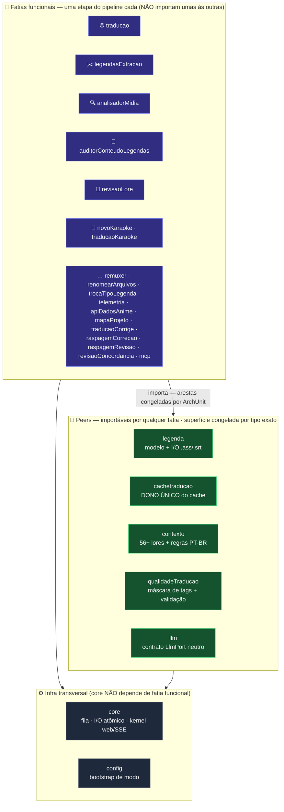
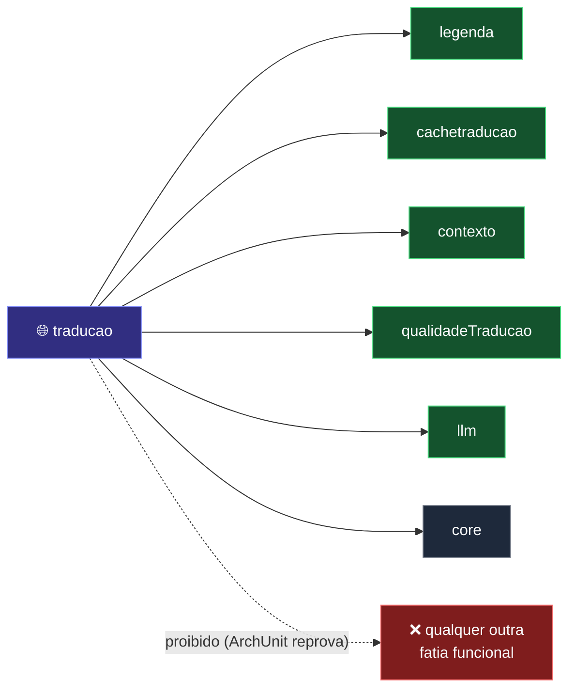
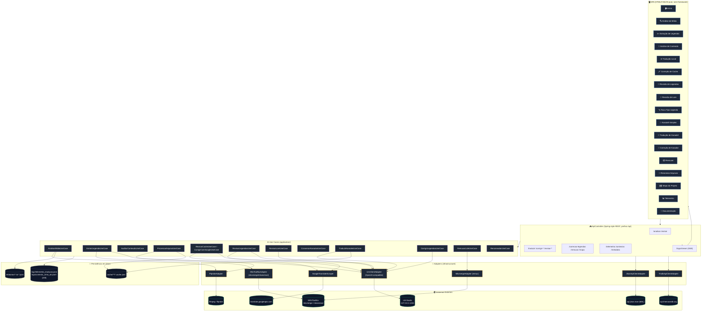
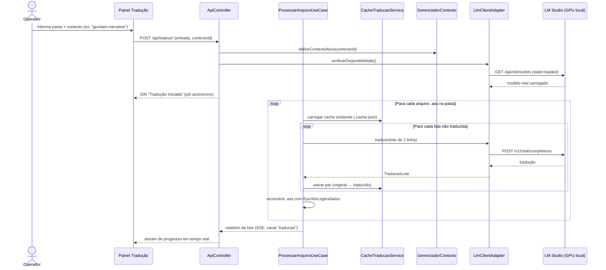

# 📐 Arquitetura do Sistema

[← Voltar ao README](../README.md) | [Instalação & Configuração →](02-instalacao.md)

---

## Visão Geral

O **KRONOS CORE** é uma plataforma monolítica modular construída sobre o **Quarkus** (usando as extensões de compatibilidade Spring — `quarkus-spring-di`, `quarkus-spring-web`, `quarkus-spring-boot-properties`), organizada em **fatias verticais** (*vertical slices*) sob `org.traducao.projeto.*` — hoje são **27 fatias**, cada uma resolvendo uma etapa específica do pipeline de tradução de legendas de anime.

A arquitetura passou por uma refatoração longa (FASES A–I) que substituiu o antigo monólito de controllers por **fatias isoladas** cujas fronteiras são **congeladas por testes de fitness ArchUnit**. Duas categorias:

- **Fatias funcionais** — uma etapa do pipeline cada (ex.: `traducao`, `legendasExtracao`, `analisadorMidia`, `remuxer`, `revisaoLore`). Uma fatia funcional **não pode** depender de outra: o teste `FronteiraTraducaoArchTest` prova, a cada build, que a Tradução Local tem **ZERO** arestas de saída para outra fatia.
- **Peers** — bibliotecas internas *importáveis* por qualquer fatia, com a superfície pública **congelada por tipo exato**: `legenda` (modelo + I/O de `.ass`/`.srt`), `cachetraducao` (**dono único** do cache), `contexto` (56+ lores + regras de concordância PT-BR), `qualidadeTraducao` (máscara de tags, validação anti-alucinação) e `llm` (contrato `LlmPort` neutro). Cada peer tem seu próprio `Fronteira<Peer>ArchTest`.

Abaixo de tudo, `core` (fila de execução, I/O atômico, kernel web/SSE) e `config` (bootstrap de modo) são **infra transversal** — e o `core` é proibido, por regra permanente, de depender de qualquer fatia funcional.

Na SPA, o menu lateral agrupa os painéis em **6 grupos acordeão** que espelham o fluxo de trabalho: **Preparação** (1. Análise de Mídia, 2. Extração, 3. Análise de Legenda), **Tradução** (4. Tradução Local, 5. Correção Cache), **Qualidade** (6. Revisão de Legendas, 7. Revisão de Lore, 8. Revisão de Concordância, 9. Troca Tipo Legenda), **Karaokê** (10. Karaokê Simples, 11. Tradução de Karaokê, 12. Correção de Karaoke), **Finalização** (13. Remuxer, 14. Renomear Arquivos) e **Sistema** (Telemetria, Mapa do Projeto, Documentação, Sobre). Os grupos são recolhíveis e o estado é lembrado por navegador (`localStorage`).

O desenho segue **Arquitetura Hexagonal (Ports & Adapters)** por módulo: cada pacote tem, tipicamente, `domain/` (modelos e portas), `application/` (casos de uso, orquestração), `infrastructure/` (adapters concretos — ffmpeg, mkvmerge, HTTP client do LM Studio, scraping do Google Translate) e `presentation/` (controllers REST e/ou CLI).

| Camada | Responsabilidade | Exemplos |
|--------|-------------------|----------|
| `presentation/` | Controllers REST (Spring-style) e telas CLI legadas | `ApiController`, `AnalisadorMidiaCLI` |
| `application/` | Casos de uso — orquestram domínio e adapters | `ProcessarArquivoUseCase`, `ExtrairLegendaUseCase` |
| `domain/` | Modelos, portas (interfaces), exceções de negócio | `LlmPort`, `AuditoriaResultado`, `LegendaInfo` |
| `infrastructure/` | Implementações concretas das portas | `LlmClientAdapter`, `MkvmergeAdapter`, `FfprobeAdapter` |

A aplicação roda **100% localmente** (`quarkus.http.host=127.0.0.1`) — não expõe nenhuma porta na rede, e a única dependência de rede externa opcional é para metadados de anime (Jikan/TMDB) e correção via Google Translate (scraping da API pública, não a API paga).


---

## Fatias Verticais, Peers e Fronteiras Congeladas (ArchUnit)

O código é dividido em **fatias funcionais** (uma etapa do pipeline cada) e **peers** (bibliotecas internas importáveis). As setas entre camadas são **provadas a cada build** por testes de fitness ArchUnit — não é convenção de boa vontade, é falha de compilação quando alguém cruza uma fronteira não homologada.



**A fronteira da Tradução Local (`traducao`), congelada por `FronteiraTraducaoArchTest`:** ela consome só os cinco peers + `core`, e tem **ZERO** arestas de saída para outra fatia funcional. Cada TIPO consumido de um peer entra numa allowlist exata; um tipo novo cruzando a fronteira **reprova o build** até homologação intencional documentada.



> **Por que peers e não uma fatia "compartilhada"?** Porque o fence ArchUnit proíbe fatia→fatia — só um **peer** pode ser importado. E o `cachetraducao` é **dono único do cache**: nenhuma outra fatia escreve cache paralelo. Assim, o núcleo cresce sem virar espaguete: cada dependência cruzada é explícita, congelada e auditável.

---

## Diagrama de Componentes



---

## Diagrama de Fluxo — Pipeline Completo (visão de negócio)


> 🎨 **Cores por grupo do menu**: azul = Preparação, índigo = Tradução, verde = Qualidade, rosa = Karaokê, laranja = Finalização.

> Cada etapa é **independente e re-executável** — o operador pode rodar só a extração de novo, ou só a revisão, sem repetir as etapas anteriores. O elo entre etapas é sempre o sistema de arquivos (pastas de entrada/saída informadas manualmente em cada painel).

---

## Diagrama de Sequência — Tradução com Cache e LLM Local



---

## Pacotes e Responsabilidades

```text
org.traducao.projeto/
│
│  ── Fatias funcionais (uma etapa do pipeline; NÃO importam umas às outras) ──
├── traducao/               ← NÚCLEO da Tradução Local: orquestra ler → cache → traduzir → validar → publicar
│   └── */contextocena/     ← correção de gênero por contexto de cena (D) — flag OFF por padrão
├── legendasExtracao/       ← Extração de faixas de legenda (ASS/SRT/PGS) via mkvextract/ffmpeg
├── analisadorMidia/        ← Auditoria técnica (ffprobe): codecs, drift de sincronismo
├── auditorConteudoLegendas/← Análise de Conteúdo: anomalias de LLM, efeitos vazados, karaokê danificado
├── raspagemCorrecao/       ← Correção de cache via Google Translate (scraping)
├── raspagemRevisao/        ← Revisão de .ass finais (Google/LLM) + detector de concordância PT-BR
├── revisaoConcordancia/    ← Revisão de concordância de GÊNERO PT-BR (CorretorConcordanciaGeneroService)
├── revisaoLore/            ← Refinamento de lore pós-tradução: nomes, lugares, termos de universo
├── correcaoLegendas/       ← Correção estrutural da PT-BR usando a original como referência imutável
├── traducaoCorrige/        ← Limpeza de cache (esvazia entradas de fallback)
├── trocaTipoLegenda/       ← Troca em lote de fontes legadas (TCVN3/VNI) por Unicode
├── novoKaraoke/            ← Karaokê Simples: KFX (milhares de eventos) → linha limpa por frase
├── traducaoKaraoke/        ← Tradução de Karaokê: romaji preservado + letra EN → PT-BR via LLM
├── remuxer/                ← Combina vídeo original + legenda traduzida em MKV final (mkvmerge)
├── renomearArquivos/       ← Renomeação em lote "Nome - S01E01" com dry-run e undo
├── telemetria/             ← Painel de telemetria + SSE (lê o arquivo próprio da Tradução Local)
├── mapaProjeto/            ← Gera o mapa_projeto.md (varredura estática de docstrings)
├── apiDadosAnime/          ← Metadados externos (Jikan/MAL, TMDB) — decorativo na UI
├── mcp/                    ← Ferramentas MCP (Model Context Protocol) que expõem funções do KRONOS
├── sistema/                ← Ciclo de vida do processo (menu "Sair" — encerramento gracioso)
│
│  ── Peers (importáveis por qualquer fatia; superfície congelada por tipo exato) ──
├── legenda/                ← Modelo puro (DocumentoLegenda/EventoLegenda) + Leitor/Escritor .ass/.srt
├── cachetraducao/          ← DONO ÚNICO do cache: CacheTraducaoService, EntradaCache, ProvenienciaCache
├── contexto/               ← 56+ providers de lore por anime/temporada + RegrasConcordanciaPtBr
├── qualidadeTraducao/      ← MascaradorTags, ValidadorTraducaoService (anti-alucinação), ProtecaoLegendaAssService
├── llm/                    ← Contrato neutro do LLM: LlmPort, Lote, TraducaoLote, StatusLlm
│
│  ── Infra transversal (core NÃO depende de fatia funcional) ──
├── core/                   ← FilaExecucaoPipeline (fila única de jobs LLM), I/O atômico, kernel web/SSE
└── config/                 ← Bootstrap (modo WEB vs CLI legado)
```

> O antigo `traducao.presentation.web.ApiController` monolítico foi **decomposto na FASE C2**: cada controller migrou para a fatia dona (ex.: `TelemetriaController` → `telemetria`, `CorrecaoCacheController` → `traducaoCorrige`) e o kernel técnico de apresentação foi para `core.presentation`. O `LlmClientAdapter` (ponte HTTP com o LM Studio) permanece em `traducao.infrastructure` como **ponto de composição** do peer `llm`.

---

## Decisões de Arquitetura

### Por que Quarkus com compatibilidade Spring, e não Quarkus "puro" (JAX-RS/CDI nativo)?

O projeto foi originalmente escrito sobre Spring Boot e migrado para Quarkus preservando as anotações `@RestController`, `@Component`, `@Service`, `@RequestMapping` via `quarkus-spring-web` e `quarkus-spring-di`. Isso permitiu ganhar o **modo dev com live reload** e o tempo de boot menor do Quarkus sem reescrever toda a camada web. Pontos onde SSE/JAX-RS puro é necessário (`LogStreamResource`, `TelemetriaStreamResource`) usam `@Path`/`@GET` nativos do Quarkus para evitar colisão de roteamento com o dispatcher Spring-style.

### Por que LLM local (LM Studio) em vez de API paga?

Tradução de legendas de fã-sub envolve volumes grandes de texto (temporadas inteiras, filmes) e a lore de cada obra é sensível a nuance (nomes próprios, gênero de personagens, tom). Rodar localmente via LM Studio elimina custo por token, elimina limite de rate, e garante que o app **adapta-se dinamicamente ao modelo que o operador tiver carregado** (ver [`tradutor.llm.model: "current"`](14-configuracao.md)) — o operador troca de modelo pela UI do LM Studio para comparar qualidade sem precisar recompilar o app.

### Por que cache em JSON por arquivo, e não banco de dados?

O cache (`cache/**/*.cache.json`) espelha a estrutura de pastas de entrada do usuário, é editável manualmente (o operador pode corrigir uma tradução direto no JSON), e não introduz dependência de infraestrutura (sem SGBD para rodar/manter). O trade-off é que buscas cruzadas entre animes não são triviais — mitigado pelo fato de que cada operação já é escopada a uma pasta específica.

### Por que 3 fluxos distintos de correção/revisão em vez de um só?

Cada fluxo ataca uma fonte de erro diferente com o custo/precisão adequado: **correção de cache** (LLM local, grátis, mas pode repetir o mesmo erro do 1º passe), **correção via Google Translate** (scraping gratuito, baseline melhor que "não traduzido", mas sem entender a lore), e **revisão de concordância PT-BR** (heurística regex + LLM, focada especificamente no problema mais comum de tradução EN→PT-BR: calque de gênero). Ver [Correção & Revisão](06-modulo-correcao-revisao.md) para o comparativo completo.

### Por que SSE (Server-Sent Events) para logs em vez de WebSocket?

Todo o fluxo de logs é **unidirecional** (servidor → navegador) — o operador só observa o progresso, nunca envia comandos pelo canal de log. SSE é mais simples de implementar (HTTP puro, sem handshake de upgrade), reconecta automaticamente no navegador (`EventSource`), e o `ConsoleRedirector` intercepta `System.out` globalmente, então qualquer `println` de qualquer módulo já aparece no navegador sem instrumentação extra.

---

## Navegação

| Anterior | Próximo |
|----------|---------|
| [← README](../README.md) | [Instalação & Configuração →](02-instalacao.md) |
