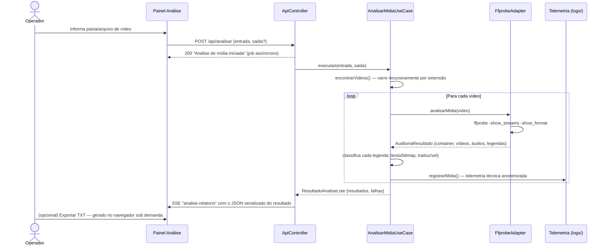

# 🔍 Módulo: Análise de Mídia

[← Instalação](02-instalacao.md) | [Extração de Legendas →](04-modulo-extracao-legendas.md)

---

## Para que serve

Primeira etapa do pipeline: **auditoria técnica** de arquivos de vídeo antes de qualquer processamento. Usa `ffprobe` para extrair contêiner, codecs de vídeo/áudio e **cada faixa de legenda embutida**, e classifica cada legenda por **traduzibilidade** — se é de **texto** (ASS, SSA, SRT, WebVTT, MOV_TEXT), extraível e traduzível, ou **bitmap** (PGS, VobSub, DVB), que exige OCR. Esse é o dado vital do módulo: decidir, antes de gastar tempo, se dá para extrair e traduzir a legenda de um arquivo.

> ⚠️ Este módulo **não** emite um veredito confiável de sincronismo. O `ffprobe` fornece apenas **metadados técnicos** (durações, codecs, flags). A duração de uma faixa de legenda quando comparada à do vídeo é reportada como **informação**, não como diagnóstico — e frequentemente é um placeholder (igual à do vídeo), não um valor real. Um atraso constante ou uma incompatibilidade entre releases (legenda de um fansub/encode diferente do vídeo) só pode ser confirmado analisando os **eventos temporais da própria legenda**, o que está fora do escopo atual. Qualquer diagnóstico futuro de sincronismo deve ser tratado como **heurística, não como certeza**.

> 📖 Contexto real de uso: numa sessão de suporte, a legenda de um filme (*Gundam Narrative*) chegava "adiantada" desde a primeira fala — a causa raiz era a legenda ter sido extraída de um release/encode diferente (grupo de fansub distinto) do vídeo usado no remux. A análise técnica ajuda a levantar os metadados, mas a confirmação do desalinhamento exigiu inspecionar os tempos dos eventos da legenda. Ver [Solução de Problemas](15-solucao-problemas.md#legenda-dessincronizada-desde-o-inicio).


---

## Pacote e classes principais

| Classe | Papel |
|--------|-------|
| `AnalisarMidiaUseCase` (`application`) | Orquestra o lote: varre vídeos, chama o adapter, classifica as legendas, coleta sucessos e falhas e registra telemetria. **Não grava relatório em disco.** |
| `FfprobeAdapter` (`infrastructure/adapters`) | Executa `ffprobe -show_format -show_streams -print_format json` e mapeia o JSON para os records de domínio |
| `AuditoriaResultado`, `ContainerInfo`, `VideoInfo`, `AudioInfo`, `LegendaInfo` (`domain`) | Records imutáveis do resultado da auditoria |
| `ResultadoAnaliseLote` (`domain`) | Retorno do use case: **`resultados`** (análises bem-sucedidas) + **`falhas`** (arquivos que erraram). Não contém `Path` de relatório salvo. |
| `ConsoleAnalisadorLogger` (`presentation/ui`) | Formatação colorida para a CLI legada |

---

## Fluxo de execução



> O que a tela recebe é o **`ResultadoAnaliseLote` serializado diretamente em JSON** e transmitido via SSE no canal `analise-relatorio`. **Não** há gravação de `.txt`/`.json` da análise em disco, nem releitura de arquivo: a fonte da interface é o **domínio estruturado**. A exportação para TXT é **manual**, disparada pelo operador no navegador e produzida a partir dos mesmos dados estruturados. Apenas a **telemetria técnica** é persistida — separadamente, no destino canônico interno (`logs/telemetria_compartilhada.json`).

---

## O que é auditado por faixa

### Vídeo
Codec, resolução, profundidade de cor, FPS, aspect ratio, bitrate.

### Áudio
Idioma, codec, canais, taxa de amostragem, bitrate, título da faixa.

### Legenda — classificação por traduzibilidade

Para cada faixa, o módulo classifica o formato e deriva a traduzibilidade:

| Categoria | Formatos | Traduzível | Observação |
|-----------|----------|------------|------------|
| **Texto** | ASS, SSA, SRT/SubRip, WebVTT, MOV_TEXT | Sim | Extraível para texto e apto ao pipeline de tradução |
| **Bitmap** | PGS, VobSub, DVB | Não (exige OCR) | Legenda em imagem; **não** é hardsub — é uma faixa embutida, apenas não textual |
| **Sem faixa de legenda** | — | — | Pode ser RAW **ou** hardsub; a **ausência de faixa softsub não prova** que há hardsub |

**Indicadores temporais** (duração da legenda e diferença para a duração do vídeo) são exibidos apenas como **informação técnica**, sem veredito de sincronia.

---

## Formato de legenda detectado (resumo no topo do relatório em tela)

O resultado sempre abre com uma seção **"FORMATO DE LEGENDA DETECTADO"**, listando o tipo de cada faixa (ASS, SSA, SRT, PGS, VobSub, DVB, WebVTT, MOV_TEXT) antes de qualquer outro dado — costuma ser a primeira coisa que o operador precisa saber ao decidir se vale extrair aquele arquivo. Atenção à terminologia:

- **PGS** e **VobSub** são legendas **bitmap** (imagem), não extraíveis para texto sem OCR — **não** são hardsub.
- **Hardsub** é conteúdo **queimado na imagem do vídeo**; não aparece como faixa de legenda.
- **Nenhuma faixa de legenda** encontrada **não** confirma hardsub — o arquivo pode ser apenas RAW.

---

## Endpoint REST

### `POST /api/analisar`

```json
{
  "entrada": "C:/animes/[Sokudo] DanMachi/Season 04",
  "saida": null
}
```

`entrada` é obrigatório (pasta ou arquivo de vídeo). `saida` é opcional.

**Resposta imediata:** `200 OK` com `{"mensagem": "Análise de mídia iniciada no servidor."}`. O job roda em segundo plano; o resultado chega via **SSE** no canal `analise-relatorio` como o **JSON do `ResultadoAnaliseLote`** (ver [API REST — Referência](13-api-endpoints.md)).

**Saída em disco:**
- **Nenhum relatório de análise é gravado automaticamente.** O resultado completo aparece no HTML a partir do JSON estruturado.
- A **exportação para TXT é manual**, feita no navegador sob demanda, a partir dos mesmos dados estruturados.
- A **telemetria técnica** (metadados anonimizados por mídia) é persistida separadamente no destino canônico interno (`logs/telemetria_compartilhada.json`), servindo tanto para diagnóstico quanto como dataset de melhoria futura.

---

## Navegação

| Anterior | Próximo |
|----------|---------|
| [← Instalação](02-instalacao.md) | [Extração de Legendas →](04-modulo-extracao-legendas.md) |
