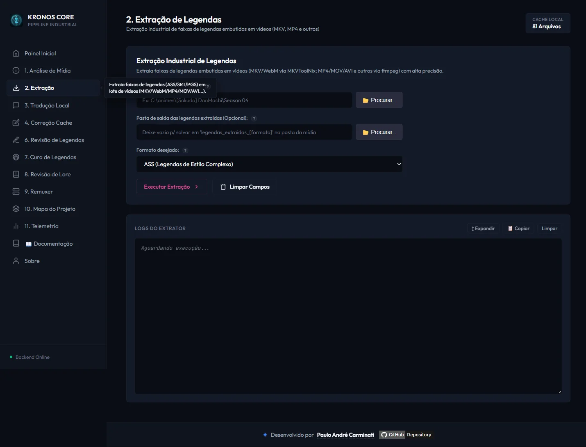
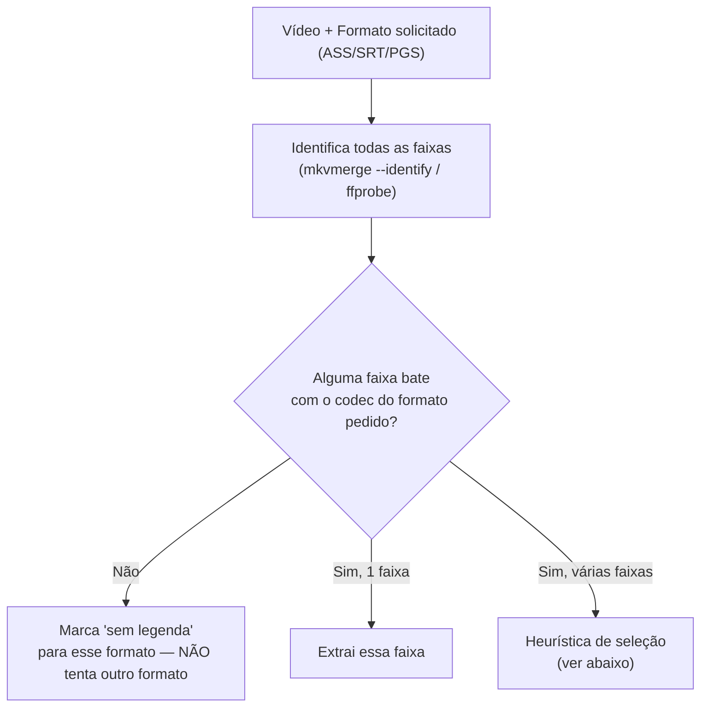
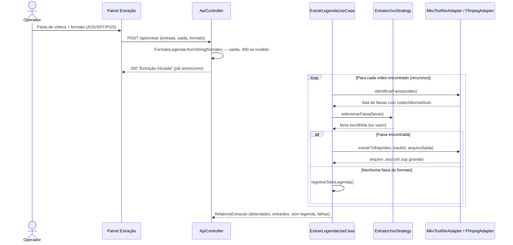

# ✂️ Módulo: Extração de Legendas

[← Análise de Mídia](03-modulo-analise-midia.md) | [Tradução Local →](05-modulo-traducao-llm.md)

---

## Para que serve

Extrai a faixa de legenda embutida de um vídeo para um arquivo independente (`.ass`, `.srt` ou `.sup`), no formato solicitado pelo operador, para que ela possa ser traduzida e depois remuxada de volta. Suporta lote (varredura recursiva de pasta) e dois motores conforme o contêiner do vídeo.



---

## Pacote e classes principais

| Classe | Papel |
|--------|-------|
| `ExtrairLegendaUseCase` (`application`) | Orquestra: varre vídeos, identifica faixas, seleciona a estratégia certa por formato, chama o adapter de extração |
| `FormatoLegenda` (`domain`) — enum `ASS` / `PGS` / `SRT` | Formato solicitado; cada um mapeia para uma extensão de saída (`.ass`, `.sup`, `.srt`) |
| `ExtratorAssStrategy`, `ExtratorPgsStrategy`, `ExtratorSrtStrategy` (`application/strategy`) | Uma estratégia por formato — cada uma filtra as faixas candidatas **estritamente pelo próprio codec**, sem fallback cruzado entre formatos |
| `MkvToolNixAdapter` (`infrastructure/adapters`) | Para contêineres `.mkv`/`.webm` — usa `mkvmerge --identify` + `mkvextract` |
| `FfmpegAdapter` (`infrastructure/adapters`) | Para os demais contêineres (`.mp4`, `.mov`, `.avi`, `.ts`, `.m2ts`, `.flv`, `.wmv`) — usa `ffprobe` + `ffmpeg -map` |
| `FormatoLegendaInvalidoException` (`domain/exceptions`) | Lançada quando o formato solicitado é vazio/inválido — o endpoint responde `400` em vez de silenciosamente assumir ASS |

---

## Como o motor escolhe a faixa certa

Cada estratégia filtra as faixas do vídeo **apenas pelo codec compatível com o formato pedido** — não existe fallback que troque de formato silenciosamente (ex.: pedir ASS e receber PGS). Se nenhuma faixa do formato pedido existir no vídeo, ele é contabilizado como **"sem legenda"** no relatório final, e o operador é avisado para tentar outro formato ou verificar hardsub.



### Heurística quando há múltiplas faixas do mesmo formato

| Formato | Critério de seleção |
|---------|----------------------|
| **ASS** | 1) Palavras-chave no nome da faixa (`dialogue`, `full`, `complete`, `legendado`, `english`); 2) senão, a **última** candidata da lista (geralmente a faixa completa — a primeira costuma ser "signs") |
| **PGS / SRT** | Faixa marcada `default` ou idioma `por`/`eng`; senão, a **primeira** candidata |

> Essa heurística escolhe a faixa certa *dentro do formato correto* — mas não é uma verificação de conteúdo real. Se o relatório de [Análise de Mídia](03-modulo-analise-midia.md) mostrar múltiplas faixas ASS com títulos ambíguos, vale conferir manualmente qual foi extraída.

---

## Fluxo de execução



---

## Nomenclatura do arquivo de saída

```
<nomeOriginalDoVideoSemExtensao>_Track<idDaFaixa>.<extensão>
```

Exemplo: `Episodio01_Track3.ass`. A pasta de saída padrão é `<pastaVideos>/legendas_extraidas_<formato>/` — uma pasta **plana** (não replica subpastas). Se a varredura recursiva encontrar dois vídeos com o **mesmo nome** em subpastas diferentes (ex.: `Season01/Episodio01.mkv` e `Season02/Episodio01.mkv`), o segundo sobrescreve o arquivo extraído do primeiro — nomeie os episódios de forma única entre temporadas, ou extraia temporada por temporada em pastas de saída separadas.

---

## Endpoint REST

### `POST /api/extrair`

```json
{
  "entrada": "C:/animes/[Sokudo] DanMachi/Season 04",
  "saida": "C:/animes/[Sokudo] DanMachi/legendas_extraidas",
  "formato": "ASS"
}
```

| Campo | Obrigatório | Valores aceitos |
|-------|:-----------:|-------------------|
| `entrada` | ✅ | Caminho de pasta ou arquivo de vídeo |
| `saida` | ⚪ | Se omitido, usa `<entrada>/legendas_extraidas_<formato>/` |
| `formato` | ✅ | `ASS`, `SRT` ou `PGS` (case-insensitive) — vazio/inválido retorna `400` |

**Formatos de vídeo suportados:** `.mkv`/`.webm` (via MKVToolNix) e `.mp4`/`.mov`/`.avi`/`.ts`/`.m2ts`/`.flv`/`.wmv` (via ffmpeg).

---

## Navegação

| Anterior | Próximo |
|----------|---------|
| [← Análise de Mídia](03-modulo-analise-midia.md) | [Tradução Local →](05-modulo-traducao-llm.md) |
