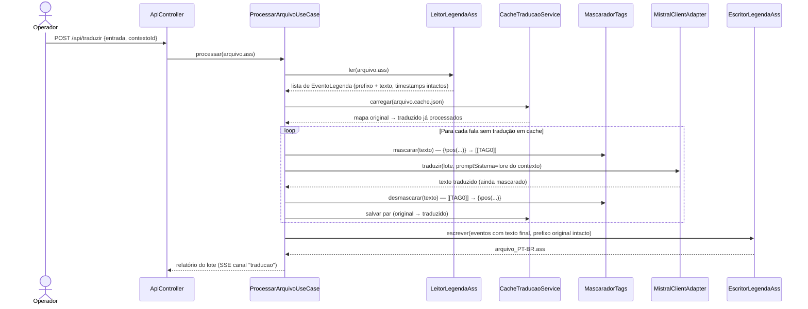

# 🌐 Módulo: Tradução Local (LLM)

[← Extração de Legendas](04-modulo-extracao-legendas.md) | [Correção & Revisão →](06-modulo-correcao-revisao.md)

---

## Para que serve

O núcleo do pipeline: traduz cada fala de uma legenda `.ass`/`.ssa` do inglês para PT-BR usando um **LLM rodando 100% localmente** via [LM Studio](https://lmstudio.ai/), com **cache persistente** (evita retraduzir falas já processadas) e **contexto/lore por anime** (nomes próprios, gênero de personagens, terminologia).


---

## Pacote e classes principais

| Classe | Papel |
|--------|-------|
| `ProcessarArquivoUseCase` (`application`) | Orquestra: lê o `.ass`, separa falas por lote, consulta o cache, envia pendências ao LLM, escreve o `.ass` traduzido |
| `MistralClientAdapter` (`infrastructure/adapters`) | Implementa `MistralPort` — cliente HTTP OpenAI-compatible para o LM Studio (apesar do nome, funciona com qualquer modelo servido pelo LM Studio, não só Mistral) |
| `CacheTraducaoService` / `EntradaCache` (`infrastructure/cache`) | Persistência do par original↔traduzido por arquivo de legenda |
| `GerenciadorContexto` / `ProvedorContexto` (`contexto/`, `infrastructure/contexto`) | Sistema de lore por anime — ver [Contextos & Lore](09-contextos-lore.md) |
| `LeitorLegendaAss` / `EscritorLegendaAss` (`infrastructure/legenda`) | Parser/escritor do formato `.ass` — preserva timestamps e formatação **byte a byte**, só troca o campo `Text` |
| `MascaradorTags` | Protege tags de formatação ASS (`{\pos(...)}`, `{\i1}` etc.) substituindo-as por marcadores `[[TAG0]]` antes de enviar ao LLM, e restaura depois — evita que o modelo traduza ou corrompa a sintaxe de estilo |
| `ValidadorTraducaoService` | Detecta resíduo em inglês / alucinação na resposta do LLM |
| `DetectorTraducaoIdenticaService` | Detecta falas onde `traduzido == original` (sinal de falha silenciosa do LLM) |

---

## Por que o parser de `.ass` nunca interpreta timestamps

Uma decisão de design deliberada: `LeitorLegendaAss` separa cada linha `Dialogue:`/`Comment:` em **`prefixo`** (tudo até o penúltimo campo do `Format:` — inclui `Start`, `End`, `Style`, posicionamento) e **`texto`** (só o último campo, que vai para tradução). O parser **nunca decompõe `H:MM:SS.cc`** — o prefixo é tratado como string opaca e devolvido bit a bit idêntico na escrita. Isso garante que **a tradução nunca pode introduzir dessincronização de tempo** — se uma legenda sai dessincronizada depois de traduzida, a causa está em outro lugar (ex.: legenda de origem que já veio de um release diferente do vídeo — ver [Solução de Problemas](15-solucao-problemas.md)).

---

## Fluxo de execução (cache-aware)



---

## Cache de tradução

- **Formato:** JSON, lista de `EntradaCache(indice, estilo, original, traduzido, idiomaOriginal, idiomaTraduzido)`.
- **Localização:** `cache/<espelha a pasta de entrada>/<nomeLegenda>.cache.json` — ex. `cache/86/86 Part1/[DB]86_-_01_..._ENG.cache.json`.
- **Chave de lookup:** o **texto original**, não o índice — se a mesma frase aparecer em falas diferentes, a mesma tradução é reaproveitada (cada evento mantém seu próprio timestamp, então isso nunca afeta sincronismo).
- **Editável manualmente:** o operador pode abrir o `.cache.json` e corrigir uma tradução na mão; na próxima execução, o valor corrigido é respeitado (não é sobrescrito, a menos que o texto original mude).
- **Entradas de falha:** quando o LLM devolve o mesmo texto (não traduziu), a entrada é salva com `original == traduzido` — esse é o "fallback de falha" que os 3 fluxos de [Correção & Revisão](06-modulo-correcao-revisao.md) tratam de formas diferentes.

---

## Proteção de tags ASS (`MascaradorTags`)

Falas de karaokê/efeitos têm prefixos de formatação complexos:

```
{\fad(100,100)\blur2\c&HE8E8E8&\1a&HFF&}Kitto Soba de Hohoendeitai
```

Antes de enviar ao LLM, o `MascaradorTags` substitui blocos `{...}` por marcadores neutros (`[[TAG0]]`, `[[TAG1]]`...), pedindo ao LLM para preservá-los literalmente. Isso evita dois problemas comuns de LLMs com texto estruturado: (1) tentar "traduzir" o conteúdo da tag, e (2) alucinar/corromper a sintaxe da tag. Falas de estilos listados em `tradutor.estilos-ignorados` (karaokê romaji, títulos de abertura/encerramento) **nem chegam a ser enviadas ao LLM** — são copiadas como estão.

---

## Prevenção de alucinação: lote de 1 linha

`tradutor.tamanho-lote: 1` — cada requisição ao LLM traduz **uma única fala por vez**, não um lote de N falas. Isso é mais lento (mais chamadas HTTP), mas elimina uma classe inteira de erro: LLMs locais menores frequentemente perdem a contagem de linhas em lotes maiores (retornam menos ou mais linhas que o pedido), desalinhando toda a tradução subsequente do arquivo.

---

## Modelo "coringa": `tradutor.llm.model: "current"`

O valor de `tradutor.llm.model` em `application.yml` é **sempre** o literal `"current"`, nunca o id fixo de um modelo (ex. `"mistralai/mistral-nemo-instruct-2407"`). Ao iniciar cada operação, `MistralClientAdapter.verificarDisponibilidade()` consulta o LM Studio para descobrir **qual modelo está de fato carregado em memória** (via a API estendida `/api/v0/models`, que expõe o campo `state: "loaded"`) e adapta o valor em runtime. Isso permite trocar o modelo ativo direto na UI/CLI do LM Studio (`lms load`) sem tocar no `application.yml` nem recompilar — e evita que o app dispare um **auto-load de uma segunda instância de modelo** ao mandar uma requisição para um id que não bate com o que está carregado (ver detalhes técnicos em [Solução de Problemas](15-solucao-problemas.md#lm-studio-carregando-dois-modelos-simultaneamente)).

---

## Endpoint REST

### `POST /api/traduzir`

```json
{
  "entrada": "C:/animes/[Sokudo] DanMachi/Season 04/legendas_extraidas",
  "saida": "C:/animes/[Sokudo] DanMachi/Season 04/legendas-ptbr",
  "contextoId": "danmachi-s4"
}
```

| Campo | Obrigatório | Descrição |
|-------|:-----------:|-----------|
| `entrada` | ✅ | Pasta com legendas `.ass`/`.ssa` em inglês |
| `saida` | ⚪ | Pasta de saída para os arquivos `_PT-BR.ass` |
| `contextoId` | ⚪ | Id de um dos contextos/lore cadastrados (ver [Contextos & Lore](09-contextos-lore.md)); padrão `"danmachi"` |

A resposta imediata é `200 OK` (job assíncrono); o progresso e relatório de cada lote chegam via **SSE** no canal `traducao`.

---

## Navegação

| Anterior | Próximo |
|----------|---------|
| [← Extração de Legendas](04-modulo-extracao-legendas.md) | [Correção & Revisão →](06-modulo-correcao-revisao.md) |
