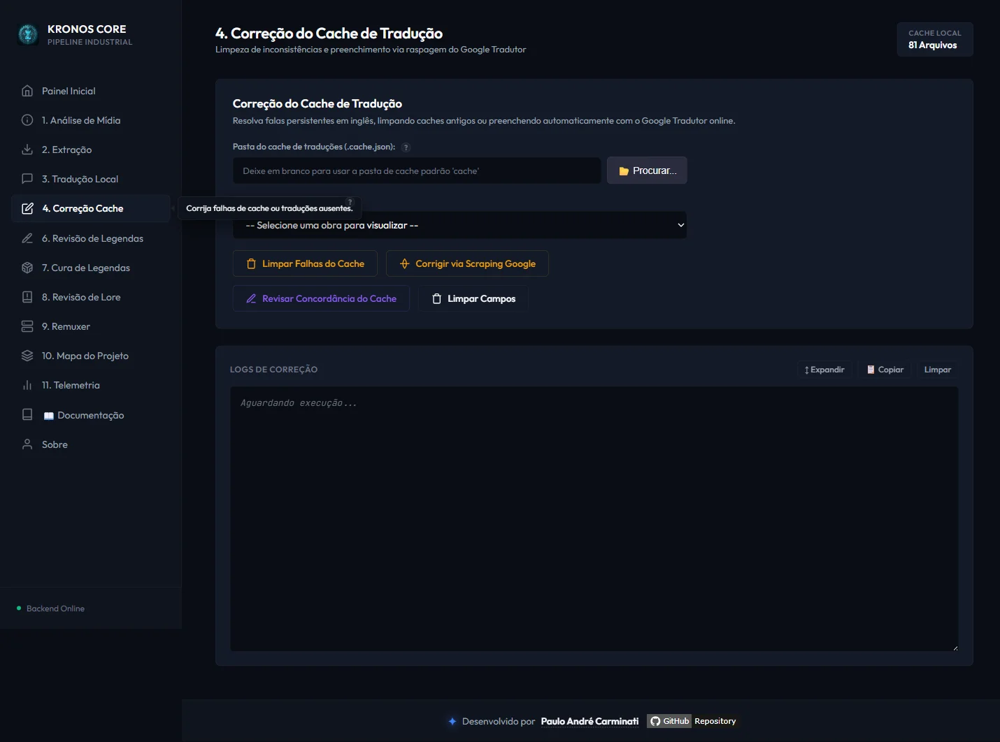
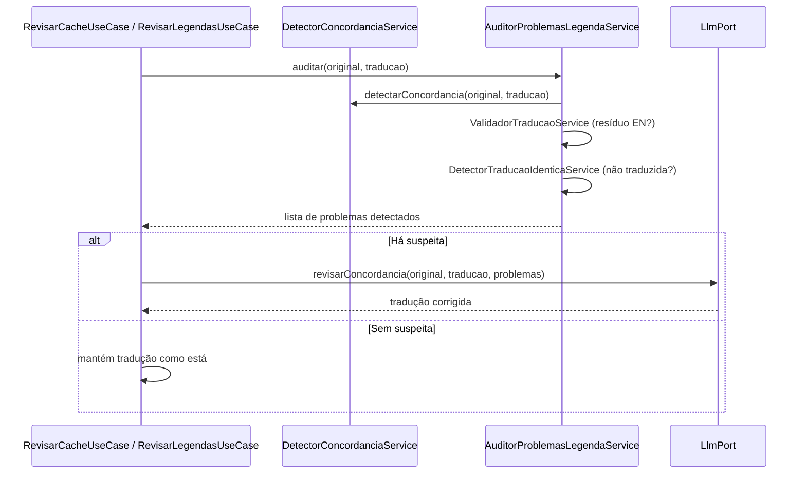
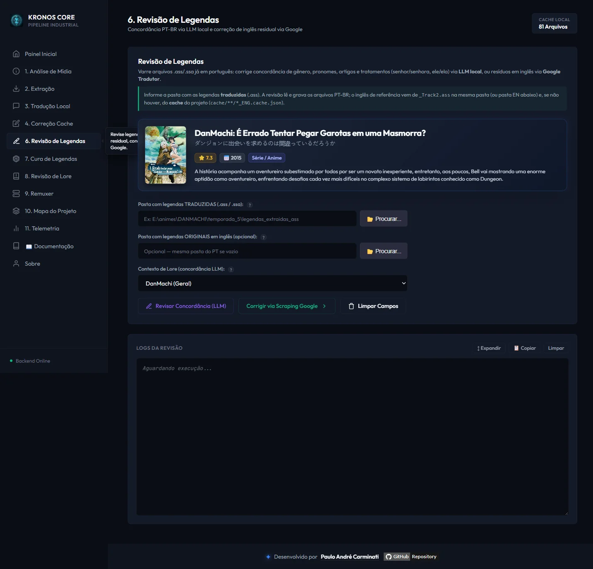

# 🩹 Módulo: Correção & Revisão

[← Tradução Local](05-modulo-traducao-llm.md) | [Correção de Legendas →](07-modulo-cura-tags.md)

---

## Para que serve

Depois da tradução inicial, sobram tipicamente dois tipos de problema: **falas que o LLM não traduziu** (resíduo em inglês, fallback silencioso) e **erros de concordância de gênero em PT-BR** (o inglês não marca gênero em pronomes/adjetivos como o português — "her sword" pode virar "sua espada dele" por calque). Existem **seis endpoints, agrupados em quatro fluxos distintos**, cada um atacando uma fonte diferente com o método mais adequado.

---

## Visão comparativa dos três fluxos

| Endpoint | Use case | Atua sobre | Método |
|----------|----------|-------------|--------|
| `POST /api/corrigir-cache` | `LimparCacheUseCase` | `cache/**/*.cache.json` | **Nenhum corretor** — apaga entradas de fallback (`traduzido == original`), forçando retradução na próxima passada de `/api/traduzir` |
| `POST /api/corrigir-scraping` | `CorrigirComGoogleUseCase` | `cache/**/*.cache.json` | **Google Translate** (scraping da API pública `translate.googleapis.com`) |
| `POST /api/revisar-cache` | `RevisarCacheUseCase` | `cache/**/*.cache.json` | **LLM local** — foco em concordância PT-BR |
| `POST /api/revisar-legendas` | `RevisarLegendasUseCase` (modo `GOOGLE`) | Arquivos `.ass`/`.ssa` já traduzidos | **Google Translate** |
| `POST /api/revisar-legendas-concordancia` | `RevisarLegendasUseCase` (modo `LLM_CONCORDANCIA`) | Arquivos `.ass`/`.ssa` já traduzidos | **LLM local** |
| `POST /api/revisar-concordancia` | `RevisarConcordanciaUseCase` (painel 8) | Só a pasta `.ass` PT-BR (sem original) | **Determinístico (regex)** — conserta gênero inequívoco, sem LLM, com dry-run/apply |

```mermaid
graph TD
    Cache[("cache/*.cache.json")] --> A["POST /corrigir-cache<br/>Limpa fallback (força retradução)"]
    Cache --> B["POST /corrigir-scraping<br/>Google Translate"]
    Cache --> C["POST /revisar-cache<br/>LLM: concordância PT-BR"]

    Ass[(".ass finais traduzidos")] --> D["POST /revisar-legendas<br/>modo GOOGLE"]
    Ass --> E["POST /revisar-legendas-concordancia<br/>modo LLM_CONCORDANCIA"]

    style Cache fill:#1e293b,stroke:#F59E0B
    style Ass fill:#1e293b,stroke:#3B82F6
```

> **Quando usar qual:** se a legenda final ainda tem falas 100% em inglês, comece por `/corrigir-cache` + rodar `/traduzir` de novo (mais barato, reaproveita o LLM já configurado). Se restarem resíduos depois disso, `/corrigir-scraping` dá um resultado melhor que "sem tradução nenhuma", sem custo. Para erros sutis de gênero/concordância que passam despercebidos numa leitura rápida, use `/revisar-legendas-concordancia` (mais lento, mas entende a lore do contexto).

---

## Fluxo 1 — Limpeza de cache (`traducaoCorrige`)

`LimparCacheUseCase` varre `cache/**/*.cache.json` e **remove** (define como vazio) as entradas onde `original.equals(traduzido)` — o padrão de uma tradução que falhou silenciosamente. Não chama nenhum serviço externo; o objetivo é só preparar o terreno para que a próxima execução de [`/api/traduzir`](05-modulo-traducao-llm.md) trate essas falas como pendentes de novo.

---

## Fluxo 2 — Correção/Revisão via Google Translate (`raspagemCorrecao`)

- **`GoogleTranslateScraper`** (`infrastructure`, reutilizado por `raspagemRevisao`) chama `https://translate.googleapis.com/translate_a/single?client=gtx&sl=en&tl=pt&dt=t&q=...` via `java.net.http.HttpClient` — a API pública não-oficial do Google Translate, não a API paga do Google Cloud.
- Mascara tags ASS (`{...}` → `[T0]`) e quebras de linha (`\N` → `[B]`) antes de enviar, restaura na resposta — mesmo princípio do `MascaradorTags` da tradução principal.
- Ignora termos de lore (`TERMOS_IGNORADOS`: nomes próprios como "Fire Bolt", "Argo Vesta") e siglas de 2 palavras capitalizadas, para não traduzir nomes que devem ficar como estão.
- Pausa de 400ms entre chamadas (rate-limit informal da API pública).
- `RevisarLegendasUseCase` (modo `GOOGLE`) faz a mesma coisa, mas direto no arquivo `.ass` final: localiza o original em inglês (heurística de nome de arquivo — `_ENG`, `_Track2`, código `S01E01`) e reescreve cada fala suspeita.

---

## Fluxo 3 — Revisão de concordância PT-BR via LLM (`raspagemRevisao`)

O fluxo mais sofisticado. `DetectorConcordanciaService` é **100% regex/heurística, sem LLM** — cruza pronomes do original (`he/she/him/her`) com artigos/substantivos/particípios/pronomes da tradução, procurando incompatibilidade de gênero (ex.: original usa `"her"` mas a tradução tem `"dele"`). Só os casos com suspeita real são enviados ao LLM (`LlmPort.revisarConcordancia()`), que recebe a lore do contexto ativo e decide a correção — economizando chamadas ao modelo.

`AuditorProblemasLegendaService` agrega 3 fontes de suspeita antes de decidir se vale acionar o LLM:

1. `ValidadorTraducaoService` — resíduo em inglês / alucinação
2. `DetectorTraducaoIdenticaService` — fala idêntica ao original (não traduzida)
3. `DetectorConcordanciaService` — erro de gênero PT-BR

`RevisarLegendasUseCase` também conserta **"karaoke quebrado"** — chaves `{texto}` sem `\`/`=` na frente — via regex, antes de qualquer chamada externa.

---

## Fluxo 4 — Concordância de gênero determinística (`revisaoConcordancia`, painel 8)

O painel **"8. Revisão de Concordância"** é uma passada **100% determinística (regex), sem LLM e sem precisar do original em inglês**: `CorretorConcordanciaGeneroService` conserta, direto na pasta `.ass` PT-BR, os casos de gênero **inequívoco** — artigo masculino + substantivo feminino (e vice-versa), `ela` + verbo de ligação + adjetivo masculino (e vice-versa) etc. Por ser barato e sem ambiguidade, roda em **dry-run** por padrão (`aplicar: false` — simula e reporta sem gravar) e só grava quando `aplicar: true`.

É complementar aos fluxos 1–3 (que dependem do LLM e/ou do original): aqui o alvo são erros **óbvios** de concordância que já estão na legenda final, sem depender de saber quem fala. A Tradução Local não corrige gênero — ver a [limitação conhecida](05-modulo-traducao-llm.md#concordância-de-gênero-limitação-conhecida).

---

## Endpoints REST

| Endpoint | Payload | Canal SSE |
|----------|---------|-----------|
| `POST /api/corrigir-cache` | `{entrada?, contextoId?}` (padrão: pasta `cache`) | `correcao` |
| `POST /api/corrigir-scraping` | `{entrada?}` | `correcao` |
| `POST /api/revisar-cache` | `{entrada?, contextoId?}` | `correcao` |
| `POST /api/revisar-legendas` | `{entradaPt, entradaEn?, contextoId?}` | `revisao` |
| `POST /api/revisar-legendas-concordancia` | `{entradaPt, entradaEn?, contextoId?}` | `revisao` |
| `POST /api/revisar-concordancia` | `{diretorioTraduzido, aplicar}` | `revisao-concordancia` |

---

## Navegação

| Anterior | Próximo |
|----------|---------|
| [← Tradução Local](05-modulo-traducao-llm.md) | [Correção de Legendas →](07-modulo-cura-tags.md) |
