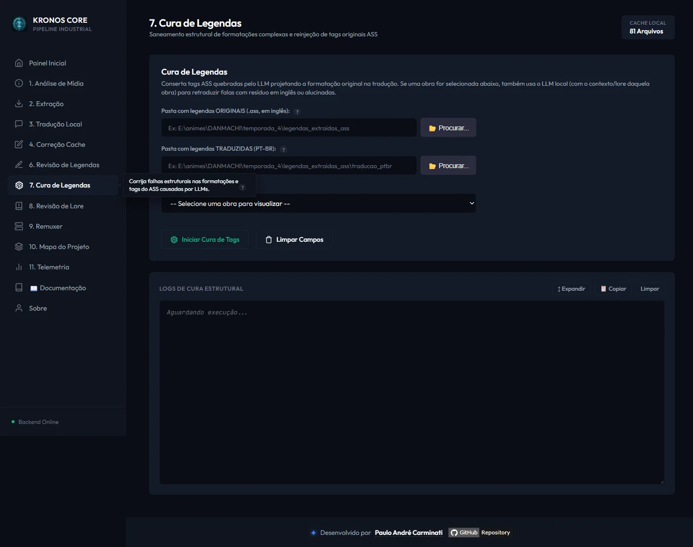
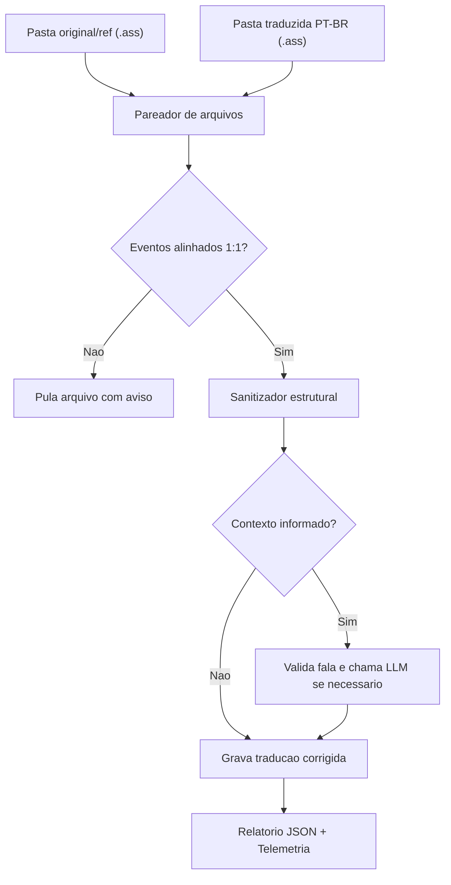

# Modulo: Correcao de Legendas

[<- Correcao & Revisao](06-modulo-correcao-revisao.md) | [Revisao de Lore ->](16-modulo-revisao-lore.md)

---

## Para que serve

Este modulo e o pos-processamento especializado de legendas traduzidas. A regra central e:

```text
Legenda original = referencia imutavel
Legenda traduzida = unico alvo de alteracao
```

Ele compara os arquivos `.ass` originais com os arquivos PT-BR ja traduzidos, preserva estrutura, tempos, estilos e tags da original, e grava somente a legenda traduzida. A original nunca deve ser reescrita.

Quando um contexto e informado, o modulo tambem pode acionar o LLM local para corrigir falas suspeitas depois da correcao estrutural. Sem contexto, a operacao e deterministica e nao usa LLM.



---

## Pacote e classes principais

| Classe | Papel |
|--------|-------|
| `CorrigirLegendasUseCase` (`correcaoLegendas`) | Orquestra localizacao de pares, validacao de eventos, sanitizacao estrutural, correcao LLM opcional, logs e telemetria |
| `SanitizadorTagsService` | Restaura tags ASS da original na traducao e remove/escapa marcacoes invalidas |
| `CorretorTraducaoLlmService` | Camada opcional: corrige via LLM falas que ainda parecem quebradas |
| `ResultadoCorrecaoLegendas` | Record de retorno da operacao |
| `CorrecaoLegendasRelatorioJson` | Relatorio JSON completo da sessao |
| `LogEventoCorrecaoLegendas` | Evento de log estruturado com timestamp UTC |
| `CorrecaoLegendasLogPersistencia` | Persiste o relatorio JSON em `relatorios/<pasta>/correcao_legendas_*.json` |
| `CorrecaoLegendasController` | Endpoint REST novo e alias legado |

---

## Fluxo



---

## Pareamento de arquivos

O corretor procura pares sem usar fuzzy perigoso. Padroes aceitos:

```text
original.ass              -> original_PT-BR.ass
original.ass              -> original_PTBR.ass
nome_ENG.ass              -> nome_PT-BR.ass
nome_ENG.ass              -> nome_PTBR.ass
nome_EN.ass               -> nome_PT-BR.ass
nome_EN.ass               -> nome_PTBR.ass
```

Essa regra foi adicionada apos os relatorios mostrarem que arquivos de `86` vinham como:

```text
[DB]86_..._PTBR_ENG.ass
[DB]86_..._PTBR_PT-BR.ass
```

Antes, estes pares eram marcados como `semPar`.

---

## Sanitizacao estrutural

Regras principais:

1. Prefixos ASS validos no inicio da fala (`{\...}` ou `{=...}`) sao restaurados a partir da original.
2. Prefixos ASS alucinados pela traducao sao removidos/substituidos pelo prefixo da original.
3. Corrupcoes legadas `\N=X` sao revertidas para `{=X}`.
4. Chaves invalidas que carregam texto, como `{pensamento}`, nao sao tratadas como tag ASS valida; o texto interno e preservado como conteudo seguro.
5. Espaco em branco apos `}` **nao** e removido de forma global — falas de karaoke (OP/ED) usam tags validas no meio da linha, uma por silaba/palavra (ex.: `{\k50}Ka {\k30}ra`), e uma limpeza global de espaco pos-`}` gruda as palavras entre si. Apenas o prefixo (inicio da linha) e normalizado.
6. Se a original tem fala real (`isDialogo` + texto nao vazio) mas a traducao pareada chegou vazia, o arquivo **nao** e "corrigido" com um texto em branco — o evento e mantido como esta, contado a parte (`traducaoAusente`) e reportado como pendencia de revisao manual, em vez de mascarar uma falha de traducao anterior como sucesso.

---

## Logs, JSON e telemetria

A correcao registra:

```text
logs/console-web.log
logs/telemetria_compartilhada.json
relatorios/<pasta-traduzida>/correcao_legendas_yyyyMMdd_HHmmss.json
```

O console web recebe as linhas via SSE no canal:

```text
correcao-legendas
```

Cada linha de execucao do use case inclui timestamp UTC e tempo relativo.

---

## Endpoints REST

### `POST /api/correcao-legendas`

Endpoint oficial.

```json
{
  "diretorioOriginal": "C:/animes/obra/legendas-en",
  "diretorioTraduzido": "C:/animes/obra/legendas-ptbr",
  "contextoId": "gundam-0083"
}
```

### `POST /api/cura-tags`

Alias legado mantido para compatibilidade.

| Campo | Obrigatorio | Descricao |
|-------|:-----------:|-----------|
| `diretorioOriginal` | Sim | Pasta com legendas originais/referencia |
| `diretorioTraduzido` | Sim | Pasta com legendas PT-BR que podem ser alteradas |
| `contextoId` | Nao | Ativa correcao textual via LLM local |

---

## Decisoes importantes

- A original e somente leitura.
- A traducao e o unico arquivo gravado.
- A revisao de lore continua em modulo separado (`revisaoLore`).
- Este modulo e pos-processamento/refinamento estrutural da legenda pronta.
- Telemetria e relatorio JSON sao parte obrigatoria da operacao.

---

## Navegacao

| Anterior | Proximo |
|----------|---------|
| [<- Correcao & Revisao](06-modulo-correcao-revisao.md) | [Revisao de Lore ->](16-modulo-revisao-lore.md) |
