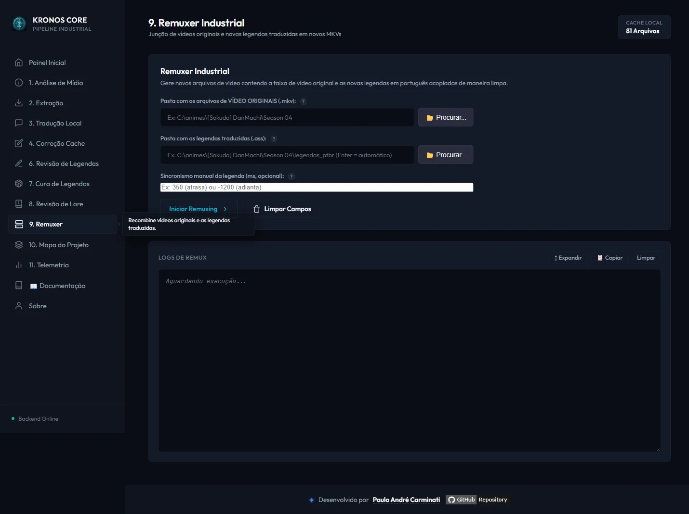
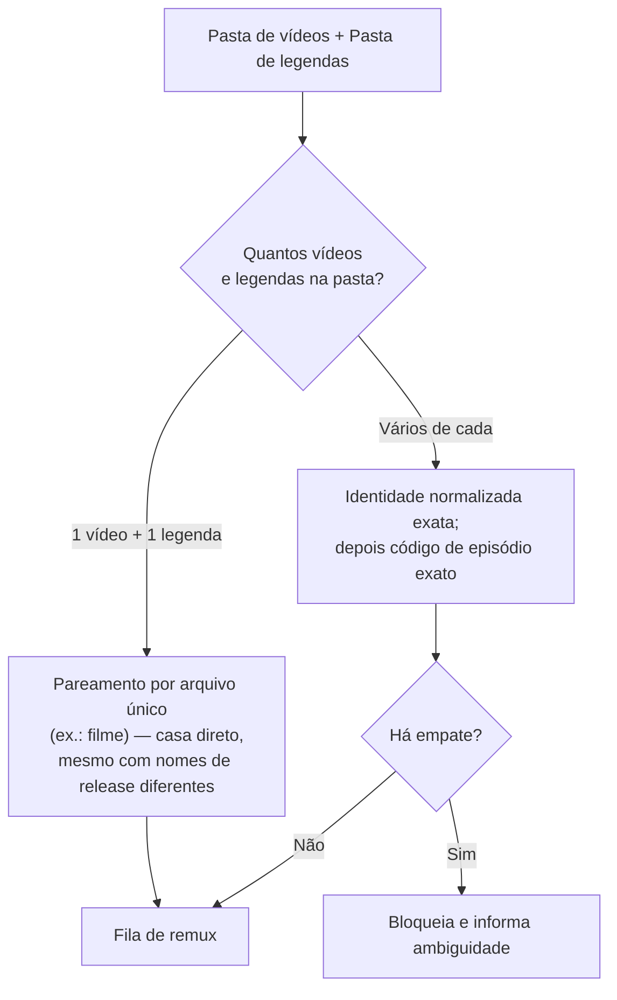
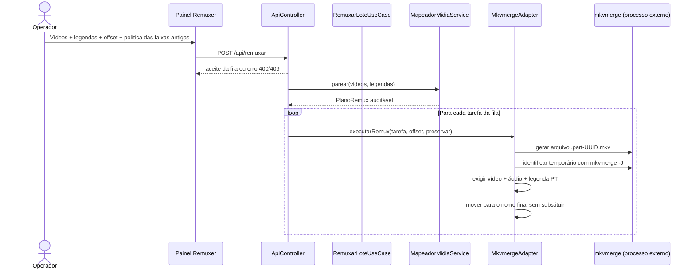

# 📦 Módulo: Remuxer

[← Troca Tipo Legenda](18-modulo-troca-tipo-legenda.md) | [Renomear Arquivos →](19-modulo-renomear-arquivos.md)

---

## Para que serve

Última etapa do pipeline: combina o **vídeo original** com a **legenda traduzida** (já revisada/curada) num novo arquivo `.mkv`, via `mkvmerge` (MKVToolNix), preservando vídeo e áudio sem recodificação. Por padrão, as legendas antigas são removidas e a nova PT-BR é adicionada como faixa padrão. A interface permite preservar as legendas antigas como alternativas; nesse caso elas deixam de ser padrão.



---

## Pacote e classes principais

| Classe | Papel |
|--------|-------|
| `RemuxarLoteUseCase` (`application`) | Orquestra a fila de tarefas de remux do lote |
| `MapeadorMidiaService` | Pareia cada vídeo com sua legenda correspondente na pasta |
| `MkvmergeAdapter` (`infrastructure/adapters`) | Gera em temporário, inspeciona o container e publica sem sobrescrever |
| `PlanoRemux` (`domain`) | Expõe tarefas, ausências, ambiguidades e avisos antes da execução |
| `RelatorioRemux` (`domain`) | Consolida sucessos, pendências, falhas, cancelamento e telemetria |

---

## Pareamento vídeo ↔ legenda



As listas são ordenadas antes do pareamento, cada legenda só pode ser usada uma vez e códigos como episódio `01` e `010` não são tratados como iguais. Em empate, o Remuxer não escolhe a primeira legenda por acaso: ele registra uma pendência. Legendas completas PT-BR e `.ass` recebem prioridade sobre faixas `Forced`, `Signs` ou `Songs`.

O caso de filme com exatamente um vídeo e uma legenda continua aceitando nomes de releases diferentes. Confira o sincronismo quando vídeo e legenda vierem de fontes distintas.

O nome final deriva da legenda curada. Tags de tracker, resolução, codec, CRC, `TrackN` e idioma são removidas; títulos editoriais, como `(Narrative)`, são preservados. Exemplo: `Mobile Suit Gundam NT (Narrative).ass` gera `Mobile Suit Gundam NT (Narrative)_PTBR.mkv`.

---

## Sincronismo manual (offset)

O formulário do Remuxer aceita um campo opcional de **sincronismo manual em milissegundos**:

- Positivo → **atrasa** a legenda
- Negativo → **adianta** a legenda

Esse valor é passado como `--sync 0:<ms>` ao `mkvmerge`, que desloca **linearmente todos os timestamps** da faixa de legenda pelo valor informado.

> ⚠️ O offset é aplicado **igualmente a todos os itens da fila do lote** — não é por arquivo individual. Se o valor foi calculado/ajustado para um episódio específico e a mesma execução processa um lote com outros arquivos (ou um filme com timing diferente), todos recebem o mesmo deslocamento. Confira o campo antes de cada execução, especialmente ao misturar um filme com uma leva de episódios na mesma operação.

O [relatório de Análise de Mídia](03-modulo-analise-midia.md#o-que-é-auditado-por-faixa) já sugere o valor de offset em ms quando detecta um "atraso constante" — use esse número como ponto de partida.

---

## Fluxo de execução



O destino final nunca é escrito diretamente. Falha, timeout ou cancelamento removem somente o temporário exclusivo daquela execução. Se o destino já existir — inclusive se surgir enquanto o processo roda — ele é preservado e o item aparece como pendência.

---

## Endpoint REST

### `POST /api/remuxar`

```json
{
  "entrada": "C:/animes/Gundam Narrative NT",
  "saida": "C:/animes/Gundam Narrative NT/legendas pt",
  "syncOffsetMs": 0,
  "preservarLegendasOriginais": false
}
```

| Campo | Obrigatório | Descrição |
|-------|:-----------:|-----------|
| `entrada` | ✅ | Pasta com os vídeos originais |
| `saida` | ⚪ | Pasta com `.ass`/`.srt`; vazia procura uma subpasta local como `legendas pt` ou `legendas-ptbr` |
| `syncOffsetMs` | ⚪ | Inteiro entre -86.400.000 e 86.400.000 ms, aplicado a todo o lote |
| `preservarLegendasOriginais` | ⚪ | `false`: remove faixas antigas; `true`: mantém como alternativas e torna a nova PT-BR padrão |

**Saída:** novos `.mkv` gravados na pasta configurada de saída do remux (padrão `mkv_final_ptbr/` dentro da pasta de vídeos).

O endpoint rejeita pasta inválida antes da fila (`400`) e nova solicitação quando já há operação em execução ou aguardando (`409`). O console mostra progresso por arquivo e termina com `CONCLUIDO`, `CONCLUIDO_COM_PENDENCIAS`, `CONCLUIDO_COM_FALHAS`, `CANCELADO` ou `SEM_ARQUIVOS`. O mesmo resumo é registrado na telemetria para formar dataset de diagnóstico e melhoria do projeto.

---

## Navegação

| Anterior | Próximo |
|----------|---------|
| [← Troca Tipo Legenda](18-modulo-troca-tipo-legenda.md) | [Renomear Arquivos →](19-modulo-renomear-arquivos.md) |
