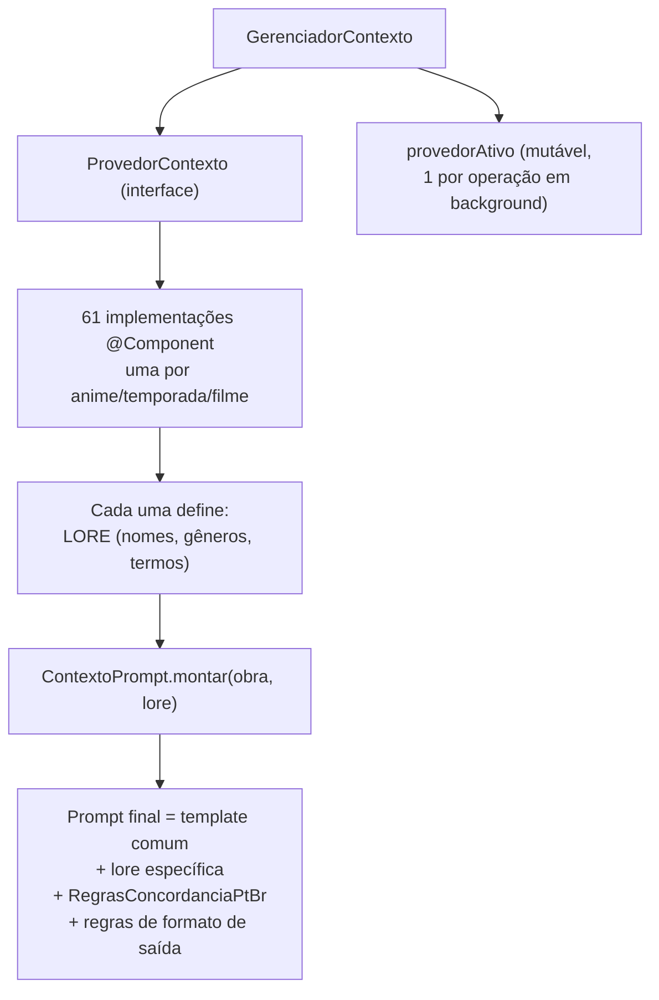

# 🎭 Contextos & Lore

[← Renomear Arquivos](19-modulo-renomear-arquivos.md) | [Módulo Telemetria →](10-modulo-telemetria.md)

---

## O que é um "contexto"

Um **contexto** é o *system prompt + lore* de tradução dedicado a um anime, temporada ou filme específico: nomes próprios que não devem ser traduzidos, terminologia de RPG/lore própria da obra, **gênero dos personagens** (informação crítica para a [revisão de concordância PT-BR](06-modulo-correcao-revisao.md#fluxo-3--revisão-de-concordância-pt-br-via-llm-raspagemrevisao)) e tom geral da tradução. Cada painel do pipeline que chama o LLM (tradução, correção de cache, revisão, cura de tags) aceita um `contextoId` opcional.

---

## Como funciona



- **Interface:** `ProvedorContexto` (peer **`contexto`**, `contexto/domain/`) — `getId()`, `getNomeExibicao()`, `obterPromptSistema()`.
- **Implementações:** **61** classes `@Component` em `contexto/lore/**`, cobrindo franquias inteiras — ex.: DanMachi (temporadas 1–5 + Orion + Sword Oratoria), toda a linha Gundam (0079, SEED, Zeta, ZZ, Narrative...), Macross, Evangelion, Knights of Sidonia, Guilty Crown, 86.
- **Template comum** (`ContextoPrompt.montar()`): prioridades de tradução, a lore específica do contexto, o bloco `RegrasConcordanciaPtBr.BLOCO_TRADUCAO` (regras gerais de concordância de gênero em PT-BR) e regras de formato de saída (preservar marcadores `[[TAGn]]`, não numerar linhas, uma tradução por linha).
- **Reaproveitamento de lore em revisões pontuais:** o gerenciador guarda um mapa `prompt completo → lore crua`, permitindo que a [revisão de concordância](06-modulo-correcao-revisao.md) reenvie **só a lore** ao LLM (sem repetir o prompt de tradução inteiro), economizando tokens de contexto.
- **Contexto padrão:** `"danmachi"` (`ID_CONTEXTO_PADRAO`), usado quando nenhum `contextoId` é informado.
- **Ativação:** `gerenciadorContexto.definirContextoAtivo(contextoId)` é chamado no início de cada operação em background, antes de qualquer chamada ao LLM.

---

## Endpoint REST

### `GET /api/contextos`

Retorna a lista que popula os `<select>` de contexto em cada painel da UI:

```json
[
  { "id": "danmachi", "nome": "DanMachi (Geral)", "padrao": true },
  { "id": "gundam-narrative", "nome": "Mobile Suit Gundam: Narrative", "padrao": false }
]
```

---

## Adicionando um novo contexto

1. Crie uma classe em `src/main/java/org/traducao/projeto/contexto/lore/` implementando `ProvedorContexto`.
2. Defina a constante `LORE` com nomes próprios, gênero dos personagens principais e termos que **não** devem ser traduzidos.
3. Monte o prompt com `ContextoPrompt.montar(nomeDaObra, LORE)`.
4. Anote a classe com `@Component` — o Spring DI (via `quarkus-spring-di`) injeta automaticamente todas as implementações de `ProvedorContexto` em `GerenciadorContexto`, sem precisar registrar em nenhum lugar central.

---

## Painel de Revisão de Lore (UI)

O painel **"7. Revisão de Lore"** da SPA revisa nomes próprios, locais e termos de lore em legendas `.ass` já traduzidas, comparando com a legenda original em inglês. Ele **não** usa este `ProvedorContexto` — tem seu próprio sistema de contextos (`ProvedorPromptRevisaoLore`, pacote `revisaoLore/contexto/**`, atualmente **45 obras calibradas**). Documentação completa em [Módulo: Revisão de Lore](16-modulo-revisao-lore.md).

---

## Navegação

| Anterior | Próximo |
|----------|---------|
| [← Renomear Arquivos](19-modulo-renomear-arquivos.md) | [Módulo Telemetria →](10-modulo-telemetria.md) |
