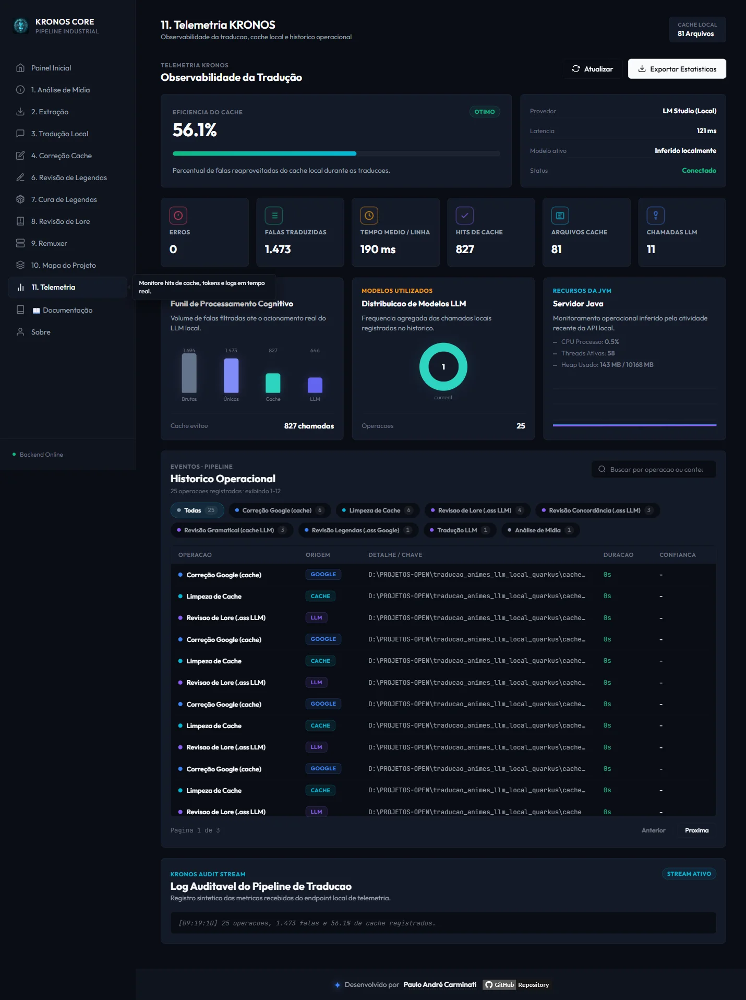

# 📊 Módulo: Telemetria

[← Contextos & Lore](09-contextos-lore.md) | [Metadados de Anime →](11-modulo-metadados-anime.md)

---

## Para que serve

Rastreia **todas** as operações do pipeline (análise, extração, tradução, correção, revisão, remux) em um armazenamento único e persistente, alimentando o painel **Telemetria** da UI em tempo real via SSE e permitindo auditoria histórica de tudo que já foi processado.



---

## Arquitetura

```mermaid
graph TB
    subgraph OPS["Operações do pipeline"]
        AN["Análise"]
        TR["Tradução"]
        CO["Correção/Revisão"]
        RX["Remuxer"]
    end

    OPS -->|registrar*| TS["TelemetriaService<br/>(@Service @ApplicationScoped)"]
    TS --> MEM1["bancoMidia (Map)"]
    TS --> MEM2["bancoLlm (Map)"]
    TS --> MEM3["bancoOperacoes (List)"]
    TS -->|escrita atômica<br/>.tmp + Files.move ATOMIC_MOVE| JSON[("logs/telemetria_compartilhada.json")]
    TS -->|@PostConstruct| JSON
    TS -->|broadcast a cada 1s| SSE["TelemetriaStreamResource<br/>/api/telemetria/stream"]
    SSE --> UI["Painel Telemetria (SSE)"]
    API["GET /api/telemetria"] --> TS
    EXP["GET /api/telemetria/exportar"] --> JSON
```

- **`TelemetriaService`** mantém 3 bancos em memória e **persiste imediatamente** a cada `registrar*()` — escrita atômica (grava em `.tmp` e faz `Files.move` com `ATOMIC_MOVE`) para não corromper o arquivo se o processo cair no meio da escrita.
- No `@PostConstruct`, recarrega o JSON existente — a telemetria **sobrevive a restarts** do servidor.
- **"Telemetria compartilhada"** = esse arquivo canônico, fonte de verdade das operações de **análise, extração, remux e correções** (não é por sessão nem por anime).

> **Atenção (FASE E8):** a **Tradução Local** NÃO escreve mais neste arquivo — ela ganhou um **arquivo canônico próprio** (`logs/telemetria_traducao.json`), descrito na próxima seção. O `telemetria_compartilhada.json` segue vivo para as demais operações.

---

## Telemetria própria da Tradução Local (`logs/telemetria_traducao.json`)

Para isolar a Tradução Local do módulo `telemetria` (o fence ArchUnit proíbe a aresta `traducao → telemetria`), a fatia escreve seu **próprio** arquivo canônico via `TelemetriaTraducaoAdapter`, lido pelo painel através de `TelemetriaTraducaoLeitura`.

- **Dedup por episódio (nunca append-only):** o registro mais recente de um episódio **substitui** o anterior (chave = nome normalizado). Escrita atômica (`.tmp` + move seguro); um arquivo ilegível é **preservado** como `.corrompido_<timestamp>` em vez de destruído.
- **Schema 1.1 — `pendenciasPorCausa`:** além dos 4 contadores da fatia (alucinações prevenidas, respostas rejeitadas, falhas recuperadas, fallbacks mantidos), cada episódio carrega um **KPI estruturado** que classifica as falas pendentes por `(categoria × causa-raiz)` — ex.: `DIALOGO × MARCADORES_CORROMPIDOS`, `DIALOGO × ECO` — para o painel mostrar *por que* algo não traduziu, não só *quanto*.
- **Relatório A/B do contexto de cena (`logs/contexto_cena_ab.jsonl`):** quando o [piloto D](05-modulo-traducao-llm.md#correção-de-gênero-por-contexto-de-cena-piloto-d) roda com `relatorio-ab=true`, grava-se um relatório **append-only** — o oposto do dedup acima, de propósito: o braço A e o braço B do MESMO episódio coexistem para comparação de atividade/custo.

---

## O que é rastreado

| Registro | Campos principais |
|----------|---------------------|
| `MidiaTelemetria` (por vídeo) | Formato do contêiner, tamanho MB, duração, codec, resolução, fps, lista de legendas com veredito de sincronismo (`driftRatioSegundosPorHora`, `diferencaFimSegundos`) |
| `LlmTelemetria` (por episódio traduzido) | Modelo LLM usado, total de linhas, falas traduzidas, falas do cache, tempo total, erros, nome do anime/temporada |
| `OperacaoTelemetria` (genérica) | Tipo, detalhe (pasta), duração, arquivos processados, itens detectados/corrigidos, timestamp ISO — cobre revisão, correção Google, limpeza de cache, remuxer |
| Contador de alucinações prevenidas | Quantas vezes o `MascaradorTags`/validadores impediram uma tag corrompida de ir parar no arquivo final |

Cada operação também grava, em `relatorios/<pasta-da-operação>/`, um relatório `.txt` + `.json` individual timestampado, além da cópia consolidada no JSON compartilhado.

---

## Endpoints REST

### `GET /api/telemetria`

Retorna `TelemetriaResumo`:

```json
{
  "cacheCount": 42,
  "totalEpisodios": 12,
  "totalLinhas": 3841,
  "tempoMedioPorLinhaMs": 850,
  "cacheHits": 2103,
  "alucinacoesPrevenidas": 17,
  "totalErros": 3,
  "historicoOperacoes": [ { "origem": "LLM", "detalhe": "...", "timestamp": "..." } ],
  "traducoesLlm": [ ],
  "jvm": { "cpuPercent": 12.4, "threadsAtivas": 24, "heapUsadoMB": 512, "heapMaximoMB": 4096 }
}
```

Inclui **métricas de JVM em tempo real** (CPU do processo, threads ativas, heap usado/máximo).

### `GET /api/telemetria/exportar`

Download do arquivo bruto `logs/telemetria_compartilhada.json` como anexo `kronos_telemetria_segura.json`.

### `GET /api/telemetria/stream` (SSE, JAX-RS puro)

Implementado em `TelemetriaStreamResource` (não em `ApiController` Spring-style, para evitar colisão de rota) — um `ScheduledExecutorService` interno faz `broadcast()` do `TelemetriaResumo` serializado a cada **1 segundo** para todos os clientes conectados.

### `POST /api/telemetria/publicar-dataset`

Botão **"Publicar Dataset"** do painel: publica a telemetria como **dataset público** no repositório Git dedicado **[`kronos-anime-translation-telemetry-dataset`](https://github.com/carmipa/kronos-anime-translation-telemetry-dataset)** (convenção da comunidade `[NomeDoSistema]-telemetry-dataset`, voltada a pesquisa/ML/AIOps).

Fluxo do `TelemetriaDatasetService`:

1. **Sanitiza** — só métricas: avisos viram `quantidadeAvisos` (nenhum texto de legenda), o campo `detalhe` das operações é descartado e nomes de episódio perdem qualquer diretório (nenhum caminho de máquina/PII — declaração LGPD/GDPR no README do dataset);
2. **Gera** `metrics/kronos-telemetria-dataset.json` no repositório local (clonado/bootstrapado automaticamente, com README e LICENSE na primeira publicação);
3. **Commita e faz push** — cada publicação é um commit; o histórico Git é a linha do tempo dos snapshots.

Configuração em `application.yml` (`telemetria-dataset.repositorio-local` / `repositorio-remoto`). Único passo manual, uma vez: criar o repositório vazio no GitHub.

---

## Navegação

| Anterior | Próximo |
|----------|---------|
| [← Contextos & Lore](09-contextos-lore.md) | [Metadados de Anime →](11-modulo-metadados-anime.md) |
