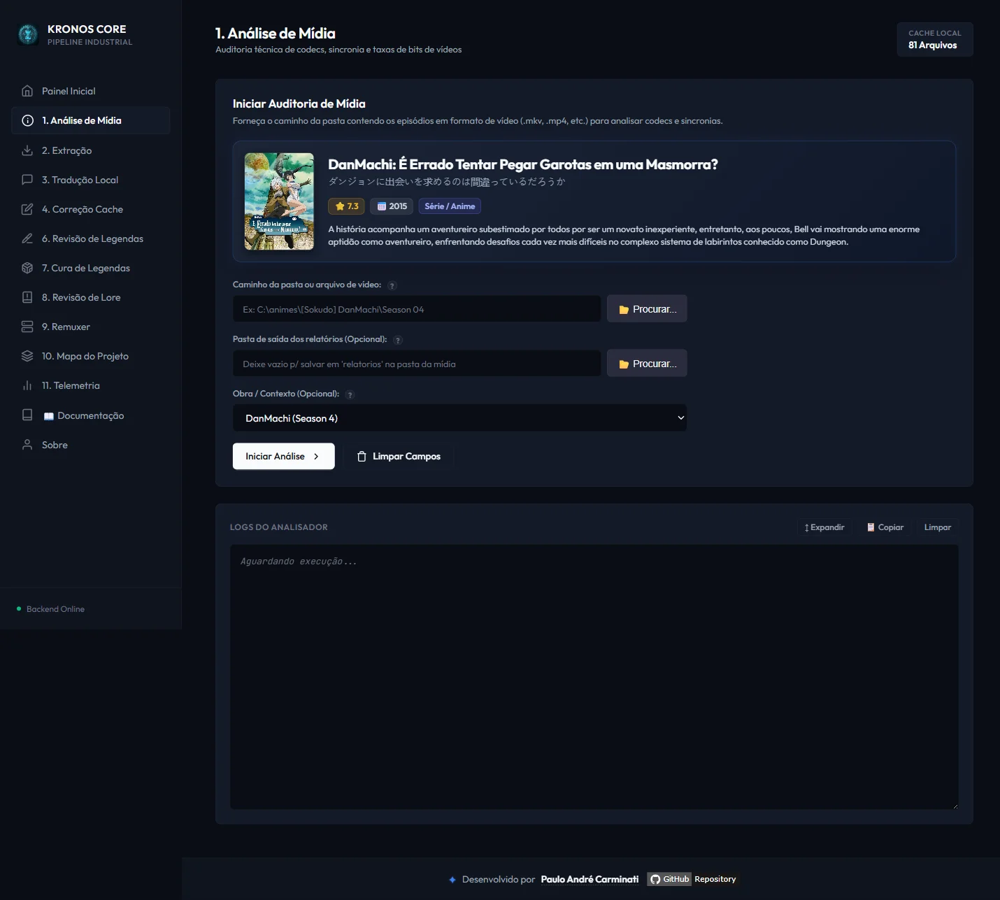
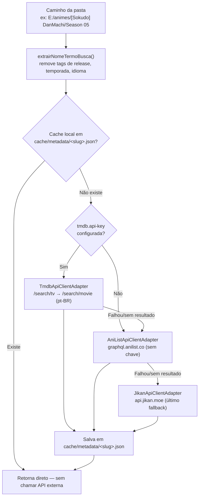

# 🎬 Módulo: Metadados de Anime

[← Módulo Telemetria](10-modulo-telemetria.md) | [Mapa do Projeto →](12-modulo-mapa-projeto.md)

---

## Para que serve

Módulo **decorativo/informativo** — não afeta tradução, cache ou lore. Busca pôster, título, sinopse, ano, episódios e score de um anime a partir do caminho da pasta informada em qualquer painel, para que o operador confirme visualmente que está prestes a processar o anime certo antes de disparar uma operação em lote.



---

## Fluxo de resolução



- **Normalização do nome:** remove tags de release (`[1080p]`, `(BD)`, `S01E01`, `ENG`, `PTBR` etc.) e extrai o segmento de pasta mais provável como nome do anime.
- **TMDB** é tentado primeiro (melhor cobertura de sinopse em português), só se `tmdb.api-key` estiver configurada — ver [Configuração](14-configuracao.md).
- **AniList** é o fallback público principal, sem chave ou autenticação, e fornece capa, títulos, ano, episódios, nota, sinopse e gêneros.
- **Jikan/MyAnimeList** permanece como último fallback quando TMDB e AniList não retornam resultado.

---

## Onde aparece na UI

Dez painéis possuem `.anime-meta-banner`: Análise, Tradução, Correção do Cache, Revisão, Correção de Legendas, Revisão de Lore, Troca Tipo Legenda, Renomear Arquivos, Karaokê Simples e Tradução de Karaokê. Ao digitar/selecionar um caminho ou mudar o select de obra, o frontend (`inicializarMetadadosDinamicos()` em `js/app.js`) chama `GET /api/metadata?caminho=...` e renderiza o banner (pôster, título, sinopse, score) acima do formulário. Se todas as fontes falharem, o banner fica oculto e nunca bloqueia a operação.

---

## Endpoint REST

### `GET /api/metadata?caminho=<pasta_ou_nome>`

```json
{
  "titulo": "DanMachi: Is It Wrong to Try to Pick Up Girls in a Dungeon?",
  "tituloIngles": "DanMachi",
  "tituloJapones": "ダンジョンに出会いを求めるのは間違っているだろうか",
  "posterUrl": "https://...",
  "ano": 2015,
  "episodios": 13,
  "score": 7.8,
  "sinopse": "...",
  "generos": ["Ação", "Aventura", "Fantasia"]
}
```

---

## Navegação

| Anterior | Próximo |
|----------|---------|
| [← Módulo Telemetria](10-modulo-telemetria.md) | [Mapa do Projeto →](12-modulo-mapa-projeto.md) |
