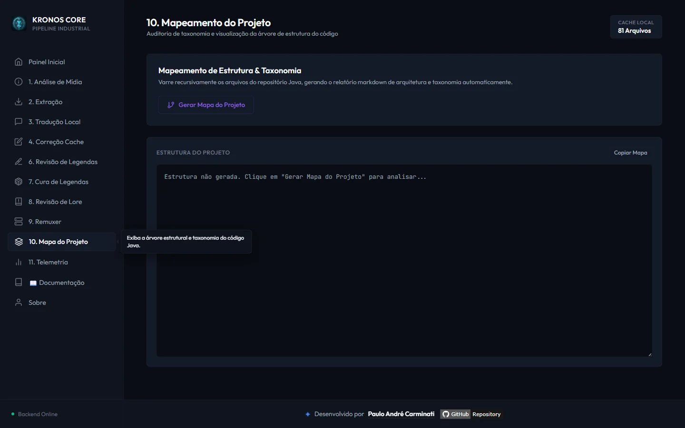
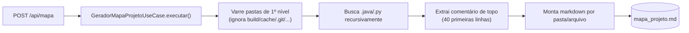

# 🗺️ Módulo: Mapa do Projeto

[← Metadados de Anime](11-modulo-metadados-anime.md) | [API REST — Referência →](13-api-endpoints.md)

---

## Para que serve

Gera automaticamente o `mapa_projeto.md` na raiz do repositório — um índice de todos os arquivos `.java`/`.py` do projeto com o comentário/docstring de topo de cada um, servindo como mapa de contexto rápido (para humanos ou para uma LLM) sem precisar abrir cada arquivo.



---

## Como funciona

`GeradorMapaProjetoUseCase` (`mapaProjeto/application/`) é **análise estática simples via regex/parsing de texto — não usa LLM**:

1. Varre as pastas de primeiro nível do projeto, **ignorando**: `.git`, `.venv`, `.idea`, `.cursor`, `.claude`, `docs`, `build`, `bin`, `cache`, `.gradle`, `multiplexar`, `legendas-traduzidas-ptbr`.
2. Busca recursivamente arquivos `.java` e `.py`.
3. Para cada um, extrai o **cabeçalho explicativo** — Javadoc/comentário de bloco no topo do `.java`, ou docstring/comentários `#` no topo do `.py` — lendo só as **40 primeiras linhas**.
4. Monta o markdown com seções `## 📁 Pasta:` / `### 📄 Arquivo:` e grava por cima de `mapa_projeto.md`.



> ⚠️ **Nota de manutenção:** o texto gerado sempre inclui a linha *"Memória viva e estado recente: veja **CEREBRO_IA.md** na raiz do repositório"*, mas esse arquivo **não existe** neste projeto (é uma referência hardcoded no gerador, provavelmente herdada de outro projeto/convenção paralela). Ignore essa linha ao ler o mapa gerado.

---

## Endpoint REST

### `POST /api/mapa`

Sem payload. Regenera `mapa_projeto.md` na raiz do repositório.

```json
{ "mensagem": "Mapa do projeto gerado com sucesso.", "caminho": "mapa_projeto.md" }
```

---

## Relação com esta documentação (`docs/`)

O `mapa_projeto.md` é um **índice plano gerado automaticamente**, útil para varredura rápida por uma ferramenta ou para achar em qual arquivo uma função mora. Esta documentação (`docs/`), por outro lado, é **escrita e mantida manualmente**, explicando *como os módulos se relacionam entre si*, decisões de arquitetura e fluxos de negócio — os dois são complementares, não substitutos um do outro.

---

## Navegação

| Anterior | Próximo |
|----------|---------|
| [← Metadados de Anime](11-modulo-metadados-anime.md) | [API REST — Referência →](13-api-endpoints.md) |
