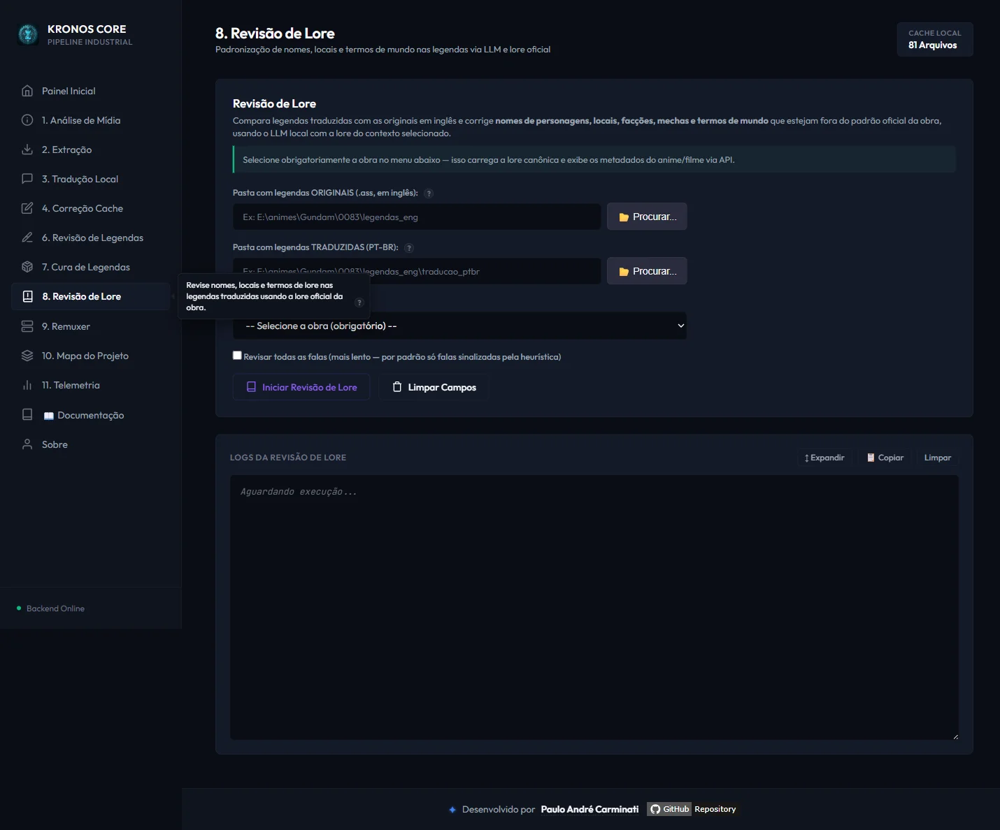
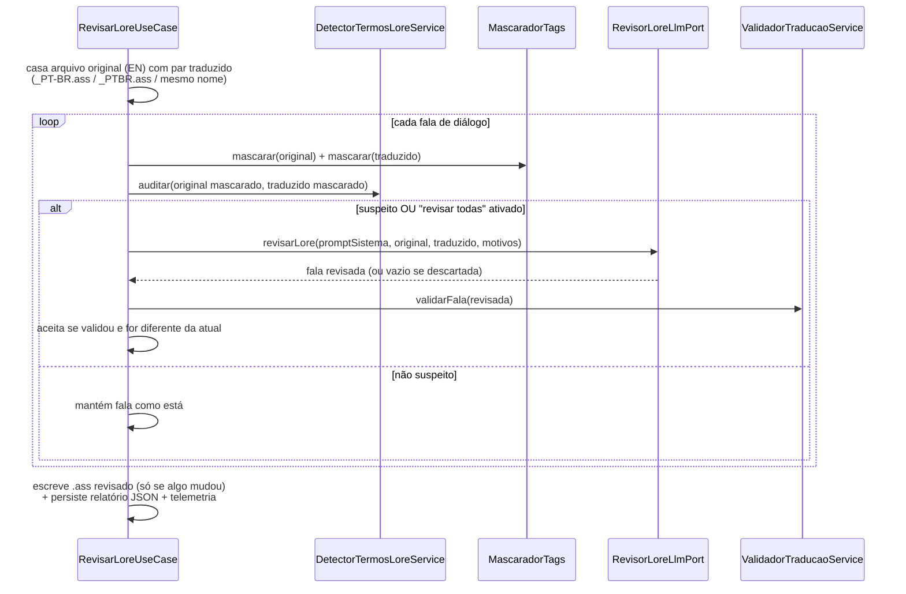

# 📖 Módulo: Revisão de Lore

[← Correção de Legendas](07-modulo-cura-tags.md) | [Troca Tipo Legenda →](18-modulo-troca-tipo-legenda.md)

---

## Para que serve

Painel **"7. Revisão de Lore"** da SPA. Compara cada fala de uma legenda `.ass` **já traduzida** (PT-BR) com a mesma fala na legenda **original em inglês**, e usa o LLM local para corrigir **nomes de personagens, locais, facções, mechas e termos de mundo** que tenham saído fora do padrão oficial da obra — sem tocar em concordância de gênero ou reescrever a fala inteira (isso é papel do [fluxo 3 de Correção & Revisão](06-modulo-correcao-revisao.md#fluxo-3--revisão-de-concordância-pt-br-via-llm-raspagemrevisao)).

Diferente da tradução principal, aqui a **seleção de obra é obrigatória**: sem contexto/lore selecionado, o backend recusa a requisição (`400 Bad Request`) — não existe modo "sem lore" para esta operação, porque o propósito inteiro é comparar contra uma lore canônica.



---

## Pacote e classes principais

| Classe | Papel |
|--------|-------|
| `RevisarLoreUseCase` (`application`) | Orquestra: casa cada arquivo original com seu par traduzido, audita fala a fala, chama o LLM só nas suspeitas, escreve o `.ass` revisado e persiste o relatório |
| `DetectorTermosLoreService` (`application`) | Heurística **100% regex, sem LLM** — sinaliza falas suspeitas antes de gastar uma chamada ao modelo (ver [Como a heurística prioriza falas](#como-a-heurística-prioriza-falas) abaixo) |
| `GerenciadorPromptRevisaoLore` (`application`) | Agrega todas as implementações de `ProvedorPromptRevisaoLore` (injeção via `quarkus-spring-di`), valida ids únicos e resolve qual prompt usar por `contextoId` |
| `PromptRevisaoLore` (`application`) | Monta o prompt de sistema (regras de preservação de nomes/tags) e o prompt de usuário (original + tradução atual + motivos da suspeita) |
| `ProvedorPromptRevisaoLore` (`domain/ports`) | Interface implementada por cada contexto de lore — `getId()`, `getNomeExibicao()`, `obterPromptSistema()` |
| `ResultadoRevisaoLore`, `ResultadoDeteccaoLore` (`domain`) | Records imutáveis do resultado agregado e da detecção heurística por fala |
| `RevisaoLoreRelatorioJson`, `LogEventoRevisaoLore` (`domain`) | Estrutura do relatório JSON persistido em disco (métricas + log completo da sessão) |
| `RevisaoLoreException` (`domain/exceptions`) | Erros de validação/execução específicos do módulo |
| `RevisaoLoreLogPersistencia` (`infrastructure`) | Serializa `RevisaoLoreRelatorioJson` via Jackson e salva em `relatorios/revisao_lore_<timestamp>.json` |
| `RevisaoLoreAuditoriaCache` (`infrastructure`) | Trilha de auditoria **append-only (JSONL)** com uma entrada por fala auditada: original EN, tradução antes, resposta do LLM, tradução depois e o resultado (`CONFORME`, `CORRIGIDA`, `DESCARTADA_*`, `SEM_RESPOSTA`) — permite reverter cirurgicamente qualquer regressão sem retraduzir |
| `EntradaAuditoriaRevisaoLore` (`domain`) | Record de cada entrada da trilha de auditoria |
| `RevisaoLoreController` (`presentation`) | Endpoints REST — lista de contextos e disparo da operação em background |

> ⚠️ **Este módulo tem seu próprio sistema de contextos**, separado do [`ProvedorContexto`](09-contextos-lore.md) usado na tradução principal. São **9 implementações** de `ProvedorPromptRevisaoLore` em `revisaoLore/contexto/**` (DanMachi geral + S4 + S5, 86, e a linha Gundam: 0080, 0083, 08th MS Team, CCA, Narrative) — um subconjunto bem menor que os 56+ contextos de tradução, cobrindo só as obras onde a revisão de lore já foi calibrada manualmente.

---

## Fluxo de execução



### Como a heurística prioriza falas

`DetectorTermosLoreService` roda **antes** de qualquer chamada ao LLM e sinaliza uma fala como suspeita por 4 caminhos independentes (qualquer um já marca `suspeito = true`):

1. **Tradução literal de termo canônico** — dicionário fixo de falsos cognatos (ex.: `narrative` → "narrativo/narrativa", `mobile suit` → "traje móvel", `newtype` → "novo tipo") que deveriam ter ficado no original.
2. **Nome/termo em inglês remanescente** — palavras de 4+ letras do original que sobrevivem literalmente na tradução, exceto nomes próprios já esperados e uma lista de palavras comuns ignoradas (`the`, `you`, `okay`...).
3. **Nome próprio divergente** — nomes próprios do original (sequências de palavras capitalizadas) que não aparecem na tradução nem como variante parcial aproximada.
4. **Sigla/termo em maiúsculas suspeito** — tokens todo-maiúsculos de 3+ letras na tradução que não sejam `ASS`/`SSA` (formato do arquivo).

Isso mantém o custo de LLM baixo: por padrão (checkbox **"Revisar todas as falas"** desmarcado), só as falas realmente sinalizadas viram uma chamada ao modelo — o resto passa direto.

A detecção de nomes próprios divide o candidato por **quebras reais de frase** (`. ! ?`), preservando abreviações e patentes (`Dr.`, `Lt.`, `Col.`...), e ignora palavras comuns capitalizadas em início de sentença (`Yes. Someone...`, `Forever.`, `Please...`) — casos que antes geravam falso positivo. Eventos de desenho vetorial (`\p1`) e estilos ignorados ficam **fora** da auditoria.

### Blindagem contra retradução (decisão de 2026-07-05)

O LLM local sofre de *overcorrection*: com o modo "revisar todas as falas" ativo, ele retraduzia diálogos comuns já corretos e introduzia regressões (estrangeirismos, nomes completos artificiais, erros de concordância). A blindagem tem duas camadas:

1. **Prompt endurecido** — proibições explícitas de adicionar sobrenomes ausentes no original, introduzir termos em inglês em fala comum e criar erros gramaticais; fala sem termo de lore deve voltar **idêntica**.
2. **Descarte estrutural** — se a fala foi ao LLM **sem nenhum motivo heurístico** (revisão preventiva) e o modelo propôs alteração, a proposta é **descartada antes de gravar** (`DESCARTADA_PREVENTIVA_SEM_LORE`); a proposta fica registrada apenas na trilha de auditoria. Melhorias de fluidez do PT-BR são responsabilidade do módulo de [Correção de Legendas](07-modulo-cura-tags.md), não da revisão de lore.

A comparação "antes = depois" usa normalização de texto visível (tags ASS, `\N`, caracteres invisíveis) — diferenças que o espectador não vê não contam como correção.

---

## Endpoint REST

| Endpoint | Payload | Canal SSE |
|----------|---------|-----------|
| `GET /api/revisao-lore/contextos` | — | — |
| `POST /api/revisar-lore` | `{diretorioOriginal, diretorioTraduzido, contextoId, revisarTodasFalas}` | `revisao-lore` |

```json
{
  "diretorioOriginal": "E:/animes/Gundam/0083/legendas_eng",
  "diretorioTraduzido": "E:/animes/Gundam/0083/legendas_eng/traducao_ptbr",
  "contextoId": "gundam_0083",
  "revisarTodasFalas": false
}
```

`contextoId` é **obrigatório** — sem ele (ou com um id desconhecido), o endpoint responde `400 Bad Request` antes de sequer verificar as pastas.

---

## Tela da interface

Os dois campos de pasta (original em inglês / traduzida em PT-BR) mais o seletor de obra — que, além de carregar a lore, também exibe a capa/sinopse do anime via [Metadados de Anime](11-modulo-metadados-anime.md), igual aos outros painéis que usam contexto.

---

## Navegação

| Anterior | Próximo |
|----------|---------|
| [← Correção de Legendas](07-modulo-cura-tags.md) | [Troca Tipo Legenda →](18-modulo-troca-tipo-legenda.md) |
