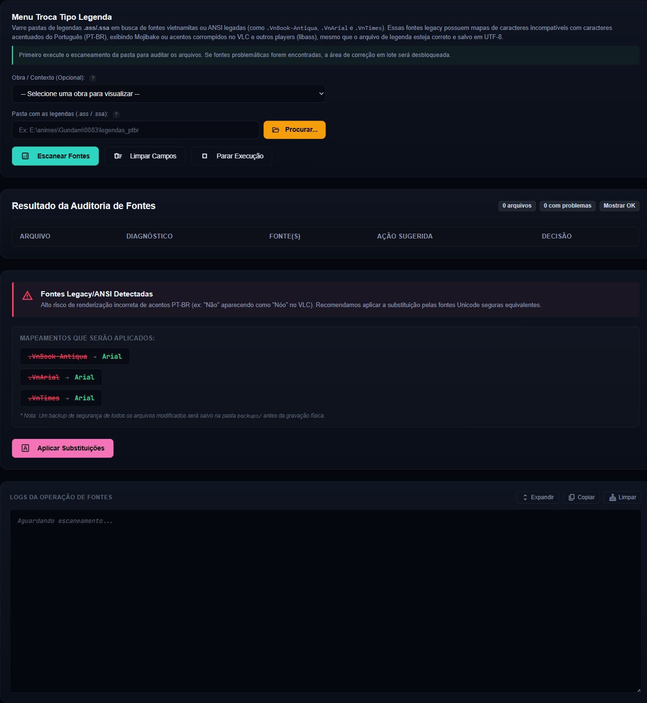
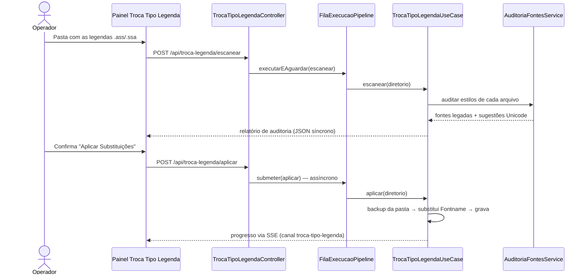

# 🔤 Módulo: Troca Tipo Legenda (Fontes Legadas)

[← Revisão de Lore](16-modulo-revisao-lore.md) | [Remuxer →](08-modulo-remuxer.md)

---

## Para que serve

Painel **"8. Troca Tipo Legenda"** da SPA (grupo **Qualidade**). Audita arquivos `.ass`/`.ssa` em busca de **fontes legadas de 8 bits** nos estilos (`Fontname` em `[V4+ Styles]`) e as substitui em lote por fontes Unicode seguras — com backup automático antes de gravar.



### O problema que motivou o módulo

Fansubs antigos usam fontes com codificações pré-Unicode — em especial as vietnamitas **TCVN3/VNI** (prefixo `.Vn`, ex.: `.VnBook-Antiqua`) — que colocam **glifos vietnamitas nas posições dos caracteres acentuados do Latin-1**. O texto no arquivo fica correto, mas qualquer player que honre fontes embutidas (VLC, mpv/libass) renderiza `"Não, não é"` como `"Nóo, nóo ộ"`. Legendas em inglês (ASCII puro) nunca revelam o defeito — ele só aparece quando o pipeline traduz para PT-BR e os acentos entram em cena.

> 💡 Caso real: a temporada de *Gundam 08th MS Team* (release [Joseki]) usava `.VnBook-Antiqua` no estilo `Dialogue`, com o `Vnantiqb.ttf` embutido nos MKVs. O defeito é 100% de **renderização** — o `.ass` está íntegro — e por isso não aparece em nenhum grep/diff do texto.

---

## Pacote e classes principais

| Classe | Papel |
|--------|-------|
| `TrocaTipoLegendaUseCase` (`application`) | Orquestra o lote: escaneia, cria backup, grava substituições, persiste relatório e telemetria |
| `AuditoriaFontesService` (`application`) | Detecta fontes legadas/problemáticas nos estilos e sugere a substituta Unicode |
| `TrocaTipoLegendaAuditoriaCache` (`infrastructure`) | Cache/auditoria append-only de cada substituição realizada |
| `AuditoriaFonteInfo`, `AuditoriaLegendaResultado`, `ResultadoGeralAuditoria`, `ResultadoTrocaFonte` (`domain`) | Records imutáveis dos resultados de auditoria e da aplicação |
| `TrocaTipoLegendaController` (`presentation`) | Endpoints REST — escanear (síncrono via fila) e aplicar (assíncrono via fila) |

---

## Fluxo de execução



- **Escanear** roda **síncrono dentro da fila** (`executarEAguardar`): garante que nenhum job pesado roda em paralelo e devolve o relatório na própria resposta HTTP. Se a fila estiver ocupada com um job longo, a requisição espera.
- **Aplicar** roda **assíncrono na fila** (`submeter`): cria o backup, grava os arquivos, loga cada substituição no console via SSE e registra cada troca no cache de auditoria.
- A execução respeita **parada cooperativa** (interrupção via encerramento/`/api/pipeline/parar`) — arquivos já gravados são preservados.

---

## Endpoints REST

| Endpoint | Payload | Canal SSE |
|----------|---------|-----------|
| `POST /api/troca-legenda/escanear` | `{diretorioLegendas}` | — (resposta síncrona) |
| `POST /api/troca-legenda/aplicar` | `{diretorioLegendas}` | `troca-tipo-legenda` |

```json
{ "diretorioLegendas": "C:/animes/[Joseki] Gundam 08th MS Team/traducao-ptbr" }
```

`diretorioLegendas` é **obrigatório** (`400` se ausente).

---

## Pontos de atenção

- A troca altera apenas o cabeçalho `[V4+ Styles]`; tags `\fn` inline nos eventos (raras) precisam de conferência manual — o relatório de auditoria as aponta.
- Depois da troca, os MKVs finais precisam ser **re-remuxados** ([Remuxer](08-modulo-remuxer.md)) para embutir a legenda corrigida.
- Fontes anexadas no MKV original que nenhum estilo referencia mais (ex.: o `Vnantiqb.ttf` órfão) são inofensivas, mas continuam dentro do vídeo até um remux que as descarte.
- Regra prática ao iniciar **qualquer série nova**: rodar o escaneamento na pasta das legendas extraídas antes de traduzir — fontes `.Vn*`, `VNI-*` e similares quebram a acentuação PT-BR silenciosamente.

---

## Navegação

| Anterior | Próximo |
|----------|---------|
| [← Revisão de Lore](16-modulo-revisao-lore.md) | [Remuxer →](08-modulo-remuxer.md) |
