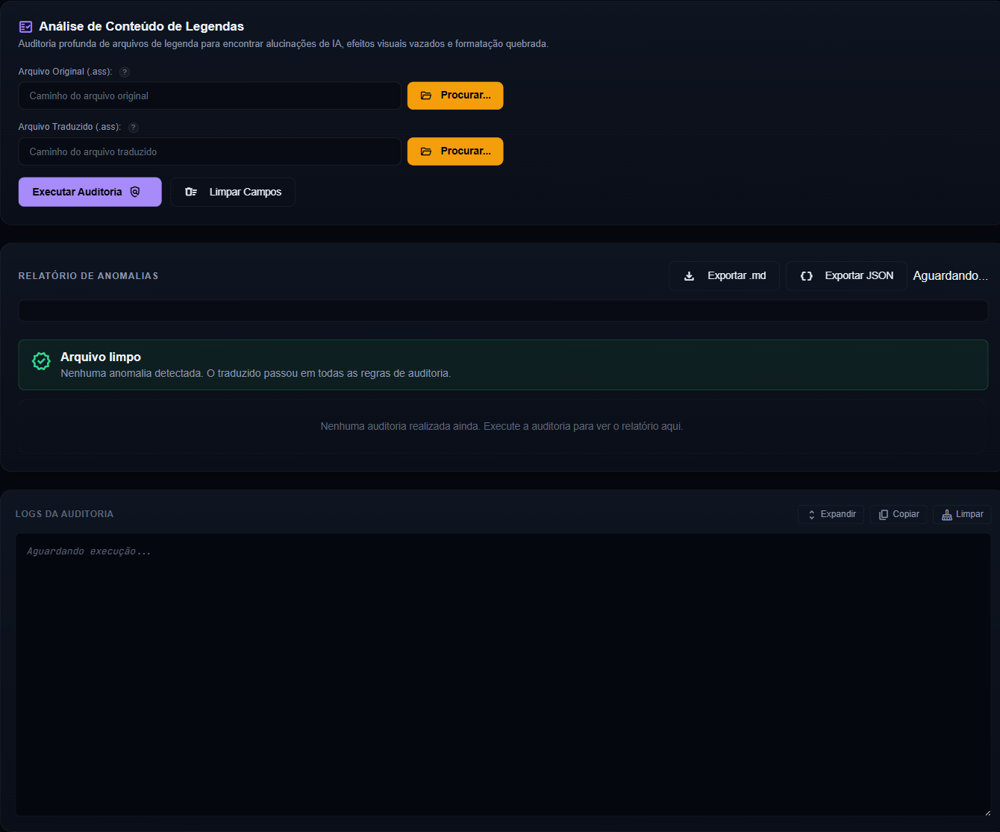
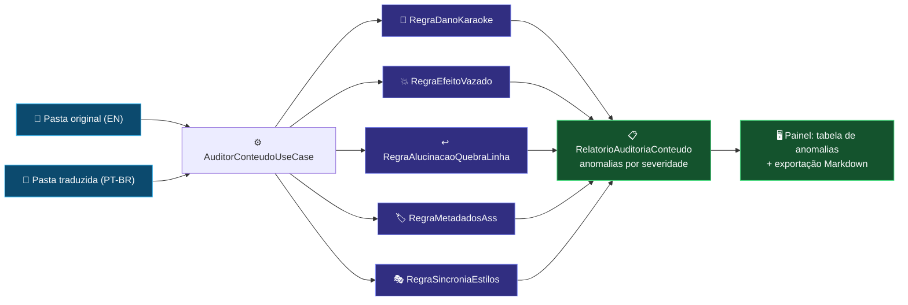

# 🔎 Módulo: Análise de Conteúdo de Legendas

[← Extração de Legendas](04-modulo-extracao-legendas.md) | [Tradução Local (LLM) →](05-modulo-traducao-llm.md)

---

## Para que serve

Painel **"3. Análise de Conteúdo"** da SPA (grupo **Preparação**). Audita legendas `.ass`/`.srt` **antes e depois da tradução**, procurando anomalias que nenhuma etapa individual enxerga sozinha: efeitos de karaokê destruídos por LLM, tags vazadas para o texto visível, quebras de linha alucinadas e metadados inconsistentes. Existe porque **blindagem por nome de estilo não é confiável entre releases** — cada fansub estrutura legendas de um jeito, então o fluxo seguro é extrair → **auditar o que veio** → traduzir.

### Três modos (abas internas)

O card de entrada tem uma barra de abas que escolhe o **escopo** da análise:

| Aba | Modo | Arquivos | Regras aplicadas |
|-----|------|----------|------------------|
| **Ambas (comparar)** | `AMBAS` | original + traduzido | 5 regras **comparativas** (par original ↔ traduzido) |
| **Só Original (EN)** | `ORIGINAL` | só o original | 6 regras de **arquivo único** (estruturais + tempo) |
| **Só Traduzida (PT-BR)** | `TRADUZIDO` | só o traduzido | 6 regras de **arquivo único** (estruturais + tempo) |

As regras de arquivo único não dependem de referência: tags `{}` não fechadas, timestamp inválido (fim ≤ início), evento de diálogo vazio, quebras `\N` excessivas, sobreposição de tempo entre diálogos e efeito visual com texto longo (possível vazamento). No modo `TRADUZIDO` a anomalia é rotulada no lado traduzido; no `ORIGINAL`, no lado original.

---

## Pacote e classes principais

| Classe | Papel |
|--------|-------|
| `AuditorConteudoUseCase` (`application`) | Orquestra as regras sobre cada par original ↔ traduzido e monta o relatório |
| `RegraDanoKaraoke` (`application/regras`) | Detecta letra de música original (romaji/JP) destruída ou traduzida indevidamente |
| `RegraEfeitoVazado` (`application/regras`) | Tags de efeito ASS vazando como texto visível na tela |
| `RegraAlucinacaoQuebraLinha` (`application/regras`) | Quebras `\N` inventadas ou removidas pelo LLM |
| `RegraMetadadosAss` (`application/regras`) | Cabeçalho/metadados `.ass` alterados indevidamente |
| `RegraSincroniaEstilos` (`application/regras`) | Estilos divergentes entre original e traduzido (evento a evento) |
| `AnomaliaConteudo` / `RelatorioAuditoriaConteudo` (`domain`) | Modelo das anomalias com severidade + relatório agregado |
| `AuditorConteudoController` (`presentation`) | Endpoint REST síncrono — devolve o relatório na própria resposta |

---

## Fluxo de auditoria

---

## Endpoints REST

| Endpoint | Payload | Retorno |
|----------|---------|---------|
| `POST /api/auditoria-conteudo` | `{modo?, caminhoOriginal?, caminhoTraduzido?}` | `RelatorioAuditoriaConteudo` (JSON, síncrono) |

`modo` aceita `AMBAS` (default se ausente — retrocompatível), `ORIGINAL` ou `TRADUZIDO`. O modo determina quais caminhos são obrigatórios: `AMBAS` exige os dois; `ORIGINAL` exige `caminhoOriginal`; `TRADUZIDO` exige `caminhoTraduzido`. O relatório retornado inclui o campo `modo` para a tela e a exportação se adaptarem.

Diferente dos jobs longos, a auditoria responde o relatório **na própria requisição** (leitura pura, sem LLM). O log detalhado sai no canal SSE `auditor-conteudo`, encerrando com a linha `[RELATÓRIO FINAL]` padrão (operação + tempo total + hora local).

---

## Pontos de atenção

- A auditoria **nunca altera arquivos** — é 100% leitura; a correção é feita pelos módulos de [Correção](06-modulo-correcao-revisao.md), [Correção de Karaoke](07-modulo-cura-tags.md) e [Karaokê Simples](21-modulo-karaoke-simples.md).
- A `RegraDanoKaraoke` nasceu do caso real do 86 (Eighty-Six): a faixa original havia sido destruída pela tradução automática de romaji — ver [Memória de Decisões da IA](17-memoria-decisoes-ia.md).
- Rode a auditoria **duas vezes** no ciclo: após a extração (linha de base do release) e após a tradução (diff de anomalias introduzidas).

---

## Navegação

| Anterior | Próximo |
|----------|---------|
| [← Extração de Legendas](04-modulo-extracao-legendas.md) | [Tradução Local (LLM) →](05-modulo-traducao-llm.md) |
