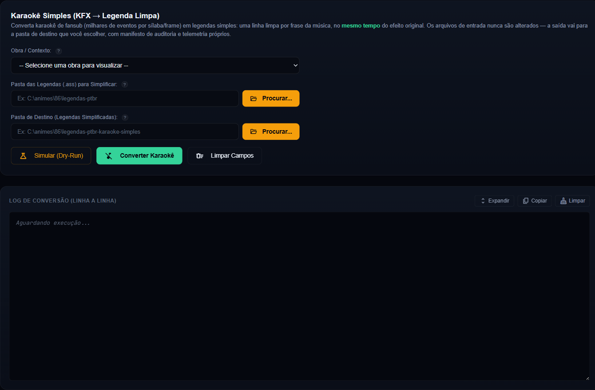
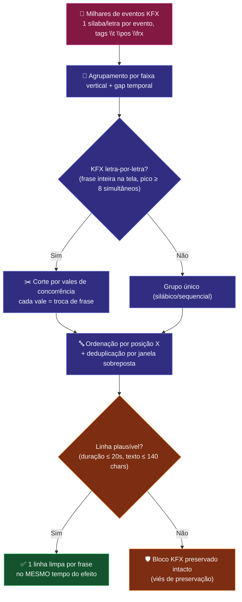

# 🎵 Módulo: Karaokê Simples (KFX → Legenda Limpa)

[← Troca Tipo Legenda](18-modulo-troca-tipo-legenda.md) | [Tradução de Karaokê →](22-modulo-traducao-karaoke.md)

---

## Para que serve

Painel **"9. Karaokê Simples"** da SPA (grupo **Karaokê**). Converte karaokê KFX de fansub — **milhares de eventos por sílaba/letra/frame** gerados pelo Kara Templater do Aegisub — em legendas simples: **uma linha limpa por frase da música, no mesmo tempo do efeito original**. É o pré-requisito para a [Tradução de Karaokê](22-modulo-traducao-karaoke.md) e alivia players fracos que travam com KFX pesado.

---

## Pacote e classes principais

| Classe | Papel |
|--------|-------|
| `ConversorKaraokeUseCase` (`application`) | Agrupa fragmentos KFX em frases, reconstrói a linha limpa e reescreve o `.ass` |
| `EventoAss` / `LinhaSimplesKaraoke` (`domain`) | Parse dos eventos ASS e a linha reconstruída (início, fim, texto) |
| `ResultadoConversaoKaraoke` (`domain`) | Métricas por arquivo (eventos removidos, linhas criadas, preservados por segurança) |
| `NovoKaraokePersistencia` (`infrastructure`) | Manifesto de auditoria em `logs/novo-karaoke/manifestos/` |
| `NovoKaraokeController` (`presentation`) | Endpoints REST — simular e aplicar em background |

---

## Como o KFX vira linha limpa

---

## Garantias de segurança

- **Os arquivos de entrada NUNCA são alterados** — a saída vai para a pasta de destino escolhida (obrigatoriamente diferente da entrada).
- Diálogo, placas e `Comment:` são reemitidos **byte a byte** (linha crua).
- Bloco musical que não puder ser reconstruído com confiança é **mantido intacto** — deixar KFX pesado custa menos que destruir a música.
- Manifesto JSON por execução em `logs/novo-karaoke/manifestos/` com cada linha criada e cada evento removido — trilha completa para auditar ou refazer.
- Deduplicação de variantes divergentes da mesma frase (traduções por timestamp): janelas com sobreposição ≥ 60% e texto similar viram **uma** linha, escolhida por pontuação (romaji original vence texto "pulverizado").

---

## Endpoints REST

| Endpoint | Payload | Canal SSE |
|----------|---------|-----------|
| `POST /api/novo-karaoke/simular` | `{caminhoOrigem, caminhoDestino}` | `novo-karaoke` |
| `POST /api/novo-karaoke/aplicar` | `{caminhoOrigem, caminhoDestino}` | `novo-karaoke` |

Operação puramente local (sem LLM, sem estado global) — roda assíncrona fora da fila do pipeline. O console encerra com o resumo (arquivos, eventos removidos, linhas criadas, redução de tamanho) e a linha `[RELATÓRIO FINAL]` com o tempo total.

---

## Pontos de atenção

- KFX **letra-por-letra** (a frase inteira desenhada caractere a caractere) é detectado pelo pico de eventos simultâneos e cortado nos "vales" de concorrência — KFX silábico clássico passa pelo caminho tradicional de gap.
- Se a música ainda estiver em inglês após a simplificação, o próximo passo natural é a [Tradução de Karaokê](22-modulo-traducao-karaoke.md), que preserva o romaji e traduz só a camada inglesa.
- Telemetria da operação (tipo `NOVO_KARAOKE`) alimenta o painel de [Telemetria](10-modulo-telemetria.md).

---

## Navegação

| Anterior | Próximo |
|----------|---------|
| [← Troca Tipo Legenda](18-modulo-troca-tipo-legenda.md) | [Tradução de Karaokê →](22-modulo-traducao-karaoke.md) |
