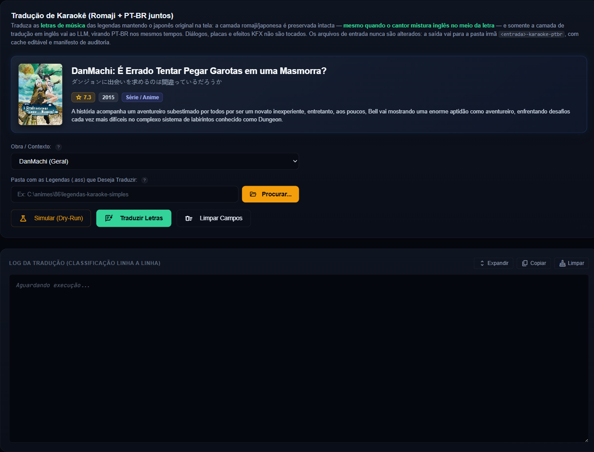
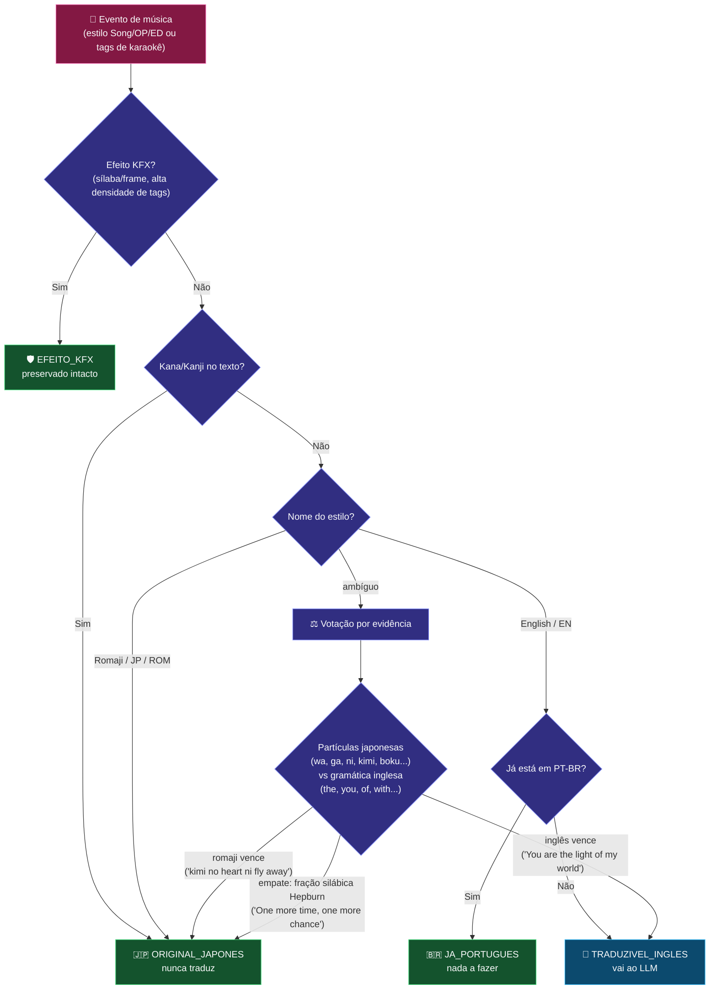
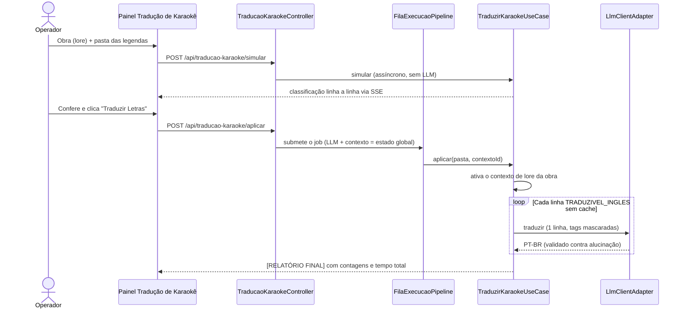

# 🎤 Módulo: Tradução de Karaokê (Romaji + PT-BR juntos)

[← Karaokê Simples](21-modulo-karaoke-simples.md) | [Correção de Karaoke →](07-modulo-cura-tags.md)

---

## Para que serve

Painel **"11. Tradução de Karaokê"** da SPA (grupo **Karaokê**). Traduz as **letras de música** das legendas mantendo o japonês original junto na tela: a camada **romaji/japonesa é preservada intacta** e apenas a camada de **tradução em inglês** vai ao LLM, virando PT-BR nos mesmos tempos — resultado: romaji em cima, PT-BR embaixo, como fansub clássico.

O problema central que o módulo resolve: **cantores japoneses misturam inglês no meio da letra** (*"kimi no heart ni fly away"*). Uma detecção ingênua de "linha em inglês" mandaria a letra original para o LLM e a destruiria. Aqui a classificação é **por evidência**, com viés de preservação.



---

## Pacote e classes principais

| Classe | Papel |
|--------|-------|
| `ClassificadorLetraKaraokeService` (`application`) | O coração do módulo: decide por linha se é letra original (preservar), tradução em inglês (traduzir), já PT-BR ou efeito KFX |
| `TraduzirKaraokeUseCase` (`application`) | Orquestra: classifica, consulta cache, chama o LLM linha a linha, grava a saída |
| `ClasseLinhaKaraoke` (`domain`) | Enum das 5 classes de linha |
| `ResultadoTraducaoKaraoke` (`domain`) | Métricas por arquivo (preservadas, traduzidas, cache, sem tradução) |
| `TraducaoKaraokePersistencia` (`infrastructure`) | Manifesto de auditoria em `logs/traducao-karaoke/manifestos/` |
| `TraducaoKaraokeController` (`presentation`) | Endpoints REST — simulação assíncrona; aplicação via fila do pipeline |

---

## Como uma linha de música é classificada



> ⚖️ **Na dúvida, o viés é PRESERVAR** — deixar uma linha de música sem traduzir custa menos que destruir a letra original. O **dry-run mostra a classificação linha a linha** antes de gastar qualquer chamada de LLM.

---

## Fluxo de execução



---

## Garantias de segurança

- **Entrada intocada**: a saída vai para a pasta irmã `<entrada>-karaoke-ptbr`, com o **mesmo nome de arquivo** (o pareamento do [Remuxer](08-modulo-remuxer.md) continua funcionando).
- **Cache editável por arquivo** em `cache/karaoke/*.cache.json` — mesmo fluxo de correção manual da [Tradução Local](05-modulo-traducao-llm.md); refrão repetido gasta **uma** chamada de LLM.
- Falha ou alucinação do LLM numa linha **mantém a linha original** com aviso — nunca derruba o arquivo.
- Diálogos, placas e efeitos KFX passam **byte a byte** — o módulo só toca música.
- A aplicação roda **na fila única do pipeline** (o contexto de lore ativo e o modelo LLM são estado global).

---

## Endpoints REST

| Endpoint | Payload | Canal SSE |
|----------|---------|-----------|
| `POST /api/traducao-karaoke/simular` | `{caminhoOrigem, contextoId}` | `traducao-karaoke` |
| `POST /api/traducao-karaoke/aplicar` | `{caminhoOrigem, contextoId}` | `traducao-karaoke` |

```json
{ "caminhoOrigem": "C:/animes/86/legendas-karaoke-simples", "contextoId": "eight_six" }
```

---

## Pontos de atenção

- O lugar natural do módulo é **depois do [Karaokê Simples](21-modulo-karaoke-simples.md)** (converte o KFX primeiro, traduz a letra depois) e **antes da [Correção de Karaoke](07-modulo-cura-tags.md)**.
- Estilos rotulados decidem primeiro (`OP - Romaji` preserva, `OP - English` traduz) — a votação por evidência só entra em estilos ambíguos (`Song`, `Insert`).
- Letra 100% em inglês **cantada no original** (ex.: *"One more time, one more chance"*) é preservada pelo desempate silábico — se ela estiver na camada de tradução com estilo rotulado `English`, é traduzida normalmente.

---

## Navegação

| Anterior | Próximo |
|----------|---------|
| [← Karaokê Simples](21-modulo-karaoke-simples.md) | [Correção de Karaoke →](07-modulo-cura-tags.md) |
