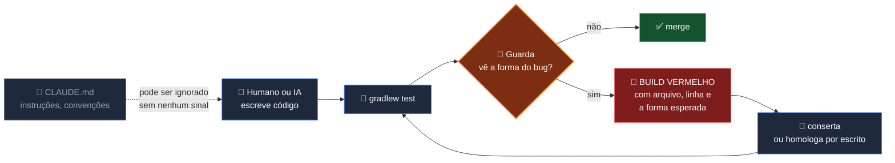
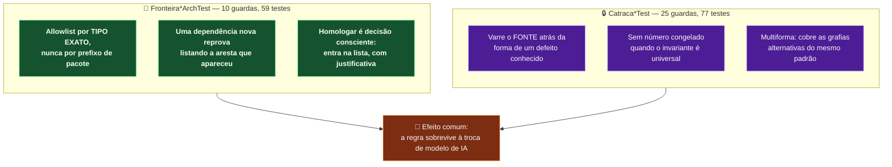

# 🚦 Catracas e Fronteiras — como as regras sobrevivem

[← Arquitetura](arquitetura.md) | [Voltar ao README](../README.md)

---

## O problema que este mecanismo resolve

Um repositório trabalhado por várias IAs — Claude, Gemini, GPT, Codex, Cursor — e por um humano
com pressa tem um modo de falha próprio: **a regra combinada some**. Não porque alguém discorde
dela, mas porque ninguém a lê no momento em que ela importa.

Documentação não impõe nada. Um arquivo de instruções pode ser ignorado por qualquer agente que
abra o projeto amanhã. **Um teste vermelho, não.**

Daí a peça central da arquitetura do KRONOS: **35 guardas executáveis**, 136 testes, que não
verificam comportamento — verificam que **um padrão perigoso não voltou**. Elas leem o
código-fonte, a estrutura de pacotes ou o HTML, e **reprovam o build** ao encontrar a forma do
bug.



---

## As duas famílias



**Fronteira** congela *quem pode importar quem*. **Catraca** congela *que forma não pode voltar
a existir*. A diferença prática: a fronteira olha o grafo de dependências; a catraca lê o texto
do código.

---

## O inventário completo

Medido em **19/08/2026**, rodando a suíte inteira com `--rerun-tasks`: **35 guardas · 136 testes ·
0 falhas**. A contagem por classe vem do relatório JUnit, não da memória.

### Fronteiras — congelam *quem pode importar quem* (10 guardas, 59 testes)

| Guarda | Testes | O que impede |
|--------|-------:|--------------|
| `FronteiraTraducaoArchTest` | 15 | A fatia `traducao` (tier gold) ganhar qualquer aresta de saída para outra fatia funcional. Congela os tipos de `core` consumidos, um a um |
| `FronteiraContextoArchTest` | 8 | O peer de lore passar a depender de fatia funcional. O nome é legado — o alvo hoje é `org.traducao.projeto.lore` |
| `FronteiraTermoAssTest` | 8 | A mecânica de casamento de termo em ASS voltar a viver em 12 arquivos de 7 fatias, com as duas metades (fronteira e separador) divergindo |
| `FronteiraTrocaTipoLegendaArchTest` | 6 | A regra de negócio do achatamento voltar para dentro da fatia, desfazendo o desacoplamento de 29/07/2026 |
| `FronteiraCorretorCacheArchTest` | 5 | As quatro fatias da área de correção de cache (`traducaoCorrige`, `raspagemCorrecao`, `raspagemRevisao`, `correcaoLegendas`) se enroscarem de novo |
| `FronteiraQualidadeTraducaoArchTest` | 5 | O peer de máscara de tags e validação anti-alucinação perder independência |
| `FronteiraLlmArchTest` | 4 | O contrato `LlmPort` vazar detalhe de provedor — é o que permite trocar o LLM sem tocar no pipeline |
| `FronteiraLegendaArchTest` | 3 | O peer de modelo e I/O de `.ass`/`.srt` depender de quem o consome |
| `FronteiraCacheTraducaoArchTest` | 3 | Outra fatia escrever cache paralelo. `cachetraducao` é **dono único** |
| `FronteiraInboundArchTest` | 2 | Entrada de fora cruzar direto para dentro da `traducao` sem passar pela porta |

### Catracas de escrita na legenda — o veto de música (4 guardas, 12 testes)

Quatro portas diferentes reescrevem fala; **todas** têm de responder *"e se for música?"*. Cada
catraca é cega fora do próprio prefixo — foi por isso que precisaram ser quatro.

| Guarda | Testes | O que impede |
|--------|-------:|--------------|
| `CatracaEscritaDeFalaVetaMusicaTest` | 4 | Um ponto novo de reescrita nascer na **3.1** sem responder ao veto |
| `CatracaEscritaDeFalaVetaMusicaLoreTest` | 3 | Idem na **3.2** |
| `CatracaEscritaDeFalaVetaMusicaConcordanciaTest` | 3 | Idem na **3.3** |
| `CatracaFerramentaDeAcervoVetaMusicaTest` | 2 | Idem nas **ferramentas que varrem o acervo** — o caminho que não passa por tela nenhuma, e que reescreveu 103 linhas de romaji antes desta existir |

### Catracas de interface (6 guardas, 18 testes)

| Guarda | Testes | O que impede |
|--------|-------:|--------------|
| `CatracaAvisoSonoroNasTelasLongasTest` | 5 | Tela que espera a fila terminar em silêncio — e que o aviso vire uma segunda cópia do áudio em vez do módulo compartilhado |
| `CatracaCartaoDoAlvoTemDonoUnicoTest` | 4 | Cada tela montar o próprio cartão de "para onde vou escrever". Três cópias já tinham divergido |
| `CatracaConsoleOrfaoNaUiTest` | 3 | Console que nunca recebe nada — o defeito que faz job saudável parecer travado e leva o operador a matar o processo |
| `CatracaSeletorDeObraRegistradoTest` | 3 | Seletor de obra que abre vazio: valida **nos dois sentidos** (toda tela registrada, todo registro com tela) |
| `CatracaBordaAssincronaConfereCaminhoTest` | 2 | Tela responder *"iniciado"* para trabalho que não tem como acontecer |
| `CatracaTelaDestrutivaNasceEmDryRunTest` | 2 | Tela que reescreve o acervo abrir com "gravar" como padrão |

### Catracas de lore (5 guardas, 15 testes)

| Guarda | Testes | O que impede |
|--------|-------:|--------------|
| `CatracaAgregadorasForaDoCdiTest` | 4 | Alguém "consertar" a ausência deliberada de `@Component` nas três agregadoras Macross. A ausência é decisão de qualidade de tradução |
| `CatracaTerminologiaDeLoreUnificadaTest` | 4 | Quem traduz e quem revisa enxergarem terminologias diferentes |
| `CatracaSlotsReservadosLoreTest` | 3 | A dívida de obras sem lore ficar invisível — o id resolveria para nada e o operador não veria |
| `CatracaCorretorIndependeDeLoreTest` | 3 | A tradução **sem lore** receber correções determinísticas diferentes da tradução com lore — o que tornaria toda comparação entre as duas inválida |
| `CatracaCicatrizNoLoreYamlTest` | 1 | A cicatriz do `lore.yaml` (medição escrita em comentário) ser apagada por quem regenerar o arquivo e copiar por cima |

### Catracas de arquitetura e formato (6 guardas, 17 testes)

| Guarda | Testes | O que impede |
|--------|-------:|--------------|
| `CatracaCoberturaFatiaTelemetriaTest` | 4 | O mapa que decide em que aba do painel — e em que dataset publicado — cada operação aparece perder cobertura |
| `CatracaOrdemDocumentacaoTest` | 4 | O menu, o nome do arquivo em `docs/` e o índice da documentação contarem histórias diferentes |
| `CatracaPaginaDeDocumentacaoAbreTest` | 3 | Página existir em `docs/` e **não abrir** na tela. As 14 páginas numeradas passaram 13 dias devolvendo HTTP 400 depois da renomeação para `etapa-G.N-nome.md` — a guarda de ordem conferia o NOME, e nenhuma perguntava se a página carrega |
| `CatracaFronteiraQuebraAssTest` | 2 | Uma fronteira de termo esquecer que `\N` do ASS são **dois caracteres** e o `N` é letra |
| `CatracaPadraoMusicalTemDonoUnicoTest` | 2 | Um arquivo novo decidir alguma coisa a partir de "palavra musical" em silêncio |
| `CatracaRegraDuplicadaEntreFatiasTest` | 2 | Duplicação silenciosa. Duplicar é permitido — esconder que duplicou, não |

### Catracas de ambiente e portão (4 guardas, 15 testes)

| Guarda | Testes | O que impede |
|--------|-------:|--------------|
| `CatracaContainerPreparadoTest` | 9 | O KRONOS voltar a depender de coisa que só existe na máquina do Paulo, agora que também roda em contêiner |
| `CatracaTokenDeControleEmTodaPortaLlmTest` | 1 | Token de template do modelo (`<\|END_OF_TURN_TOKEN\|>`) chegar à legenda. Nasceu de 4.903 propostas recusadas em silêncio |
| `CatracaPortaoDistinguePastaGenericaTest` | 2 | Um único aviso servir a dois casos que pedem consertos **opostos** — "obra sem lore" e "pasta genérica" |
| `CatracaSuiteSemDriveWindowsTest` | 2 | Caminho absoluto de Windows cravado no fonte do teste, que quebra a suíte dentro do contêiner Linux |

---

## As três regras de operação

### 1. Guarda nasce de prejuízo real, nunca de bug hipotético

Guarda preventiva é cerimônia, e cerimônia é a primeira coisa abandonada na pressa. Cada uma das
35 carrega, no próprio javadoc, o incidente que a originou. Exemplos verdadeiros:

- `CatracaRegraDuplicadaEntreFatiasTest` — *"cópia não declarada foi a causa de três defeitos em
  03/08/2026, um deles vivo por nove dias."*
- `CatracaFronteiraQuebraAssTest` — a metade que faltava da mecânica corrompeu tradução correta:
  reverteu `Nahel Argama` para `Argama` num caso e produziu `Nahel\NNahel Argama` na tela no
  outro.
- `FronteiraContextoArchTest` — 15 caches de Gundam 0083 gravados com `contextoId = guilty_crown`.

### 2. Guarda tem de ser vista REPROVANDO um caso-controle

Uma guarda exercitada apenas no código são pode estar passando **por não enxergar nada**. Antes
de confiar no verde, injeta-se o defeito à mão e confirma-se que ela morre.

Caso real, 05/08/2026: a `CatracaFronteiraQuebraAssTest` procurava **uma** grafia de fronteira e
por isso afirmava cobertura que não tinha. Passou a cobrir nove grafias, e cada uma foi vista
reprovando um arquivo de caso-controle — **9 de 9**, com a grafia certa nomeada na mensagem. Na
primeira execução real ela encontrou um ponto cego que estava verde havia meses.

### 3. Número congelado só quando não há invariante universal

Baseline numérica ("no máximo N ocorrências") é aceitável quando congelar por tipo é inviável —
mas **número se ajusta de boa-fé**, e já foi ajustado neste repositório: uma IA com permissão de
commit baixou o total de 14 para 11 no mesmo commit em que "consertava" algo, porque a própria
refatoração cegou o scanner.

Quando o invariante é universal, a guarda nasce **sem número**. É o caso da
`CatracaFronteiraQuebraAssTest`: não existe "quantidade aceitável" de fronteira sem tratar a
quebra, então não há o que ajustar para baixo.

---

## ⚠️ A armadilha do verde falso

O cache do Gradle **já produziu falso-verde** em teste de arquitetura neste projeto. A guarda lê
arquivos-fonte, e o Gradle considera a tarefa atualizada quando as entradas declaradas não
mudaram — só que o arquivo violado pode não estar entre elas.

```bash
# ERRADO — pode passar verde sem ter rodado
./gradlew test --tests "*Catraca*"

# CERTO
./gradlew test --tests "*Catraca*" --rerun-tasks
```

Isso vale para toda verificação de arquitetura, e vale em dobro para IA com permissão de commit:
**conferir o número da catraca em todo commit dela e exigir a mutação.**

---

## A catraca da borda assíncrona

`CatracaBordaAssincronaConfereCaminhoTest` — nasceu em 11/08/2026, sondando as bordas com uma
pasta que não existe em ambiente nenhum. **Sete rotas responderam HTTP 200/202 "iniciada"**
para trabalho impossível, entre elas as duas que gravam no acervo. A `correcao-legendas` foi
até o fim e registrou na telemetria canônica `{"arquivosProcessados": 1, "itensCorrigidos": 0}`
para uma pasta inexistente — "0 corrigidos porque não existe" ficou idêntico a "0 corrigidos
porque estava tudo certo".

A forma que ela congela: **controller que dispara trabalho em segundo plano
(`filaExecucao.submeter` / `CompletableFuture.runAsync`) a partir de um caminho vindo do
usuário tem de referenciar `core.io.GuardaCaminhoEntrada`.** O discriminador é a assincronia,
não a fatia: rota síncrona não entra na regra, porque a exceção do caso de uso ainda alcança a
resposta HTTP — e o caso-controle verifica também esse lado, para a catraca não passar a
cobrar guarda de quem não precisa.

Calibrada contra um controller doente **que compila**: a primeira tentativa trocou o tipo por
`Object` e quebrou o `compileJava`, o que prova o compilador, não a catraca.

---

## Guardas que não se chamam "Catraca"

Duas moram fora do pacote `arquitetura` e fazem o mesmo trabalho:

- **`WebInterfaceTest#indexSidebarComEstruturaNavMenuValida`** — cobra a numeração do menu como
  invariante: no grupo de ordem G, o item de posição N começa com `G.N`. Antes de 05/08/2026 ela
  congelava o rótulo literal, o que quebrava a cada renomeação e — pior — **não via item novo
  entrando sem número**, que foi exatamente como nasceu o antigo `4b.`.
- **`SseConsoleDinamicoTest#batimentoCarregaIdentidadeDaExecucaoENaoORelogio`** — impede que o
  batimento SSE volte a carregar o relógio em vez da identidade da execução. Com o relógio, o
  navegador não distingue "servidor reiniciou" de "continuo conectado", e o console fica exibindo
  a execução morta.

---

## O endereço único: `checar-portao.ps1`

```powershell
.\checar-portao.ps1
```

Um comando roda **todas** as guardas. Guarda que depende de alguém lembrar de rodar é
documentação com sorte.

**Três estados, nunca dois:**

| Saída | Significado |
|---|---|
| `0` | pode trabalhar |
| `1` | defeito real — guarda vermelha, hash divergente, documento sumido, compilação quebrada |
| `2` | **não deu para conferir** — sem Java, sem `gradlew`, zero teste selecionado |

O `2` não é detalhe. Sem ele, um ambiente sem Java e um repositório impecável produzem
exatamente o mesmo silêncio, e "não verificou" passa por aprovação.

**`--rerun-tasks` é obrigatório e o script o impõe.** O prejuízo está registrado: uma IA
comitou alteração de lore com a suíte "verde" que era `UP-TO-DATE` do cache do Gradle —
nenhum teste havia rodado. Verde de cache é indistinguível de verde de execução, a não ser
que se force a execução.

**Cobertura declarada, não presumida.** O filtro pega a convenção de nome (`Catraca*`,
`Fronteira*`, `Guarda*`) **mais** as duas guardas da seção acima, nomeadas explicitamente no
script. Guarda nova com nome fora da convenção não entra sozinha — acrescente na lista do
`$FILTROS`. Medido em 11/08/2026: 154 testes em 31 classes, 30 s.

O passo 1 do portão confere `.claude/LEITURA-REGRA-ATUAL.md`: o SHA-256 e a contagem de linhas
de cada documento-regra têm de bater com o arquivo em disco. Sem isso, "eu li a regra" é
lembrança — e lembrança não distingue a versão atual da de duas semanas atrás.

> A própria conferência nasceu com o defeito que ela existe para pegar. Na primeira execução,
> um hash adulterado para `...FFFF` não casava com o padrão `[0-9a-f]{64}` embutido na regex:
> a linha era **descartada em silêncio**, o contador caía de 3 para 2 e o portão respondia
> `OK` e saía `0`. Guarda que descarta o que não entende aprova por cegueira. Hoje linha
> malformada é defeito, e os três casos doentes (hash errado, hash malformado, contagem
> errada) foram vistos reprovando.

---

## Definition of Done

Um item só vira `[x]` quando:

1. `.\checar-portao.ps1` sai **0** — não `2`, que significa "não verificou", e não verificar
   nunca foi aprovar;
2. a suíte completa passou (`.\gradlew.bat test --rerun-tasks`), e a contagem de testes
   EXECUTADOS foi conferida — `BUILD SUCCESSFUL` também sai quando nada roda;
3. o instrumento foi visto reprovando um caso doente, e o caso doente **compila** (mutação que
   quebra o compilador prova o `javac`, não a guarda);
4. quando a mudança tem tela ou API, ela foi exercida no que está **servido**, não só no teste —
   e tela se confere olhando, porque bytes não provam tela;
5. o que **não** foi feito está dito por escrito, com o motivo.

O quinto item não é formalidade. "Pronto" solto é proibido: o veredito diz o que foi executado,
o que não foi, e o que continua **não comprovado**.

---

## O que veio do site do Christiano e o que ficou de fora

Em 11/08/2026 a `REGRA-DESTE-DOCKER.md` daquele projeto foi varrida item a item. Entrou o que é
**método**; ficou o que é **mecanismo de lá**. O registro existe para ninguém reabrir a
discussão sem argumento novo:

| Item da REGRA | Aqui |
|---|---|
| Portão de leitura com SHA-256 | ✅ `.claude/LEITURA-REGRA-ATUAL.md`, conferido pelo script |
| Endereço único das guardas · três estados | ✅ `checar-portao.ps1` |
| Evidência é artefato · instrumento precisa de prova | ✅ já era o método daqui |
| Falha fechada / segredo fora do Git | ✅ `${VAR:?}` no compose, `.env` ignorado |
| Construir não é publicar · não editar durante o build | ✅ declarado em [ref-docker](ref-docker.md) |
| Bytes não provam tela | ✅ virou item 4 do Definition of Done |
| Tela de erro com HTTP real (sem *soft 404*) | ✅ **já cumprido** — medido: `/pagina-que-nao-existe` devolve 404 |
| Guardas de RLS, tenant, `casa_id` | ❌ não há banco nem inquilino |
| `build.sh` / `deploy.sh` | ❌ não há publicação: o KRONOS roda na máquina de quem usa |
| Build sempre capado | 🟡 declarado sem mecanismo — a VM do WSL2 já limita em ≈19,4 GB de 39,7 GB |
| CSP proibindo estilo inline | ❌ não há CSP, e há 40 `style=` legítimos. Aplicação só no loopback: a guarda não protegeria nada e quebraria o que funciona |
| Canto inferior direito é território ocupado | 🟡 **medido, sem guarda**: o único ocupante é `.toast-container` (`fixed`, `bottom/right: 24px`), e ele tem `pointer-events: none` sem nenhum `.toast` reativando — ninguém disputa o canto. Sem cicatriz local, guarda é cerimônia |
| Discrição com cor, nunca `opacity` | ❌ sem incidente correspondente |

---

## Como escrever uma guarda nova

1. **Tenha o prejuízo.** Sem incidente concreto, não entra.
2. **Escolha a família.** Aresta entre pacotes → `Fronteira*ArchTest`. Forma no texto do código →
   `Catraca*Test`.
3. **Cubra as grafias alternativas.** Buscar uma forma mede a forma, não o invariante.
4. **Monte o caso-controle e veja a guarda morrer.** Só então confie no verde.
5. **Escreva na mensagem de falha o que fazer** — arquivo, linha, forma esperada pronta para
   colar. Quem vai ler é alguém com pressa, possivelmente uma IA.
6. **Documente o incidente no javadoc.** A guarda sem cicatriz será apagada por alguém que a
   achou chata.

---

[← Arquitetura](arquitetura.md) | [Voltar ao README](../README.md)
