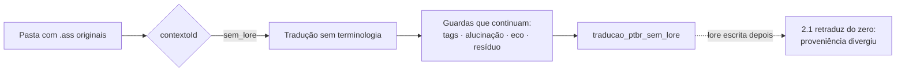

# ⚡ Etapa 2.2 — Tradução sem Lore

> Traduz o anime que **ainda não tem lore declarada**. É o caminho do "acabei de baixar e quero
> ver como fica" — e a página existe para deixar escrito, antes de você clicar, **exatamente o
> que se perde** por não ter lore.

---

## Para que serve

A [Tradução Local (2.1)](etapa-2.1-traducao-llm.md) exige escolher a obra, porque é a lore dela
que protege nome próprio, patente, mecha e facção. Para um anime recém-baixado essa lore não
existe, e escrevê-la leva tempo.

Esta tela remove a exigência: **não pede obra**. Em troca, não aplica terminologia nenhuma.

O contexto usado é o `sem_lore`, um id **reservado** que vive no contrato
(`ProvedorContexto.ID_SEM_LORE`) e não numa classe de lore concreta — a lore está migrando de 82
classes Java para um arquivo de dados, e quem precisa do id não pode depender de uma classe que
vai deixar de existir.

---

## O que você perde sem lore

| perda | consequência concreta |
|---|---|
| **Nome próprio desprotegido** | sem lista de termos protegidos, nada impede um personagem chamado `Sky` virar `Céu`. O prompt **pede** para manter — pedido não é garantia. |
| **Sem reforço determinístico** | o `EnforcadorTermosLore` não tem mapa para aplicar. É ele, e não o `termosProtegidos`, quem de fato garante a grafia canônica depois da tradução. |
| **Sem grafia canônica** | `Quattro` volta `Quatro`, `Ple` volta `Plee`, e ninguém restaura. |

## O que continua protegido

Sem lore **não** significa sem guarda. Estes seguem valendo:

- tags ASS/SSA — mascaradas antes do LLM e reconferidas na volta;
- detecção de **alucinação** e de **meta-resposta** (`PADRAO_RECUSA_META`), que impede o modelo
  responder em vez de traduzir;
- identificadores numéricos preservados;
- **resíduo em inglês** e **eco do original** acusados como pendência;
- veto de camada musical — karaokê não vai ao LLM.

---

## A saída fica separada, e isso é deliberado

O resultado vai para **`traducao_ptbr_sem_lore`**, e não para `traducao_ptbr`. Duas razões:

1. **A definitiva não é sobrescrita.** Quando a lore de verdade existir, você roda a 2.1 e a saída
   boa nasce na pasta de sempre, sem conflito.
2. **O cache desta execução é descartado sozinho.** A proveniência carimba `contextoId=sem_lore`;
   quando a obra ganhar lore, `mesmaProveniencia()` dá falso e a 2.1 retraduz do zero, em vez de
   reaproveitar uma tradução que nunca teve terminologia.

> ⚠️ A pasta `traducao_ptbr_sem_lore` é **saída**, nunca entrada. Apontar uma tradução para uma
> pasta de saída já sobrescreveu 17 arquivos limpos em 06/08/2026 — hoje a
> `GuardaCaminhoEntrada` barra isso, e a cicatriz está em
> [Catracas e Fronteiras](catracas-e-fronteiras.md).

---

## Fluxo

---

## Contrato REST

Esta tela **não tem endpoint próprio** — usa o mesmo da Tradução Local, com o `contextoId`
reservado. É o backend que decide o resto:

| o que muda | valor quando `contextoId = sem_lore` |
|---|---|
| canal SSE | `traducao-sem-lore` (a 2.1 usa `traducao`) |
| nome da operação na telemetria | `Tradução sem Lore via LLM` |
| pasta de saída, quando não informada | `traducao_ptbr_sem_lore` |

Canal SSE próprio, e não uma linha no console da 2.1: as duas telas podem estar abertas, e o
progresso de uma não pode aparecer embaixo da outra. Ver
[Ref — API e Endpoints](ref-api-endpoints.md).

---

## Quando NÃO usar

- **Para entregar.** A saída não passou por terminologia; ela serve para ver, não para arquivar.
- **Quando a obra já tem lore.** Use a [2.1](etapa-2.1-traducao-llm.md) — a lore existe justamente
  para isso, e usar esta tela desperdiça a proteção que já foi escrita.

---

## Navegação

- ⬅️ [Etapa 2.1 — Tradução Local](etapa-2.1-traducao-llm.md)
- ➡️ [Etapa 2.3 — Correção de Cache](etapa-2.3-correcao-revisao.md)
- 📚 [Contextos de Lore](modulo-contextos-lore.md) — como escrever a lore que falta aqui
- 🏠 [README](../README.md)
