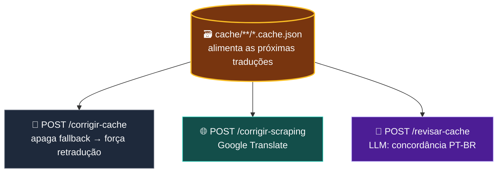
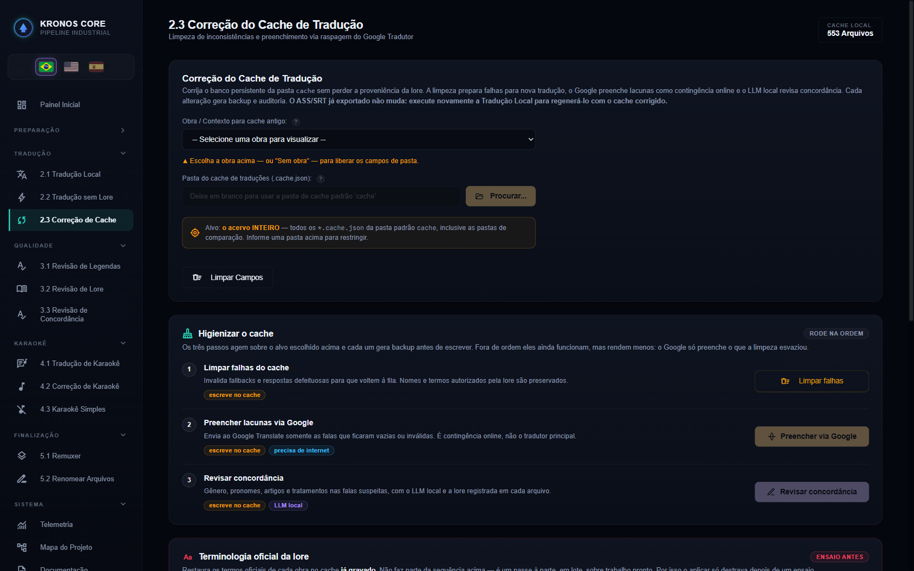
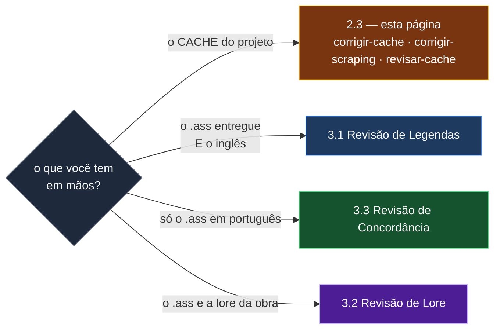

# 🗃️ Etapa 2.3 — Correção de Cache

[← 2.1 Tradução Local](etapa-2.1-traducao-llm.md) | [3.1 Revisão de Legendas →](etapa-3.1-revisao-legendas.md)

---

## Para que serve

Depois da tradução inicial sobram, tipicamente, dois problemas: **falas que o LLM não traduziu**
(resíduo em inglês, fallback silencioso) e **erros de concordância de gênero em PT-BR** — o inglês
não marca gênero em pronomes e adjetivos como o português, e `"her sword"` vira `"sua espada dele"`
por calque.

Esta tela ataca os dois **no banco de cache**, que é o que alimenta as próximas traduções. Para
consertar a legenda **já entregue**, as telas são a [3.1](etapa-3.1-revisao-legendas.md), a
[3.2](etapa-3.2-revisao-lore.md) e a [3.3](etapa-3.3-revisao-concordancia.md).

---

## Os três fluxos sobre o cache

| Endpoint | Use case | Atua sobre | Método |
|----------|----------|-------------|--------|
| `POST /api/corrigir-cache` | `LimparCacheUseCase` | `cache/**/*.cache.json` | **Nenhum corretor** — apaga entradas de fallback (`traduzido == original`), forçando retradução na próxima passada de `/api/traduzir` |
| `POST /api/corrigir-scraping` | `CorrigirComGoogleUseCase` | `cache/**/*.cache.json` | **Google Translate** (scraping da API pública `translate.googleapis.com`) |
| `POST /api/revisar-cache` | `RevisarCacheUseCase` | `cache/**/*.cache.json` | **LLM local** — foco em concordância PT-BR |

> **Quando usar qual:** se a legenda final ainda tem falas 100% em inglês, comece por
> `/corrigir-cache` e rode `/traduzir` de novo — é o mais barato e reaproveita o LLM já
> configurado. Se restarem resíduos, `/corrigir-scraping` entrega algo melhor que "sem tradução
> nenhuma", sem custo. Para erro sutil de gênero, `/revisar-cache` é mais lento, mas entende a lore
> do contexto.
>
> **O cache é propriedade de um dono único** (o peer `cachetraducao`). Nenhuma outra fatia escreve
> nele — ver [Arquitetura](arquitetura.md).

---

## Fluxo 1 — Limpeza de cache (`traducaoCorrige`)

`LimparCacheUseCase` varre `cache/**/*.cache.json` e **remove** (define como vazio) as entradas onde `original.equals(traduzido)` — o padrão de uma tradução que falhou silenciosamente. Não chama nenhum serviço externo; o objetivo é só preparar o terreno para que a próxima execução de [`/api/traduzir`](etapa-2.1-traducao-llm.md) trate essas falas como pendentes de novo.

---

## Fluxo 2 — Correção/Revisão via Google Translate (`raspagemCorrecao`)

- **`GoogleTranslateScraper`** (`infrastructure`, reutilizado por `raspagemRevisao`) chama `https://translate.googleapis.com/translate_a/single?client=gtx&sl=en&tl=pt&dt=t&q=...` via `java.net.http.HttpClient` — a API pública não-oficial do Google Translate, não a API paga do Google Cloud.
- Mascara tags ASS (`{...}` → `[T0]`) e quebras de linha (`\N` → `[B]`) antes de enviar, restaura na resposta — mesmo princípio do `MascaradorTags` da tradução principal.
- Ignora termos de lore (`TERMOS_IGNORADOS`: nomes próprios como "Fire Bolt", "Argo Vesta") e siglas de 2 palavras capitalizadas, para não traduzir nomes que devem ficar como estão.
- Pausa de 400ms entre chamadas (rate-limit informal da API pública).
- `RevisarLegendasUseCase` (modo `GOOGLE`) faz a mesma coisa, mas direto no arquivo `.ass` final: localiza o original em inglês (heurística de nome de arquivo — `_ENG`, `_Track2`, código `S01E01`) e reescreve cada fala suspeita.

---

## Fluxos 3 e 4 — mudaram de lugar (e por quê)

Até 06/08/2026 esta página descrevia **quatro** fluxos: os dois do cache (acima) e mais dois que
atuam **direto no arquivo `.ass` entregue**. Os dois de arquivo cresceram, ganharam tela própria
numerada no menu e **página própria** — manter a descrição aqui criaria duas fontes de verdade
sobre o mesmo assunto, que é o que a invariante de fonte única proíbe.

| era aqui | mora agora em | atua sobre |
|---|---|---|
| Fluxo 3 — revisão de concordância PT-BR via LLM | **[3.1 Revisão de Legendas](etapa-3.1-revisao-legendas.md)** | os `.ass` PT-BR entregues, com o inglês de referência |
| Fluxo 4 — concordância de gênero determinística | **[3.3 Revisão de Concordância](etapa-3.3-revisao-concordancia.md)** | só o `.ass` PT-BR, sem inglês, sem cache e sem LLM |

A diferença que decide qual usar:

> **Regra prática:** o cache alimenta as próximas traduções; o `.ass` é a entrega. Corrigir o cache
> não conserta a legenda que já saiu, e corrigir a legenda não impede o erro de voltar na próxima
> tradução. Por isso os dois lados existem.

---

## Endpoints REST desta tela

| Endpoint | Payload | Canal SSE |
|----------|---------|-----------|
| `POST /api/corrigir-cache` | `{entrada?, contextoId?}` (padrão: pasta `cache`) | `correcao` |
| `POST /api/corrigir-scraping` | `{entrada?}` | `correcao` |
| `POST /api/revisar-cache` | `{entrada?, contextoId?}` | `correcao` |

Os endpoints que atuam no `.ass` (`/api/revisar-legendas`, `/api/revisar-legendas-concordancia`,
`/api/revisar-concordancia`) estão documentados nas páginas 3.1 e 3.3.

---

## Navegação

| Anterior | Próximo |
|----------|---------|
| [← 2.1 Tradução Local](etapa-2.1-traducao-llm.md) | [3.1 Revisão de Legendas →](etapa-3.1-revisao-legendas.md) |
