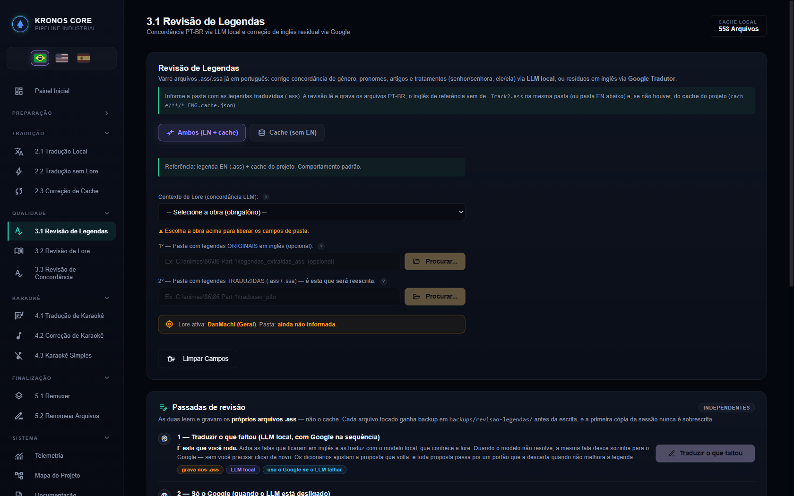
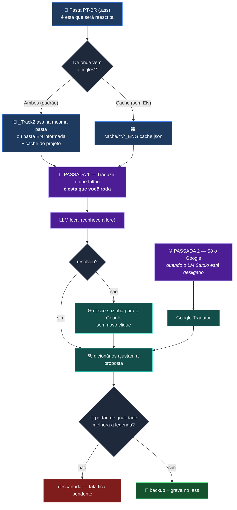
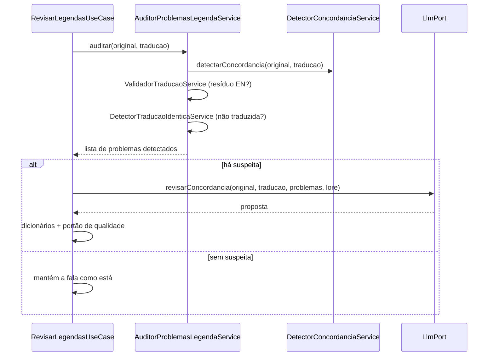

# 🩹 Etapa 3.1 — Revisão de Legendas

[← 2.3 Correção de Cache](etapa-2.3-correcao-revisao.md) | [3.2 Revisão de Lore →](etapa-3.2-revisao-lore.md)

---

## O que ela é

A primeira das três telas de **Qualidade**. Ela varre `.ass`/`.ssa` **já traduzidos** e ataca o que
sobrou da tradução: falas que ficaram em **inglês** e erros de **concordância** que o modelo deixou
passar.

Diferente da `2.3 Correção de Cache`, que trabalha o **banco de cache**, a 3.1 lê e grava os
**próprios arquivos `.ass`** — é a legenda entregue que muda.



---

## As duas passadas — independentes, e qual você roda



| passada | motor | quando usar | endpoint |
|---|---|---|---|
| **1 — Traduzir o que faltou** | LLM local **com Google em cascata** | é a padrão | `POST /api/revisar-legendas-concordancia` |
| **2 — Só o Google** | Google Tradutor isolado | LM Studio fora do ar | `POST /api/revisar-legendas` |

> Os nomes dos endpoints são **históricos** e não descrevem mais o que cada botão faz. O que manda
> é a tabela acima — ela foi lida do `revisao.js`, não da memória.

**Sem cascata, o Google sozinho custa caro:** fala com tag inline (`{\i1}…{\i0}`) costuma voltar
como `TAG_CORROMPIDA` e ficar pendente. Medido no Guilty Crown: **5 falas** que a passada 1
resolveu.

---

## O cartão do alvo — a cicatriz que ele carrega

A tela mantém à vista **qual lore está ativa** e **qual pasta será reescrita**:

```
Lore ativa: DanMachi (Geral). Pasta: ainda não informada.
```

O rótulo *"pasta que será reescrita"* é deliberado. Em 06/08/2026 uma tradução apontou para
`legenda-simplificada`, que é pasta de **saída**, e sobrescreveu **17 arquivos limpos**. O código
fez o que foi mandado; a interface é que permitiu mandar.

Desde 19/08/2026 o cartão tem **dono único** (`js/cartaoAlvoAtivo.js`), importado pelas três telas
de Qualidade. Antes, o mesmo cartão existia copiado em três lugares e as cópias **já tinham
divergido**: a da 3.2 interpolava a pasta no `innerHTML`, a da 3.1 usava `textContent`. A versão
compartilhada é a segura — provada com caso-controle no navegador: a pasta
`C:\animes\<b>injecao</b>\pt` sai como **texto**, não como HTML.

A guarda `CatracaCartaoDoAlvoTemDonoUnicoTest` impede a divergência de voltar.

---

## Backup — a primeira cópia da sessão nunca é sobrescrita

Cada arquivo tocado ganha backup em `backups/revisao-legendas/` **antes** da escrita. Rodar a
mesma pasta duas vezes na mesma sessão **não** substitui o backup original — a primeira cópia é a
que interessa quando algo dá errado.

---

## Contrato de tags — o que impede a legenda de quebrar

A revisão herda o mesmo contrato da tradução: toda proposta que **perca, duplique, reordene ou
invente** um marcador `[[TAGn]]` é descartada e provoca nova tentativa. Nenhuma versão
estruturalmente divergente é publicada.

As quebras internas `\N` seguem caminho separado: são retiradas antes da chamada ao LLM e
recolocadas **deterministicamente** no limite textual mais equilibrado depois da resposta. Os
termos canônicos são mascarados pela proteção de lore entre as duas etapas e restaurados antes da
validação final.

O detector de idioma analisa o texto **sem os termos já reconhecidos pela lore**. Assim,
`Mont Blanc` (nave do Zeta) não vira "vazamento de francês" por causa de `blanc`, enquanto francês
real (`aura bleu`) continua sendo rejeitado.

---

## Concordância na 3.1 × concordância na 3.3

As duas corrigem gênero, e a diferença é o que cada uma **tem em mãos**:

| | 3.1 Revisão de Legendas | 3.3 Revisão de Concordância |
|---|---|---|
| precisa do inglês | **sim** (ou do cache) | não |
| usa LLM | sim | **não** |
| usa lore | sim | não (a obra é só rótulo) |
| alcance | tratamentos, pronomes, artigos, senhor/senhora, `ele`/`ela` | gênero **inequívoco** por comparação de palavras |
| custo | minutos por lote | segundos |

Do corretor da 3.1, apenas **dois** tratamentos são PT-only e puderam ser copiados para a 3.3
(`graças ao deus → graças a Deus` e o possessivo de parentesco `minha pai → meu pai`); todo o
resto exige o original em inglês. Essa cópia foi consciente e medida: ganho **zero** nas 332.545
falas do acervo de hoje — estão lá para a tradução de amanhã, e isso fica escrito em vez de virar
promessa.

> **A exceção do `a`**, que a 3.1 já documentava e a 3.3 teve de reaprender: antes de substantivo
> masculino, `a` é **preposição** e está certo (`"Graças a Deus"`). O detector da 3.1 sempre deixou
> o `a` de fora; o corretor da 3.3 nasceu de uma segunda escrita da mesma ideia e **perdeu a
> exceção** — 14 estragos para 1 acerto no acervo, até ser medido. É a divergência que a regra da
> medição prevê: critério que a produção já implementa é **consultado**, nunca reescrito.

---

## Música: aqui **não** há veto

Diferente da 3.3, a varredura da 3.1 pega **todos os estilos**, inclusive letras de abertura e
encerramento. Se a legenda tem faixa de música em inglês (estilo `Song ENG`), ela é tratada como
inglês residual e **é traduzida**.

Isso é decisão, não descuido — mas exige o hábito: **confira o relatório antes de dar a rodada por
boa**. A própria tela avisa.

---

## Quanto defeito existe hoje

Medido em 19/08/2026 sobre o acervo entregue:

```
detector 3.1 (com inglês de referência) ..... 60 suspeitas em 122.640 falas   (0,05%)
```

Instrumento saturado perto de zero é sinal de que o alvo está pequeno — e é motivo para **medir
antes de ampliar**, não para ampliar as famílias de correção.

---

## Por dentro — como a suspeita nasce antes de gastar o modelo

`AuditorProblemasLegendaService` agrega **três fontes de suspeita**, todas regex, **antes** de
decidir se vale acionar o LLM:

1. `ValidadorTraducaoService` — resíduo em inglês / alucinação
2. `DetectorTraducaoIdenticaService` — fala idêntica ao original (não traduzida)
3. `DetectorConcordanciaService` — erro de gênero PT-BR: cruza pronomes do original
   (`he/she/him/her`) com artigos, substantivos, particípios e pronomes da tradução, procurando
   incompatibilidade (o inglês usa `"her"`, a tradução diz `"dele"`)



Só o que tem suspeita real vira chamada ao modelo — é o que mantém o custo baixo.

O mesmo caso de uso conserta **"karaokê quebrado"** (chaves `{texto}` sem `\` ou `=` na frente) por
regex, antes de qualquer chamada externa.

### O catálogo de lore que a revisão usa

Uma auditoria dos 50 `.ass` ingleses do Zeta ampliou o catálogo operacional com nomes
**efetivamente usados nos diálogos**: `Dogosse Gier`, `Rosammy`, `Haro`, `Shinta`, `Qum`,
`Green Noa`, `Green Oasis`, `Von Braun City`, `Bosnia`, `Sudori`, `Baund Doc` e o elenco secundário
recorrente.

**Aliases curtos ambíguos não são protegidos isoladamente** (`Four`, `Fa`, `Bright`), porque o
casamento ignora caixa; as formas completas (`Four Murasame`, `Fa Yuiry`, `Bright Noa`) continuam
protegidas. O mapa de terminologia, espelhado na [3.2](etapa-3.2-revisao-lore.md), restaura
variantes realmente observadas — `Dogosse Giar → Dogosse Gier`, `Quem → Qum`, `Mancack → Manack`,
`Ramus → Ramsus` — sempre **só quando o inglês original contém o canônico correspondente**.

---

## Contrato REST

| Endpoint | Payload | Canal SSE |
|----------|---------|-----------|
| `POST /api/revisar-legendas-concordancia` | `{entrada, entradaEn?, contextoId}` | `revisao` |
| `POST /api/revisar-legendas` | `{entrada, entradaEn?, contextoId}` | `revisao` |

`entrada` é a pasta PT-BR (**obrigatória**, é a que será reescrita). `contextoId` desconhecido
devolve **HTTP 400**. Indisponibilidade do LLM aparece no console SSE **sem derrubar a fila**.

---

## Guardas que protegem esta tela

| guarda | o que impede |
|---|---|
| `CatracaCartaoDoAlvoTemDonoUnicoTest` | o cartão do alvo divergir entre as três telas |
| `CatracaEscritaDeFalaVetaMusicaTest` | escrita em fala de estilo musical fora do escopo declarado |
| `CatracaTokenDeControleEmTodaPortaLlmTest` | token de template do modelo vazar para a legenda |
| `CatracaBordaAssincronaConfereCaminhoTest` | a borda dizer "iniciada" para pasta inexistente |
| `CatracaAvisoSonoroNasTelasLongasTest` | o lote terminar em silêncio |

---

## Navegação

| Anterior | Próximo |
|----------|---------|
| [← 2.3 Correção de Cache](etapa-2.3-correcao-revisao.md) | [3.2 Revisão de Lore →](etapa-3.2-revisao-lore.md) |
