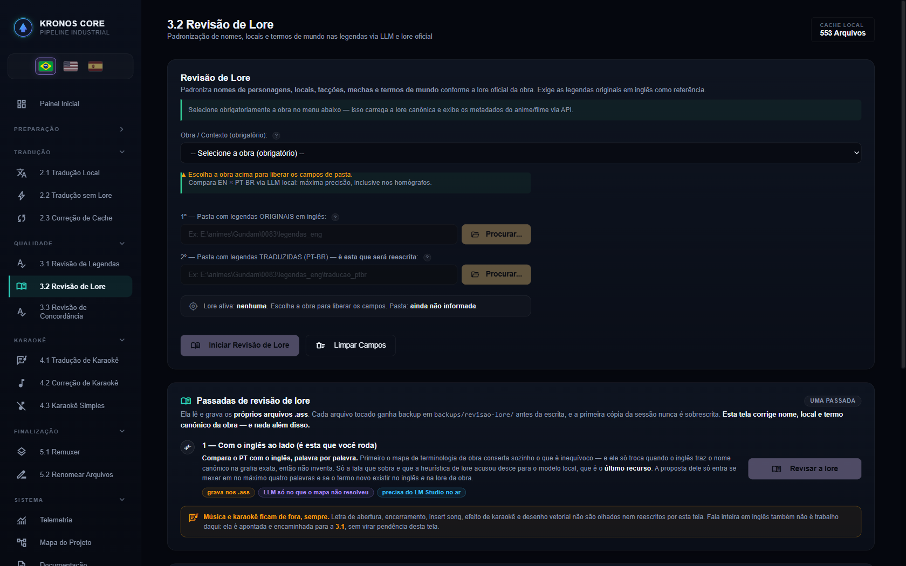
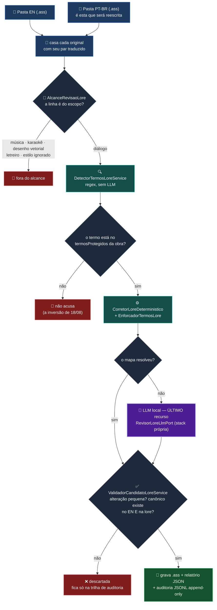

# 📖 Etapa 3.2 — Revisão de Lore

[← 3.1 Revisão de Legendas](etapa-3.1-revisao-legendas.md) | [3.3 Revisão de Concordância →](etapa-3.3-revisao-concordancia.md)

---

## O que ela é — e o que mudou em 18/08/2026

Compara cada fala de uma legenda `.ass` **já traduzida** com a mesma fala no **original em inglês**
e conserta **nome de personagem, local, facção, mecha e termo de mundo** que saiu fora do padrão
oficial da obra.

> **A tela passou a CORRIGIR.** Até 18/08/2026 ela auditava e sinalizava, e **nunca consertava**:
> sete obras rodaram com *"Falas corrigidas: 0"* em todas. No fim daquele dia ela escreveu
> **85 falas** em quatro obras, com a legenda conferida linha a linha.

Ela **não** mexe em concordância de gênero nem reescreve a fala inteira — isso é papel da
[3.1](etapa-3.1-revisao-legendas.md) e da [3.3](etapa-3.3-revisao-concordancia.md).



---

## A inversão do padrão — a decisão que mudou o resultado

| | antes | depois |
|---|---|---|
| critério | acusa **tudo que parece** nome próprio; o LLM que resolva | acusa **só o que a lore da obra conhece** |

O motivo é medido: **63,9%** das acusações nomeavam termo que a lore **não conhece** — pergunta
que ninguém tem como responder. E o modelo, quando tentava, **piorava**: propôs `Equipe 08` onde o
inglês dizia `06th Team`, e `Terry Sanders Jr.` onde só havia `Sanders`.

### A fonte passou a ser o `termosProtegidos`

Havia **três listas** dizendo coisas diferentes sobre o mesmo assunto:

| lista | tamanho | quem usava | ruído acusado (18) | protagonistas preservados (11) |
|---|---|---|---|---|
| `termosProtegidos` | 1.142 nomes por obra, curados | a **tradução** | 0 | **9** |
| roster no código Java | 94 termos | a **revisão** | 0 | **0** |
| prosa do prompt | 488 palavras (Zeta) | usada como se fosse lista | 1 | 11 |

O roster preservava **zero**: "Uraki", "Kamille", "Inori", "Banagher" não estavam nele — só a regra
de posição os salvava, por acaso. A prosa parece boa e é armadilha: traz 19 palavras de
**instrução** do prompt (`ajustar`, `adjetivos`, `traduza`, `mantenha`, `terra`, `guerra`).

**Consequência prática: acrescentar nome no `lore.yaml` passa a render.**

> A primeira versão da ligação comparava por **igualdade exata**, e o catálogo guarda o nome
> COMPLETO ("Banagher Links", "Kou Uraki") enquanto a fala usa a palavra isolada: **19
> protagonistas ficaram invisíveis, em silêncio**. Com expansão em palavras, 19 → 1. Custo medido e
> declarado: 467 palavras novas, 17 genéricas (4%) — "forces", "team", "group", "fleet" —, cujo
> remédio é equivalência no YAML, não exceção no código.

---

## O `lore.yaml` é o produto

A lore saiu do Java e virou **dado**. O arquivo é gerado dos provedores reais por
`GeradorLoreYamlIT` — **nunca digitado** — e a geração só escreve depois de provar ida e volta,
campo a campo.

```
src/main/resources/lore/lore.yaml ......... 15.101 linhas

seção  obras:     69 obras   (68 aparecem na lista da UI; 1 oculta)
                  2.192 termos protegidos · 2.048 correções de terminologia
                  30 apelidos de pasta · 9 pares inconfundíveis
seção  revisao:   69 obras   ·  2.103 correções de terminologia
                  43 equivalências aceitas
```

Os dois blocos que decidem o comportamento da tela:

| bloco | significado | efeito |
|---|---|---|
| `correcoesTerminologia` | a forma está **errada** e existe uma canônica | **escreve** na legenda |
| `equivalenciasAceitas` | a tradução está **certa** e a tela precisa **calar** | não escreve, e para de acusar |

> **Por que YAML e não JSON:** o arquivo carrega **cicatrizes** — comentários que são medição real,
> migrados à mão das classes Java. Regenerar com o gerador produz **zero comentário**; copiar o
> gerado por cima **apaga toda a cicatriz**. A guarda `CatracaCicatrizNoLoreYamlTest` faz isso
> reprovar o build em vez de passar em silêncio.

---

## Fluxo



**O determinístico vem primeiro; o LLM é último recurso.** O prompt **pede** ao modelo; o
`EnforcadorTermosLore` **garante** nas formas-ruim conhecidas.

---

## As cicatrizes que valem mais que a descrição

### O token de template — 4.903 propostas recusadas em silêncio

Sete obras fecharam com **zero** correções e a leitura fácil era culpar o modelo. A auditoria disse
outra coisa: **4.903 propostas recusadas, 100% com `<|END_OF_TURN_TOKEN|>`**, e em **53,4%** o
token era a **única** diferença — o modelo não mudara nada.

A limpeza existia desde 11/08, mas **dentro da fatia `traducao`**, cujo Javadoc afirmava cobrir "os
dois pontos que leem `message.content()`". A `revisaoLore` tem o **próprio** cliente HTTP.

> **Mecânica presa numa fatia repete o prejuízo na fatia vizinha sete dias depois.** A limpeza subiu
> para o `core`, e a guarda `CatracaTokenDeControleEmTodaPortaLlmTest` cobra isso de **toda** porta
> de LLM.

### `Bosnia` — o acento que transformou uma nave num país

Três nomes de lore chegaram acentuados à legenda. `Bósnia` parece a exceção legítima: é o português
correto do país. O inglês dizia *"Send a signal flare to the Bosnia"* e *"the Alexandria, Bosnia and
Sichuan"* — **é uma nave**.

O resultado saiu em português impecável: defeito que atravessa toda régua de qualidade **porque não
parece defeito**. Regra fixada no mecanismo, não na disciplina: **nome próprio de ficção não leva
acento do português**.

### Maiúscula que não é nome — a mesma família, três encarnações no mesmo dia

| forma | exemplo |
|---|---|
| possessivo | `Our Reaper` |
| patente militar | `Ensign Keith` — **34%** das acusações eram cargo traduzido certo |
| abertura de frase | `But Lieutenant Uraki`, `Damn Cima`, `Only Nina` — **707 de 3.563** acusações |

As duas primeiras foram resolvidas com alternância de palavras — *e alternância sempre tem a
próxima que falta*. A **posição** não tem cauda: ou o candidato abre a frase, ou não.

### `Kelley` — o defeito estava no CATÁLOGO, três camadas acima

A tela acusou "Kelley" 15× no 0083 e a leitura fácil era "a tradução errou". Medido:

```
"Kelley"   release EN: 26 falas   PT entregue:  4
"Kelly"    release EN:  0 falas   PT entregue: 21
```

O YAML declarava "Kelly Layzner" em **três** lugares e a tradução seguiu o catálogo. Corrigido na
raiz, com regra para as 21 falas entregues e guarda para as três ocorrências não voltarem a
discordar entre si.

### Letreiro não é fala

114 linhas de cartaz saíram do alcance da tela. O veto de cartaz **não pegava no acervo** porque
`\btitle\b` não casa `"Titles"` — o tipo de furo que só a corrida no acervo real encontra.

---

## Duas armadilhas que foram medidas e **recusadas**

| proposta | veredito | evidência |
|---|---|---|
| **Detecção de grafia por distância de edição** | ❌ descartada | devolveu `para→Maria` (237), `bunda→Gundam` (3), `morrer→Torres` (51) e — o perigoso — `Haman→Yazan` (129), **dois personagens diferentes** a distância 2. Pior: propôs `Rosammy→Rosamia` quando o catálogo tem a regra na direção oposta |
| **Mapa inverso de `Rosammy`** | ❌ impossível | o inglês do Zeta usa os **dois**: `Rosammy` 91× (o apelido) e `Rosamia` 56× (o nome). Na fala *"I'm Rosamia! Not Rosammy!"* as duas regras disparariam e a cena que existe para distingui-los seria destruída. Conferido: **1 fala com os dois nomes, preservada; 0 achatadas** |

---

## Resultado medido

Corrida limpa nas sete obras trabalhadas, com tudo aplicado:

| obra | antes | depois | queda |
|---|---|---|---|
| 08th MS Team | 265 | 39 | −85% |
| 0080 | 85 | 21 | −75% |
| 0083 | 651 | 158 | −76% |
| Guilty Crown | 397 | 84 | −79% |
| Unicorn | 681 | 199 | −71% |
| Zeta | 1.932 | 494 | −74% |
| ZZ | 1.171 | 246 | −79% |
| **total** | **5.182** | **1.241** | **−76%** |

No acervo inteiro (22 obras, 75.114 falas ao alcance, medido pelo código de produção):
**5.185 → 3.567 suspeitas (−31%)**.

E o que sobra **mudou de natureza**: onde havia "Bridge", "Level", "Area" e "Ward", há "Uraki",
"Keith", "Gato", "Yahiro", "Hare" — nome de personagem, que é o que a tela existe para olhar.

---

## A fatia por dentro

```
revisaoLore/                                         23 classes
├── application/
│   ├── RevisarLoreUseCase.java          casa pares, audita, chama o LLM só nas suspeitas
│   ├── AlcanceRevisaoLore.java          a ÚNICA pergunta: esta linha é do escopo?
│   ├── DetectorTermosLoreService.java   heurística regex, antes de gastar chamada
│   ├── CorretorLoreDeterministico.java  garante as formas-ruim conhecidas (sem LLM)
│   ├── ValidadorCandidatoLoreService.java  impede a suspeita virar retradução
│   └── GerenciadorPromptRevisaoLore.java   resolve o prompt por contextoId
├── domain/           resultados, status, trilha de auditoria, porta do LLM
├── infrastructure/   cliente HTTP PRÓPRIO, normalizador, persistência, auditoria JSONL
└── presentation/     RevisaoLoreController
```

A fatia tem **stack de LLM própria** (`RevisorLoreLlmPort`, `RevisaoLoreHttpClient`,
`RevisaoLoreLlmProperties` no namespace `revisao-lore.llm`) desde a FASE D-Lore — ela **não**
importa a stack da `traducao`, e o `FronteiraTraducaoArchTest` congela isso.

> **A aba "PT-only" foi REMOVIDA em 17/08/2026** — ela não atendia nenhum caso do acervo. A medição
> que a condenou: 246.246 linhas de estilo musical estavam ao **alcance** dela, com portão de
> homógrafo de uma palavra decidindo sobre cada uma. Mesma forma da porta que reescreveu **687
> linhas `Song ENG`** no 08th MS Team.

---

## Contrato REST

| Endpoint | Payload | Canal SSE |
|----------|---------|-----------|
| `GET /api/revisao-lore/contextos` | — | — |
| `POST /api/revisar-lore` | `{diretorioOriginal, diretorioTraduzido, contextoId, revisarTodasFalas}` | `revisao-lore` |

```json
{
  "diretorioOriginal": "E:/animes/Gundam/0083/legendas_eng",
  "diretorioTraduzido": "E:/animes/Gundam/0083/legendas_eng/traducao_ptbr",
  "contextoId": "gundam_0083",
  "revisarTodasFalas": false
}
```

`contextoId` é **obrigatório**: sem ele, ou com id desconhecido, o endpoint responde **400** antes
de sequer olhar as pastas. Não existe modo "sem lore" aqui — o propósito inteiro é comparar contra
uma lore canônica.

---

## Trilha de auditoria

`RevisaoLoreAuditoriaCache` grava **JSONL append-only**, uma entrada por fala auditada: original
EN, tradução antes, resposta do LLM, tradução depois e o desfecho (`CONFORME`, `CORRIGIDA`,
`DESCARTADA_*`, `SEM_RESPOSTA`). É o que permite reverter cirurgicamente uma regressão sem
retraduzir nada.

> **Cuidado ao ler a trilha:** no registro `DESCARTADA_VALIDACAO` o campo `traducaoDepois` guarda a
> **proposta**, não o que foi para o disco. Filtrar por "antes ≠ depois" produz alarme falso —
> aconteceu, e 13 propostas com markdown foram reportadas como se estivessem na legenda.

---

## Guardas que protegem esta tela

| guarda | o que impede |
|---|---|
| `CatracaCicatrizNoLoreYamlTest` | regenerar o YAML apagar as cicatrizes medidas |
| `CatracaTerminologiaDeLoreUnificadaTest` | as listas de terminologia divergirem entre si |
| `CatracaEscritaDeFalaVetaMusicaLoreTest` | a fatia escrever em fala de estilo musical |
| `CatracaTokenDeControleEmTodaPortaLlmTest` | token de template vazar para a legenda |
| `CatracaSlotsReservadosLoreTest` | colisão de slots reservados na lore |
| `CatracaAgregadorasForaDoCdiTest` | as três agregadoras Macross entrarem no CDI por engano |
| `CatracaConsoleOrfaoNaUiTest` | console agregado alimentar o log que o portão de compilação lê |

---

## Aberto e declarado

- **~1.241 pendências** nas sete obras trabalhadas — e são **curadoria de catálogo**, não defeito de
  código: cada uma é uma decisão sobre o `lore.yaml`.
- `traduzirArquivo` com 403 linhas e `processarArquivo` com 348 — refatoração **sem defeito
  aberto**, registrada para não virar lacuna silenciosa.
- A **proteção de acento nunca foi exercitada numa tradução real**: o acervo foi traduzido antes
  dela existir.

---

## Navegação

| Anterior | Próximo |
|----------|---------|
| [← 3.1 Revisão de Legendas](etapa-3.1-revisao-legendas.md) | [3.3 Revisão de Concordância →](etapa-3.3-revisao-concordancia.md) |
