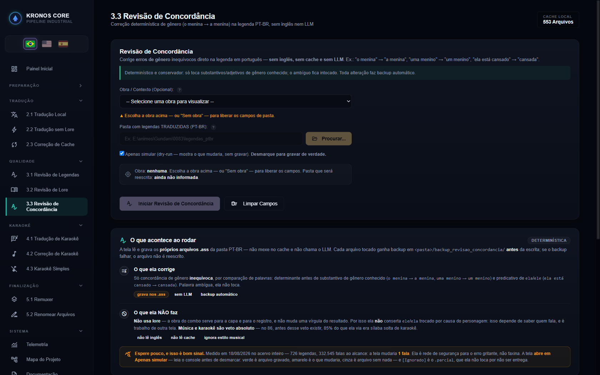
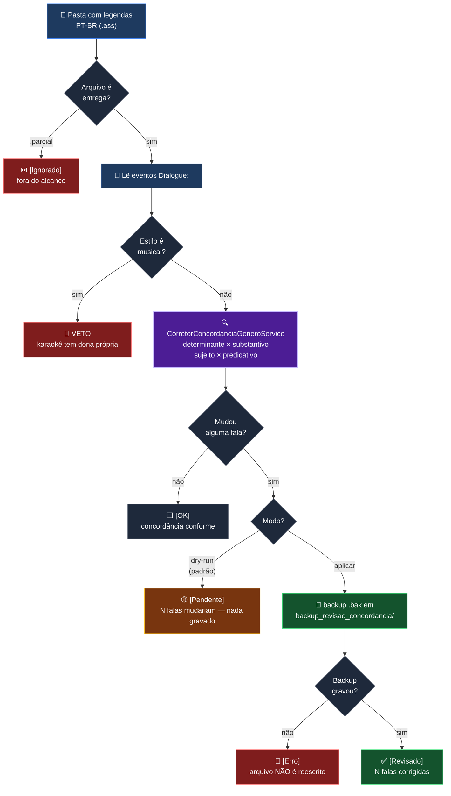

# 🔤 Etapa 3.3 — Revisão de Concordância

[← 3.2 Revisão de Lore](etapa-3.2-revisao-lore.md) | [4.1 Tradução de Karaokê →](etapa-4.1-traducao-karaoke.md)

---

## O que ela é

A **única** tela do pipeline que trabalha **só com português**: não lê o inglês, não lê o cache, não
chama o LLM. Ela abre o `.ass` PT-BR já entregue e conserta **concordância de gênero inequívoca**,
por comparação de palavras.

```
"o menina"      → "a menina"          determinante × substantivo
"uma menino"    → "um menino"
"ela está cansado" → "ela está cansada"   sujeito × predicativo
```

É a passada mais barata e a mais conservadora do projeto — e é assim de propósito. Onde as telas
3.1 e 3.2 discutem *sentido* (e por isso precisam do original e do modelo), esta discute apenas
*forma*, onde a resposta é objetiva.



---

## O que ela NÃO faz — e por que isso está escrito na tela

| não faz | motivo |
|---|---|
| **não usa lore** | a obra do combo serve para a capa e para o registro; ela não muda uma vírgula do resultado |
| **não conserta `ele`/`ela` trocado** | isso depende de saber **quem fala**, e falante é trabalho de outra tela |
| **não toca música nem karaokê** | veto absoluto — ver abaixo |
| **não abre `.parcial`** | arquivo com pendência de tradução não é entrega |
| **não toca palavra ambígua** | `guia`, `figura`, `caça`, `soldado` ficam intactas |

> Este bloco existe na interface, não só aqui. Uma tela que **reescreve o acervo** tem de dizer o
> que faz antes de o operador clicar — é a lente de boa-fé aplicada ao desenho, não documentação
> pós-fato.

---

## Fluxo



---

## A tela nasce em DRY-RUN

O checkbox **"Apenas simular"** nasce **marcado**. Para gravar de verdade é preciso desmarcá-lo —
o rótulo diz isso com todas as letras.

Isto não foi sempre assim, e a cicatriz vale a linha: até 19/08/2026 o checkbox nascia
**desmarcado** e o código fazia `aplicar = !simular`. Abrir a tela e apertar o único botão
**gravava no acervo**. As telas irmãs (`4.3 Karaokê Simples`, `5.2 Renomear Arquivos`,
`4.1 Tradução de Karaokê`) sempre tiveram **botão "Simular" separado**; a 3.3 era a exceção.

A guarda `CatracaTelaDestrutivaNasceEmDryRunTest` reprova o build se qualquer campo `*-simular`
nascer sem `checked`.

---

## O veto de música é absoluto

Karaokê pertence à fatia `traducaoKaraoke`, que sabe lidar com KFX, camadas e tempo por sílaba.
Aqui não é *"não consigo revisar"*, é **"não é meu trabalho"**.

O número que fixou a regra, medido no **86** em 16/08/2026, **antes** da guarda existir:

| | eventos ao alcance da 3.3 | do total | o que eram |
|---|---|---|---|
| 86 — Part 1 | 22.568 | de 26.524 (**85,1%**) | quase tudo sílaba solta de karaokê |
| 86 — Part 2 | 49.458 | de 53.175 (**93,0%**) | idem |

Uma tela que mexe em **gênero** — onde a heurística mais erra — enxergando 85% de sílaba solta é
dano esperando acontecer. Três catracas irmãs protegem essa fronteira hoje:
`CatracaEscritaDeFalaVetaMusicaTest`, `CatracaEscritaDeFalaVetaMusicaLoreTest` e
`CatracaEscritaDeFalaVetaMusicaConcordanciaTest`.

---

## A regra de cores do console

A mesma da 3.1 e da 3.2 — o operador não deve precisar aprender uma linguagem por tela:

| cor | rótulo | significado |
|---|---|---|
| 🟩 verde | `[Revisado]` | arquivo **escrito**, com a contagem de falas corrigidas |
| 🟨 amarelo | `[Pendente]` | nada gravado, mas há falas que **mudariam** (simulação) |
| ⬜ apagado | `[OK]` | o arquivo realmente não tinha nada a corrigir |
| 🟥 vermelho | `[Erro]` | falha de gravação — e o arquivo **não** foi reescrito |
| ⏭️ apagado | `[Ignorado]` | `.parcial` — fora do alcance por decisão, não por falha |

O banner final segue a mesma regra, e o rótulo muda com o modo: em dry-run as falas **mudariam**;
só em aplicação elas **foram corrigidas**.

> **Achado do caminho:** as contagens subiam **antes** do backup e da escrita. Uma falha ao criar o
> backup deixava o arquivo intacto no disco e o banner dizia *"1 fala corrigida"*. As contagens
> foram movidas para **depois** da gravação, com um caso vermelho provando.

---

## O que ela corrige — as famílias, e como cada uma entrou

Nenhuma família entrou por intuição. Cada uma foi **medida no acervo antes** de virar código.

### 1. Determinante + substantivo de gênero conhecido

Lista curada, cada palavra vista numa fala real do acervo. Inclui **possessivos** — metade dos
erros medidos tinha possessivo, não artigo.

```
"um isca" → "uma isca"  (17×)   ·  "o cortina" → "a cortina"  ·  "o mochila" → "a mochila"
"sua avanço" → "seu avanço"     ·  "Uma gato" → "Um gato"     ·  "O alavanca" → "A alavanca"
```

### 2. Sujeito `ela`/`ele` + predicativo adjetivo

```
"ela está cansado" → "ela está cansada"
```

### 3. Plural — entrou por medição, com padrão próprio

```
"as reforços" → "os reforços"  ·  "as reparos" → "os reparos"  ·  "os pessoas" → "as pessoas"
```

Casar número **e** gênero juntos deixaria `"o meninas"` virar `"a meninas"` — um erro por outro.
**Número divergente a tela não toca.**

### 4. Indefinidos — entrou **podada** pela medição

`algumas reparos` sobrevivia por falta de **determinante**, não de substantivo. Das 5 falas
candidatas, **3 eram falso positivo** (`"Você é muito criança"` — advérbio invariável;
`"são todos iscas"` — concorda com *alvos*). Ficaram de fora `muito/pouco/tanto` no singular,
`todo(a)(s)` e `certo(a)`.

---

## O que foi medido e **recusado**

Documentar o caminho fechado vale tanto quanto o aberto — evita reabrir a mesma porta.

| proposta | veredito | evidência |
|---|---|---|
| **Análise morfológica** para separar verbo de substantivo | ❌ não vale | o dicionário analisa o sinal como o ruído: `isca → st:iscar`, `cortina → st:cortinar`, `orgulho → st:orgulhar`. Filtrar por radical em `-ar` mataria o alvo. Separar exigiria POS tagger (spaCy/UDPipe) — dependência e modelo novos |
| **`a` como artigo feminino** | ❌ removido | antes de substantivo masculino o `a` é **preposição** e está certo: `"Graças a Deus"` viraria `"Graças o Deus"`. Foram **15 de 16** falas alteradas no acervo — 14 estragos para 1 acerto. O lado masculino mantém o `o`, que nunca é preposição |
| **Trocar só o possessivo** em `"a nossa orgulho"` | ❌ meia-correção | devolvia `"a nosso orgulho"` — discordância **nova** onde havia uma. Possessivo precedido de artigo não é tocado |
| **20 candidatas** de gênero por terminação | ❌ recusadas | ambíguas (`guia`, `figura`, `caça`, `soldado`) ou de gênero fixo contrário à terminação (`pirata`, `mecha`, `foto`, `data`) |

---

## Resultado medido no acervo

Rodado **obra a obra pela API de produção**, não por harness.

```
726 legendas (307 PT / 419 não-PT) | 2.142.264 eventos | 332.545 falas ao alcance
                                   | 1.749.570 eventos de música VETADOS

1ª rodada ......... 76 falas em 62 arquivos
2ª (indefinidos) ..  2 falas em  2 arquivos
TOTAL ............. 78 falas | 63 .bak | 11 pastas de backup | 0 fala em arquivo não-PT
IDEMPOTÊNCIA ...... 2ª passada dry-run: 15 obras, TODAS com falas = 0
```

**Espere pouco, e isso é bom sinal.** Ela é rede de segurança para o erro gritante, não faxina.
A evolução da própria tela mostra o quanto a medição mudou o alvo:

| versão | falas tocadas no acervo |
|---|---|
| lista curada de 24 palavras, com o `a` | 15 — **14 estragos, 1 acerto** |
| sem o `a` | 1 |
| + 2ª leva de substantivos e possessivos | 55 |
| + plural | 76 |
| + indefinidos podados | **78** |

---

## Backup — e a prova de que ele serve

Cada arquivo tocado ganha `.bak` em `<pasta>/backup_revisao_concordancia/` **antes** da escrita.
Se o backup falhar, o arquivo **não** é reescrito.

O `diff` do `.bak` contra o arquivo atual (ZZ S01E06) mostra exatamente as linhas trocadas, com
tempo, estilo e tags idênticos — nada além do gênero mudou.

---

## Contrato REST

| Endpoint | Payload | Canal SSE |
|----------|---------|-----------|
| `POST /api/revisar-concordancia` | `{diretorioTraduzido, aplicar}` | `revisao-concordancia` |

`aplicar = false` é dry-run. O trabalho entra na **fila única do pipeline** — a 3.3 nunca roda em
paralelo com tradução ou revisão.

---

## A fatia por dentro

```
revisaoConcordancia/                                    4 classes · 511 linhas
├── application/
│   ├── CorretorConcordanciaGeneroService.java   477 l  o motor determinístico
│   └── RevisarConcordanciaUseCase.java          279 l  varredura, veto, backup, relatório
├── domain/
│   └── ResultadoConcordancia.java                41 l  value object do desfecho
└── presentation/
    └── RevisaoConcordanciaController.java       142 l  POST + fila + console
```

**INBOUND 0** — nenhuma outra fatia a consome. **OUTBOUND 12 tipos** — `core` (5), `legenda` (5) e
`telemetria` (2). **Zero aresta fatia → fatia.**

> `arquivosAnalisados` conta o que foi **revisado**, não o que existe na pasta. O que ficou de fora
> vai em `arquivosForaDoAlcance`, numa linha separada: somar os dois faria o relatório dizer
> *"47 analisados"* quando parte deles sequer foi aberta — e número que mistura *"revisei"* com
> *"nem olhei"* é pior que número nenhum, porque parece prova.

---

## Guardas que protegem esta tela

| guarda | o que impede |
|---|---|
| `CatracaTelaDestrutivaNasceEmDryRunTest` | tela destrutiva nascer gravando |
| `CatracaEscritaDeFalaVetaMusicaConcordanciaTest` | a fatia escrever em fala de estilo musical |
| `CatracaAvisoSonoroNasTelasLongasTest` | a tela terminar o lote em silêncio |
| `CatracaSeletorDeObraRegistradoTest` | o combo de obra abrir vazio |
| `CatracaCartaoDoAlvoTemDonoUnicoTest` | o cartão do alvo divergir entre 3.1, 3.2 e 3.3 |

---

## Limites declarados

- **O tamanho real do defeito de concordância PT-only não está medido.** Os instrumentos de hoje
  acham pouco — e instrumento saturado em zero é hipótese, não conclusão. Ampliar famílias antes de
  medir é escrever corretor para defeito que ninguém provou existir.
- **Portão de saída por dicionário (pt_BR) não existe ainda.** O hunspell desta máquina (312.369
  entradas, 25.932 regras de afixo) sabe dizer o que **não existe** (`asdfgh` → `#`), mas **não é
  oráculo de gênero** (`garota` → `st:garotar`). O uso correto seria: nenhuma palavra escrita pela
  3.3 pode ser desconhecida do pt_BR.

---

## Navegação

| Anterior | Próximo |
|----------|---------|
| [← 3.2 Revisão de Lore](etapa-3.2-revisao-lore.md) | [4.1 Tradução de Karaokê →](etapa-4.1-traducao-karaoke.md) |
