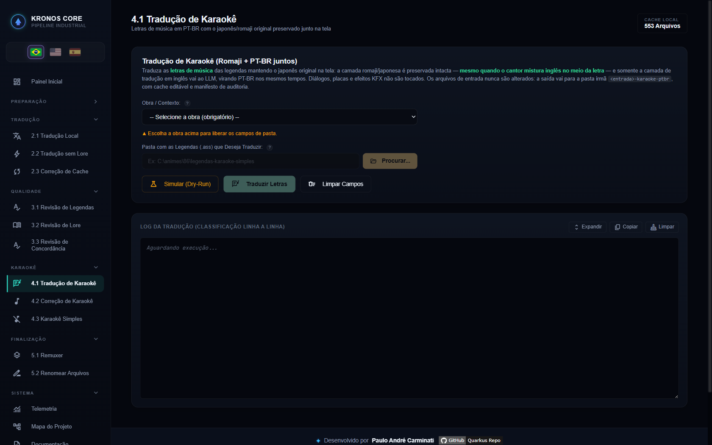
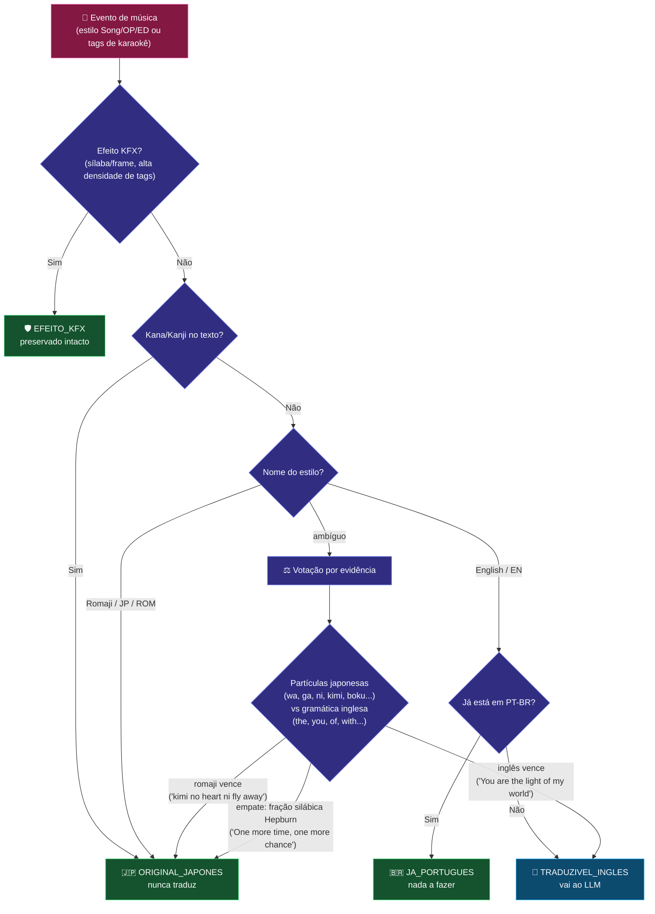
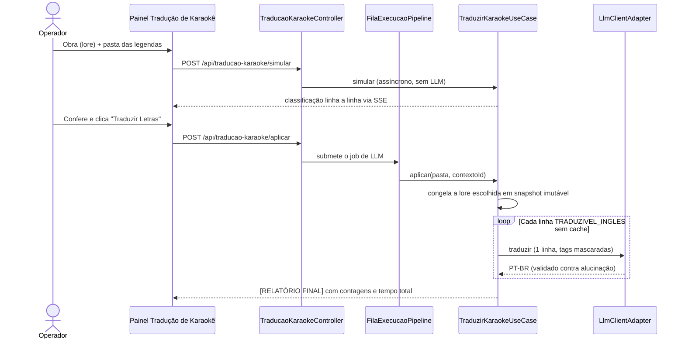

# 🎤 Módulo: Karaokê (Traduzir + Achatar — tela única)

[← Revisão de Concordância](etapa-3.3-revisao-concordancia.md) | [Correção de Karaoke →](etapa-4.2-cura-tags.md)

---

> **Tela única desde 21/09/2026.** O antigo **4.3 Karaokê Simples** (achatar/limpar) foi absorvido como o **Passo 2** desta mesma tela. As duas passadas são independentes e se aplicam na ordem **traduzir → achatar**; o backend das duas continua separado (`/api/traducao-karaoke/*` e `/api/novo-karaoke/*`), unido só na interface. Escolher a obra (ou **"sem lore"**) exibe a capa/lore e libera as passadas, no padrão de trava de lore das telas 3.x.

## Para que serve

Painel **"4.1 Karaokê"** da SPA (grupo **Karaokê**). Duas passadas:

- **Passo 1 — Traduzir:** traduz as **letras de música** mantendo o japonês original junto na tela — a camada **romaji/japonesa é preservada intacta** e apenas a camada de **tradução em inglês** vai ao LLM, virando PT-BR nos mesmos tempos.
- **Passo 2 — Achatar / limpar:** remove a animação de karaokê (KFX) e entrega **uma linha limpa por frase** — romaji em cima, PT-BR embaixo. Existe porque a geometria animada (`\clip`, posição por sílaba) é feita para os glifos originais; a tradução tem tamanho diferente e **quebra nessa geometria**. Achatar depois de traduzir resolve a "zona" de romaji + inglês + PT sobrepostos.

O problema central que o módulo resolve: **cantores japoneses misturam inglês no meio da letra** (*"kimi no heart ni fly away"*). Uma detecção ingênua de "linha em inglês" mandaria a letra original para o LLM e a destruiria. Aqui a classificação é **por evidência**, com viés de preservação.



---

## Pacote e classes principais

| Classe | Papel |
|--------|-------|
| `ClassificadorLetraKaraokeService` (`application`) | O coração do módulo: decide por linha se é letra original (preservar), tradução em inglês (traduzir), já PT-BR ou efeito KFX |
| `TraduzirKaraokeUseCase` (`application`) | Orquestra: classifica, consulta cache, chama o LLM linha a linha, grava a saída |
| `ClasseLinhaKaraoke` (`domain`) | Enum das 5 classes de linha |
| `ResultadoTraducaoKaraoke` (`domain`) | Métricas por arquivo (preservadas, traduzidas, cache, sem tradução) |
| `TraducaoKaraokePersistencia` (`infrastructure`) | Manifesto de auditoria em `logs/traducao-karaoke/manifestos/` |
| `TraducaoKaraokeController` (`presentation`) | Endpoints REST — simulação assíncrona; aplicação via fila do pipeline |

---

## Como uma linha de música é classificada


```mermaid
flowchart TB
    A["🎼 Evento de música<br/>(estilo Song/OP/ED ou tags de karaokê)"] --> B{"Efeito KFX?<br/>(sílaba/frame, alta densidade de tags)"}
    B -->|Sim| KFX["🛡️ EFEITO_KFX<br/>preservado intacto"]
    B -->|Não| C{"Kana/Kanji no texto?"}
    C -->|Sim| JP["🇯🇵 ORIGINAL_JAPONES<br/>nunca traduz"]
    C -->|Não| D{"Nome do estilo?"}
    D -->|"Romaji / JP / ROM"| JP
    D -->|"English / EN"| E{"Já está em PT-BR?"}
    D -->|ambíguo| F["⚖️ Votação por evidência"]
    E -->|Sim| PT["🇧🇷 JA_PORTUGUES<br/>nada a fazer"]
    E -->|Não| EN["🔁 TRADUZIVEL_INGLES<br/>vai ao LLM"]
    F --> G{"Partículas japonesas<br/>(wa, ga, ni, kimi, boku...)<br/>vs gramática inglesa<br/>(the, you, of, with...)"}
    G -->|"romaji vence<br/>('kimi no heart ni fly away')"| JP
    G -->|"inglês vence<br/>('You are the light of my world')"| EN
    G -->|"empate: fração silábica Hepburn<br/>('One more time, one more chance')"| JP

    classDef entrada fill:#831843,stroke:#F472B6,color:#F9FAFB
    classDef decisao fill:#312e81,stroke:#818CF8,color:#F9FAFB
    classDef preserva fill:#14532d,stroke:#4ADE80,color:#F9FAFB
    classDef traduz fill:#0c4a6e,stroke:#38BDF8,color:#F9FAFB
    class A entrada
    class B,C,D,E,F,G decisao
    class KFX,JP,PT preserva
    class EN traduz
```

> ⚖️ **Na dúvida, o viés é PRESERVAR** — deixar uma linha de música sem traduzir custa menos que destruir a letra original. O **dry-run mostra a classificação linha a linha** antes de gastar qualquer chamada de LLM.

---

## Fluxo de execução


```mermaid
sequenceDiagram
    actor Op as Operador
    participant UI as Painel Tradução de Karaokê
    participant API as TraducaoKaraokeController
    participant Fila as FilaExecucaoPipeline
    participant UC as TraduzirKaraokeUseCase
    participant LLM as LlmClientAdapter

    Op->>UI: Obra (lore) + pasta das legendas
    UI->>API: POST /api/traducao-karaoke/simular
    API->>UC: simular (assíncrono, sem LLM)
    UC-->>UI: classificação linha a linha via SSE

    Op->>UI: Confere e clica "Traduzir Letras"
    UI->>API: POST /api/traducao-karaoke/aplicar
    API->>Fila: submete o job de LLM
    Fila->>UC: aplicar(pasta, contextoId)
    UC->>UC: congela a lore escolhida em snapshot imutável
    loop Cada linha TRADUZIVEL_INGLES sem cache
        UC->>LLM: traduzir (1 linha, tags mascaradas)
        LLM-->>UC: PT-BR (validado contra alucinação)
    end
    UC-->>UI: [RELATÓRIO FINAL] com contagens e tempo total
```

---

## Garantias de segurança

- **Entrada intocada**: a saída vai para a pasta irmã `<entrada>-karaoke-ptbr`, com o **mesmo nome de arquivo** (o pareamento do [Remuxer](etapa-5.1-remuxer.md) continua funcionando).
- **Cache editável por arquivo** em `cache/karaoke/*.cache.json` — mesmo fluxo de correção manual da [Tradução Local](etapa-2.1-traducao-llm.md); refrão repetido gasta **uma** chamada de LLM.
- Falha ou alucinação do LLM numa linha **mantém a linha original** com aviso — nunca derruba o arquivo.
- Diálogos, placas e efeitos KFX passam **byte a byte** — o módulo só toca música.
- A aplicação roda **na fila única do pipeline**, mas não relê a lore global: o `contextoId` escolhido vira um snapshot imutável e seu prompt é passado explicitamente em todas as chamadas ao LLM.
- Cache, manifesto e telemetria registram o ID e a proveniência do contexto usado; cache legado sem carimbo não é reaproveitado automaticamente.

---

## O que mudou entre 07 e 15/08/2026 — quatro consertos, todos medidos

### 1. O gradiente de cor sobrevive à tradução (`GradienteKaraoke`)

Linha pintada **letra a letra** — o gradiente que os fansubs aplicam no OP/ED — tem **uma tag por
letra**. O mascarador produzia 10 a 30 marcadores intercalados, e nenhum LLM os devolve na ordem.

```
Guilty Crown, 07/08/2026: das 31 linhas recusadas numa execucao,
28 cairam por "Marcadores de formatacao ([[TAGn]])"

a unica que passou pelo validador saiu assim:
  So, everything that makes me whole
  -> So, eu e evidentementereithyingthathingthatmakes mea whole wholed
```

Agora **só o texto vai ao LLM** e as **mesmas cores voltam distribuídas** sobre a tradução. Nenhuma
tag viaja.

### 2. A tradução vinha certa e era jogada fora por falta de um marcador

O veto de `\t(` era aplicado ao **texto inteiro**, não ao trecho que importava — e derrubava
proposta correta. Medido numa execução do **86**: **2.987 recusas**, que caíram para **4** depois
do conserto.

### 3. O corretor ortográfico saiu da ORIGEM e foi para a SAÍDA

Ele estava antes do cache; passou para depois, que é por onde a legenda realmente sai. Nasce com
**preservação como padrão** — na dúvida, não mexe.

### 4. O acento tem lista PRÓPRIA, e a razão é o romaji

`AcentosLetraKaraoke` **não** reusa a lista de 162 entradas do diálogo (`NormalizadorAcentosComuns`).
Medido em 14/08/2026 contra o dicionário `ja_ROMAJI` do próprio projeto (129.745 formas): **quatro
daquelas entradas também são romaji válido** —

```
ate    mae    nao    sao
```

No diálogo elas nunca fizeram mal, porque ali não existe camada japonesa. Aqui, `mae` é 前
("antes") e virou **`mãe` 100 vezes** nos 50 episódios do Unicorn.

> **É duplicação declarada, e a medição é o motivo.** A regra que Paulo enunciou em 14/08: a
> camada resolve o problema **dela** e não empurra o próprio dano para as vizinhas. A lista daqui
> é montada do que foi medido **na saída do karaokê** — na tradução do 86, a camada portuguesa
> saiu com `nao` sem acento em 5 falas distintas, presentes em 918 linhas do arquivo (o gradiente
> de `\clip` repete a mesma fala centenas de vezes).

---

## O que mudou em 09/10/2026 — a tag no meio da frase e a linha fatiada

Na 4.1 aplicada ao acervo inteiro em 09/10/2026, **70 das 71 recusas em 12 obras** eram do Guilty
Crown: três frases do OP_S2, em 10 episódios, todas pelo mascarador.

| frase | forma | o que acontecia |
|-------|-------|-----------------|
| `that your eyes were given to you to {\c…}acknowledge others,` | cor trocando no meio da frase | tradução **certa** descartada por marcador perdido |
| `N{\3c…}o{\3c…}t{…}i{…}c{…}e` | gradiente de 6 blocos (o `GradienteKaraoke` exige 10) | o modelo recebia letras soltas entre marcadores e pedia contexto em 3 linhas |
| `r{\3c…}e{…}l{…}y` | gradiente de 4 blocos | "Relatório recebido. Início da transmissão." |

### 5. Segundo tiro sem marcador (`TagsNoMeioDaLetra`)

Quando o mascarador falha por **marcador perdido** ou **linhas a mais**, a frase vai ao modelo
**limpa** e as tags do original voltam recolocadas: posição proporcional, encaixada no mesmo tipo
de fronteira que ocupava (tag que abria palavra volta abrindo palavra — a cor nunca troca no meio
de "pa|ra"). Onde o mascarador acerta, nada muda: a tag continua onde o próprio modelo a pôs.

O portão deste tiro é **mais estrito** que o dos outros caminhos — `validarFala` **e**
`validarPar`. Sem o segundo, a invenção ("Relatório recebido…", 4 → 41 caracteres) e o eco
("rely" → "rely") passariam; as duas mutações foram vistas reprovando. Vetos: `\k`, `\N`, desenho.

### 6. A linha fatiada dentro do romaji não empilha

O fansub partiu "that your eyes…" em **cinco eventos** dentro de **um** romaji de 5,4 s (o efeito
de pulsar). O pareamento de camadas olhava as duas pontas (folga de 0,5 s, F6 de 24/09) e nenhuma
fatia casava — as cinco empilhariam `inglês\Nportuguês` com o romaji já na tela. Agora o evento
**contido** na janela da camada original também conta como o mesmo momento; o que vaza da janela
continua empilhando.

Medido pelo plano de produção sobre o acervo (`MedicaoCamadaOriginalNoInstanteIT`, foto antes ×
depois por identidade do evento): **50 de 14.375** linhas traduzíveis mudam de decisão — todas as
fatias do Guilty Crown, nenhuma outra.

### Resultado no acervo

Guilty Crown regravado em 09/10/2026 (cache e saída com backup conferido): **inglês restante 70 →
0** em 683 linhas de música; diferença para a saída anterior = exatamente as 70 linhas do OP_S2,
mesmos eventos e tempos. Cada frase saiu igual nos 10 episódios:

```
that your eyes were given to you to acknowledge others,  =>  que os seus olhos foram dados a você para reconhecer os outros,
Notice                                                     =>  Notem.
rely                                                       =>  rely\NConfie.   (sem romaji naquele instante: empilha, como desenhado)
```

> **Leitura do resumo:** o "LLM: N" do relatório conta toda linha que não veio do cache — inclusive
> a repetida no mesmo arquivo e a reaproveitada de outra camada (`[CAMADA]`), que não chamam o
> modelo. Na rodada do Guilty Crown foram 99 no resumo = 50 originais distintos que foram ao
> modelo (cada um em dois tiros: 100 chamadas; são as 50 entradas novas do cache) + 25 repetições
> no mesmo arquivo + 24 reaproveitamentos de camada.

---

## Passo 2 — Achatar / Limpar (KFX → linha limpa; o antigo Karaokê Simples)

Converte karaokê KFX de fansub — **milhares de eventos por sílaba/letra/frame** do Kara Templater do Aegisub — em **uma linha limpa por frase, no mesmo tempo do efeito original**. Sem LLM: só reagrupa e limpa. Na tela única, o Passo 2 aponta automaticamente para a saída do Passo 1 (`<entrada>-karaoke-ptbr`) — traduzir e depois achatar entrega romaji + PT limpo, sem a animação que quebra a tradução.

| Classe | Papel |
|--------|-------|
| `ConversorKaraokeUseCase` (`application`, fatia `novoKaraoke`) | Agrupa fragmentos KFX em frases, reconstrói a linha limpa e reescreve o `.ass` |
| `EventoAss` / `LinhaSimplesKaraoke` (`domain`) | Parse dos eventos ASS e a linha reconstruída (início, fim, texto) |
| `ResultadoConversaoKaraoke` (`domain`) | Métricas por arquivo (eventos removidos, linhas criadas, preservados por segurança) |
| `NovoKaraokePersistencia` (`infrastructure`) | Manifesto de auditoria em `logs/novo-karaoke/manifestos/` |
| `NovoKaraokeController` (`presentation`) | Endpoints REST `/api/novo-karaoke/*` — simular e aplicar em background |

**Garantias do achatamento:** entrada NUNCA alterada (saída em pasta destino obrigatoriamente diferente — vazia cria `legenda-simplificada` ao lado das legendas da obra); diálogo/placas/`Comment:` byte a byte; bloco KFX que não reconstrói com confiança é **mantido intacto** (viés de preservação); romaji preservado e empilhado ACIMA das outras camadas com `\N`; variantes divergentes da mesma frase deduplicadas por sobreposição + similaridade (romaji original vence texto pulverizado).

---

## Endpoints REST

As duas passadas moram na mesma tela e logam no **mesmo console** (os dois canais SSE apontam para `console-traducao-karaoke`).

| Passo | Endpoint | Payload | Canal SSE |
|-------|----------|---------|-----------|
| 1 Traduzir (dry-run) | `POST /api/traducao-karaoke/simular` | `{caminhoOrigem, contextoId}` | `traducao-karaoke` |
| 1 Traduzir (aplicar) | `POST /api/traducao-karaoke/aplicar` | `{caminhoOrigem, contextoId}` | `traducao-karaoke` |
| 2 Achatar (dry-run) | `POST /api/novo-karaoke/simular` | `{caminhoOrigem, caminhoDestino}` | `novo-karaoke` |
| 2 Achatar (aplicar) | `POST /api/novo-karaoke/aplicar` | `{caminhoOrigem, caminhoDestino}` | `novo-karaoke` |

```json
{ "caminhoOrigem": "C:/animes/86/86 Part 1/traducao_ptbr", "contextoId": "eight_six" }
```

O Passo 1 traduz via fila do pipeline (LLM); o Passo 2 roda local (sem LLM). Ambos os "aplicar" acompanham a fila e tocam o aviso sonoro ao terminar.

---

## Pontos de atenção

- O módulo vem **antes da [Correção de Karaoke](etapa-4.2-cura-tags.md)**. A ordem interna é **traduzir (Passo 1) e depois achatar (Passo 2)**: achatar por último remove a animação e deixa a linha legível.
- Estilos rotulados decidem primeiro (`OP - Romaji` preserva, `OP - English` traduz) — a votação por evidência só entra em estilos ambíguos (`Song`, `Insert`).
- Letra 100% em inglês **cantada no original** (ex.: *"One more time, one more chance"*) é preservada pelo desempate silábico — se ela estiver na camada de tradução com estilo rotulado `English`, é traduzida normalmente.

---

## Navegação

| Anterior | Próximo |
|----------|---------|
| [← Revisão de Concordância](etapa-3.3-revisao-concordancia.md) | [Correção de Karaoke →](etapa-4.2-cura-tags.md) |
