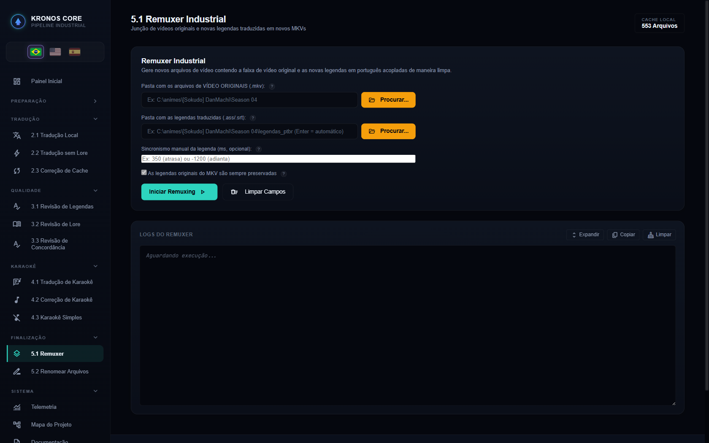
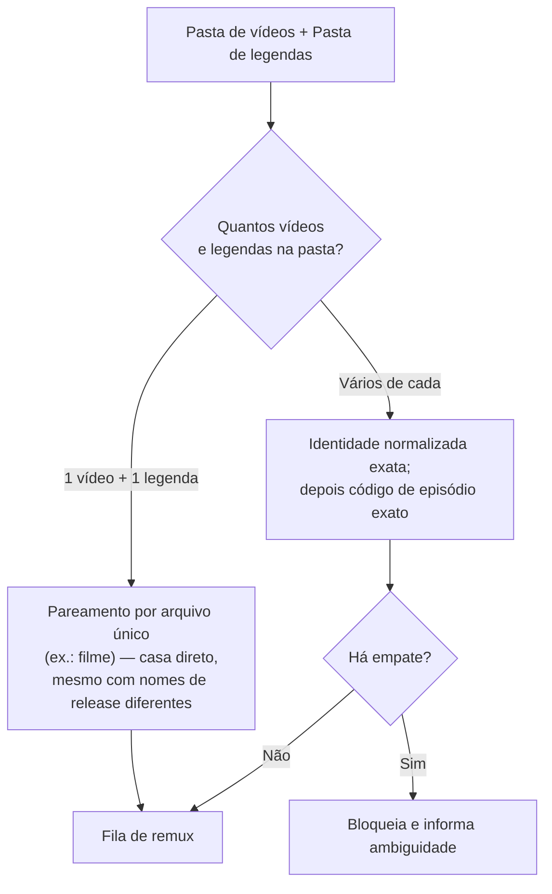
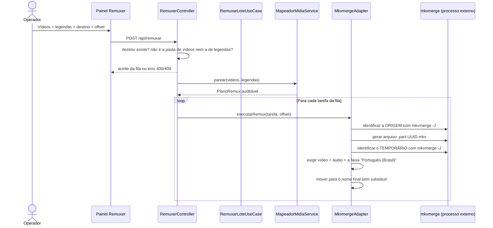

# 📦 Módulo: Remuxer

[← Troca Tipo Legenda](etapa-1.3-troca-tipo-legenda.md) | [Renomear Arquivos →](etapa-5.2-renomear-arquivos.md)

---

## Para que serve

Última etapa do pipeline: combina o **vídeo original** com a **legenda traduzida** (já revisada/curada) num novo arquivo `.mkv`, via `mkvmerge` (MKVToolNix), preservando vídeo e áudio sem recodificação.

**As legendas originais nunca são removidas.** A PT-BR entra como faixa **padrão** — é a que abre no player — e as que já estavam no arquivo continuam disponíveis como segunda escolha. Não existe modo, opção ou flag que descarte faixa: o caminho que emitia `--no-subtitles` foi **removido** em 2026-07-29, porque perder a legenda de origem é irreversível a partir do MKV remuxado e o material bruto pode não existir mais.

> Esta seção afirmava o contrário até 2026-09-02 — dizia que "por padrão as legendas antigas são removidas". A frase sobreviveu cinco semanas à remoção do caminho destrutivo, em três lugares ao mesmo tempo: aqui, na ficha da tela e no console do CLI, que anunciava "remover legendas originais" enquanto o adaptador preservava tudo.



---

## Pacote e classes principais

| Classe | Papel |
|--------|-------|
| `RemuxarLoteUseCase` (`application`) | Orquestra a fila de tarefas de remux do lote |
| `MapeadorMidiaService` | Pareia cada vídeo com sua legenda correspondente na pasta |
| `MkvmergeAdapter` (`infrastructure/adapters`) | Gera em temporário, inspeciona o container e publica sem sobrescrever |
| `PastaDeLegendaDoRemux` (`domain`) | Dono único da pergunta "onde estão as legendas traduzidas?", consultado pela tela e pelo CLI |
| `PlanoRemux` (`domain`) | Expõe tarefas, ausências, ambiguidades e avisos antes da execução |
| `RelatorioRemux` (`domain`) | Consolida sucessos, pendências, falhas, cancelamento e telemetria |

---

## Pareamento vídeo ↔ legenda



As listas são ordenadas antes do pareamento, cada legenda só pode ser usada uma vez e códigos como episódio `01` e `010` não são tratados como iguais. Em empate, o Remuxer não escolhe a primeira legenda por acaso: ele registra uma pendência. Legendas completas PT-BR e `.ass` recebem prioridade sobre faixas `Forced`, `Signs` ou `Songs`.

O caso de filme com exatamente um vídeo e uma legenda continua aceitando nomes de releases diferentes. Confira o sincronismo quando vídeo e legenda vierem de fontes distintas.

O nome final deriva da legenda curada. Tags de tracker, resolução, codec, CRC, `TrackN` e idioma são removidas; títulos editoriais, como `(Narrative)`, são preservados. Exemplo: `Mobile Suit Gundam NT (Narrative).ass` gera `Mobile Suit Gundam NT (Narrative)_PTBR.mkv`.

---

## Sincronismo manual (offset)

O formulário do Remuxer aceita um campo opcional de **sincronismo manual em milissegundos**:

- Positivo → **atrasa** a legenda
- Negativo → **adianta** a legenda

Esse valor é passado como `--sync 0:<ms>` ao `mkvmerge`, que desloca **linearmente todos os timestamps** da faixa de legenda pelo valor informado.

> ⚠️ O offset é aplicado **igualmente a todos os itens da fila do lote** — não é por arquivo individual. Se o valor foi calculado/ajustado para um episódio específico e a mesma execução processa um lote com outros arquivos (ou um filme com timing diferente), todos recebem o mesmo deslocamento. Confira o campo antes de cada execução, especialmente ao misturar um filme com uma leva de episódios na mesma operação.

O [relatório de Análise de Mídia](etapa-1.1-analise-midia.md#o-que-é-auditado-por-faixa) já sugere o valor de offset em ms quando detecta um "atraso constante" — use esse número como ponto de partida.

---

## Fluxo de execução



A validação do temporário exige a faixa **carimbada por este remux**, não "alguma legenda em português". A diferença importa no acervo real: o *Sidonia* já traz faixa PT da Netflix, e o critério antigo daria verde a um MKV publicado sem a tradução.

O destino final nunca é escrito diretamente. Falha, timeout ou cancelamento removem somente o temporário exclusivo daquela execução. Se o destino já existir — inclusive se surgir enquanto o processo roda — ele é preservado e o item aparece como pendência.

---

## Endpoint REST

### `POST /api/remuxar`

```json
{
  "entrada": "C:/animes/Gundam Narrative NT",
  "saida": "C:/animes/Gundam Narrative NT/traducao_ptbr",
  "pastaDestino": "E:/prontos/Gundam NT",
  "syncOffsetMs": 0
}
```

| Campo | Obrigatório | Descrição |
|-------|:-----------:|-----------|
| `entrada` | ✅ | Pasta com os vídeos originais |
| `saida` | ⚪ | Pasta com `.ass`/`.srt` **traduzidos** — nome herdado do contrato, não é a saída do remux. Vazio procura a subpasta `traducao_ptbr` ao lado dos vídeos |
| `pastaDestino` | ⚪ | Onde gravar os `.mkv` finais. Vazio ⇒ `mkv_final_ptbr/` dentro da pasta de vídeos. Precisa existir, e **não pode ser** a pasta de vídeos nem a de legendas |
| `syncOffsetMs` | ⚪ | Inteiro entre -86.400.000 e 86.400.000 ms, aplicado a todo o lote |
| `preservarLegendasOriginais` | ⚪ | **Aceito e ignorado.** Continua no contrato para não quebrar cliente antigo; não existe caminho que apague faixa |

**Saída:** novos `.mkv` na pasta de destino — `mkv_final_ptbr/` dentro da pasta de vídeos por padrão, ou a pasta escolhida no campo *"Pasta onde salvar os MKVs finais"* da tela (botão **Procurar...**, seletor nativo do Windows).

> **Por que o destino não pode ser a pasta de vídeos.** Não é medo de sobrescrever — disso o remuxer já cuida, preservando qualquer destino que exista. É que a pasta de vídeos é o diretório varrido em busca de **entrada**: um `X_PTBR.mkv` gravado ali seria lido como vídeo original na execução seguinte, e o acervo passaria a ter remux de remux sem nenhum aviso. A recusa vem em `400` na borda, e o caso de uso confere de novo — o CLI entra pelo mesmo ponto.

O endpoint rejeita pasta inválida antes da fila (`400`) e nova solicitação quando já há operação em execução ou aguardando (`409`). O console mostra progresso por arquivo e termina com `CONCLUIDO`, `CONCLUIDO_COM_PENDENCIAS`, `CONCLUIDO_COM_FALHAS`, `CANCELADO` ou `SEM_ARQUIVOS`. O mesmo resumo é registrado na telemetria para formar dataset de diagnóstico e melhoria do projeto.

---

## Navegação

| Anterior | Próximo |
|----------|---------|
| [← Troca Tipo Legenda](etapa-1.3-troca-tipo-legenda.md) | [Renomear Arquivos →](etapa-5.2-renomear-arquivos.md) |
