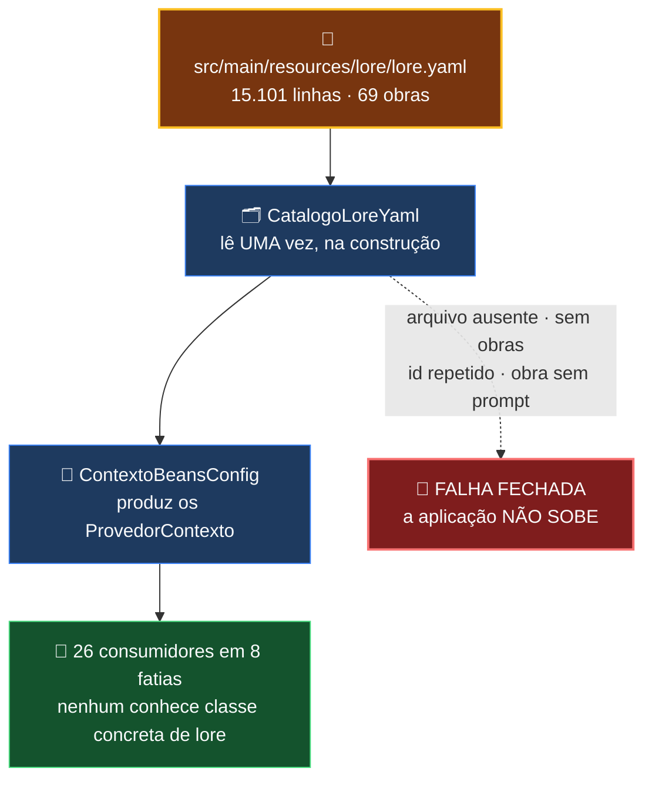

# 🎭 Contextos & Lore

[← 5.2 Renomear Arquivos](etapa-5.2-renomear-arquivos.md) | [Módulo Telemetria →](modulo-telemetria.md)

---

## O que é um "contexto"

Um **contexto** é o *system prompt + lore* de uma obra: nomes próprios que não se traduzem,
terminologia própria do universo, **gênero dos personagens** (informação crítica para a revisão de
concordância) e o tom geral da tradução. Todo painel que chama o LLM aceita um `contextoId`.

---

## A lore é DADO, não código — desde 15/08/2026

> Ordem de Paulo: *"todas as lores devem ficar em um único arquivo"*.

Antes: **82 classes Java**, 11.369 linhas. Hoje: **um** `src/main/resources/lore/lore.yaml` de
**15.101 linhas**, lido no boot.

A decisão foi medida antes de ser tomada: as 82 classes tinham **zero** lógica condicional —
nenhuma lore decidia nada, todas devolviam literais. *Classe Java para guardar literal é cerimônia
que cobra o preço de compilar, revisar e duplicar* — e foi essa duplicação que deixou a **tradução
sem 69 termos que a revisão já conhecia**.



**Falha fechada é deliberada:** catálogo de lore silenciosamente vazio faria o pipeline traduzir
**sem lore nenhuma e gravar o resultado** — o dano apareceria na legenda, semanas depois, e não no
boot.

> **O que NÃO mudou:** o contrato continua sendo `ProvedorContexto`. Os 26 consumidores não
> souberam da troca, porque nenhum deles conhecia classe concreta de lore. Era essa indireção que
> tornou a migração possível sem tocar em quem usa.
>
> A equivalência foi provada **antes** da troca, com as duas fontes vivas ao mesmo tempo
> (`EquivalenciaLoreYamlIT`, 69 obras campo a campo). Depois da troca essa comparação vira
> tautologia — quem segue provando o conteúdo é o `manifesto-lore.properties` (hash de prompt,
> nome e termos por obra) e os dois baselines de terminologia e de campos, que comparam o vivo
> contra fotografia congelada.

---

## O que o arquivo contém — medido

```
seção  obras:        69 obras     (68 aparecem na lista da UI; 1 com apareceNaLista: false)
                     2.192 termos protegidos
                     2.048 correções de terminologia
                        30 apelidos de pasta
                         9 pares inconfundíveis
seção  revisao:      69 obras
                     2.103 correções de terminologia
                        43 equivalências aceitas
```

| campo | para que serve |
|---|---|
| `prompt` | o system prompt da obra — ambientação, tom, regras |
| `termosProtegidos` | nomes que **não** se traduzem. Desde 18/08 é também a **fonte da 3.2** |
| `correcoesTerminologia` | forma-ruim → canônica. Só dispara quando o inglês contém o canônico |
| `equivalenciasAceitas` | tradução **correta** que a revisão deve parar de acusar |
| `apelidosPasta` | nomes de pasta que resolvem para esta obra |
| `paresInconfundiveis` | pares que a checagem de ambiguidade não pode confundir |
| `apareceNaLista` | se entra no `<select>` da UI |

---

## As cicatrizes dentro do YAML — e por que não é JSON

O arquivo carrega **comentários que são medição real**, migrados à mão das classes Java. Exemplos
do que está escrito lá dentro:

- `"Newtypes"` no plural **não** casava o canônico `"Newtype"`, e a restauração nunca disparava —
  medido numa corrida de ZZ, onde a fala saiu como *"uma reunião de novos tipos"*;
- `"terno"` é roupa social e **jamais** serve para *Mobile Suit*, em nenhuma combinação — decisão
  do dono do acervo;
- mas `"móvel de combate"`, `"unidade móvel"` e `"unidades móveis"` **passam** de propósito: foram
  101 falas de ZZ que o enforcer deixa em paz, porque reescrevê-las corromperia tradução legítima.

> **Regenerar o arquivo com o gerador produz ZERO comentário.** Copiar o gerado por cima **apaga
> toda a cicatriz** — e a guarda `CatracaCicatrizNoLoreYamlTest` existe para isso reprovar o build
> em vez de passar em silêncio.

---

## As três agregadoras Macross ficam FORA do CDI — de propósito

`ContextoMacross7Filmes`, `ContextoMacrossDeltaFilmes` e `ContextoMacrossFrontierFilmes` existem
como classes e **não** têm `@Component`. A ausência é **decisão de qualidade de tradução**, não
esquecimento: elas agregam filmes cuja lore conflita quando misturada.

`CatracaAgregadorasForaDoCdiTest` impede que alguém "conserte" isso.

---

## Endpoint REST

### `GET /api/contextos`

Popula os `<select>` de contexto em cada painel:

```json
[
  { "id": "eight_six", "nome": "86 (Eighty-Six)", "grupo": "", "padrao": false },
  { "id": "break_blade_1", "nome": "Break Blade - Filme 1 - O Tempo do Despertar",
    "grupo": "Break Blade", "padrao": false }
]
```

O campo `grupo` é o que permite ao `<select>` agrupar por franquia (`<optgroup>`).

---

## Adicionando uma obra nova

**Não se cria classe Java.** O caminho é o arquivo:

1. abra `src/main/resources/lore/lore.yaml` e acrescente a obra na seção `obras:`, com
   `id`, `nome`, `prompt` e — quando houver — `termosProtegidos` e `correcoesTerminologia`;
2. se a obra também precisa de revisão de lore, acrescente o par na seção `revisao:`;
3. escreva a **cicatriz** ao lado de qualquer regra não óbvia: o comentário é parte do dado, e é
   o que impede a próxima pessoa (ou IA) de "limpar" a regra sem saber o que ela custou;
4. suba a aplicação. Se o arquivo estiver inválido, ela **não sobe** — e isso é o comportamento
   correto.

> **Nome novo no `termosProtegidos` passa a render na 3.2 imediatamente**, porque desde 18/08 a
> Revisão de Lore lê essa mesma lista em vez de um roster próprio.

---

## Navegação

| Anterior | Próximo |
|----------|---------|
| [← 5.2 Renomear Arquivos](etapa-5.2-renomear-arquivos.md) | [Módulo Telemetria →](modulo-telemetria.md) |
