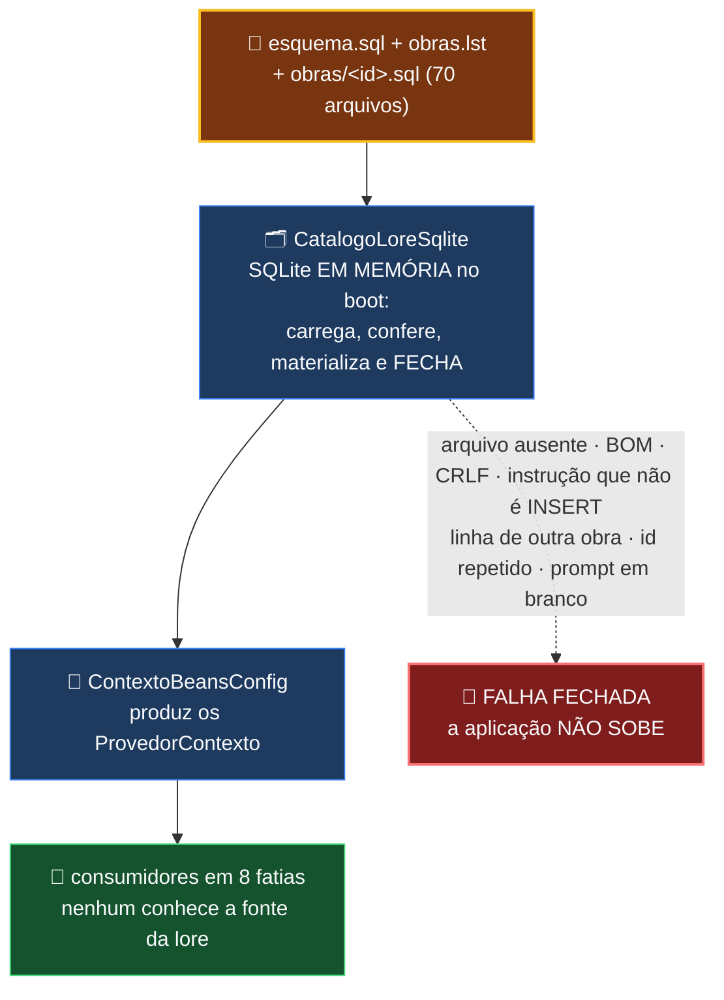

# 🎭 Contextos & Lore

[← 5.2 Renomear Arquivos](etapa-5.2-renomear-arquivos.md) | [Módulo Telemetria →](modulo-telemetria.md)

---

## O que é um "contexto"

Um **contexto** é o *system prompt + lore* de uma obra: nomes próprios que não se traduzem,
terminologia própria do universo, **gênero dos personagens** (informação crítica para a revisão de
concordância) e o tom geral da tradução. Todo painel que chama o LLM aceita um `contextoId`.

---

## A lore é DADO, não código — um arquivo SQL por obra desde 09/10/2026

> Ordem de Paulo em 15/08/2026: *"todas as lores devem ficar em um único arquivo"*.

| quando | onde a lore morava |
|---|---|
| até 15/08/2026 | **82 classes Java**, 11.369 linhas, com **zero** lógica condicional |
| 15/08 a 09/10/2026 | **um** `lore.yaml` de 15.565 linhas (1 MB), lido no boot |
| desde 09/10/2026 | **um arquivo SQL por obra** (~13 KB), carregado num SQLite em memória no boot |

Por que saiu do YAML: para corrigir ou anexar a lore de uma obra era preciso abrir 1 MB, e o arquivo
crescia ~13 KB por obra nova. Agora cada obra é um arquivo, o esquema impõe as regras e dá para
auditar a lore inteira com `sqlite3`.

```
src/main/resources/lore/
├── esquema.sql        ← as tabelas e as restrições (chave primária, estrangeira, CHECK, STRICT)
├── obras.lst          ← a lista do que existe e a ordem de carga — um id por linha
└── obras/<id>.sql     ← uma obra: só INSERT de literais, com a cicatriz em comentário "--"
```


```mermaid
graph TD
    SQL["📄 esquema.sql + obras.lst<br/>+ obras/&lt;id&gt;.sql (70 arquivos)"] --> CAT["🗂️ CatalogoLoreSqlite<br/>SQLite EM MEMÓRIA no boot:<br/>carrega, confere, materializa e FECHA"]
    CAT --> BEANS["🔌 ContextoBeansConfig<br/>produz os ProvedorContexto"]
    BEANS --> CONS["🧩 consumidores em 8 fatias<br/>nenhum conhece a fonte da lore"]
    CAT -.->|"arquivo ausente · BOM · CRLF · instrução que não é INSERT<br/>linha de outra obra · id repetido · prompt em branco"| FECHA["🛑 FALHA FECHADA<br/>a aplicação NÃO SOBE"]

    classDef dado fill:#78350f,stroke:#FBBF24,color:#F9FAFB,stroke-width:2px
    classDef mec fill:#1e3a5f,stroke:#3B82F6,color:#F9FAFB
    classDef cons fill:#14532d,stroke:#4ADE80,color:#F9FAFB
    classDef stop fill:#7f1d1d,stroke:#F87171,color:#F9FAFB,stroke-width:2px
    class SQL dado
    class CAT,BEANS mec
    class CONS cons
    class FECHA stop
```

**O banco não vive durante a tradução.** Ele existe só no boot: o catálogo materializa os mesmos
objetos imutáveis de antes e fecha a conexão. O caminho quente da tradução lê mapas em memória, sem
chamada nativa. Medido a frio: ~320 ms para carregar a lore, dos quais ~130 ms são o SQLite nativo
sendo extraído e carregado.

**Falha fechada é deliberada:** catálogo de lore silenciosamente vazio ou incompleto faria o
pipeline traduzir **sem os nomes e gravar o resultado** — o dano apareceria na legenda, semanas
depois, e não no boot.

> **O que NÃO mudou:** o contrato continua sendo `ProvedorContexto` (tradução) e
> `ProvedorPromptRevisaoLore` (revisão). Os consumidores não souberam da troca.
>
> A equivalência foi provada **antes** da virada, com os dois leitores vivos ao mesmo tempo: zero
> divergência em 69 + 69 obras. Quem segue provando o conteúdo é o `ManifestoCompletoLoreIT`, que
> congela obra a obra, lado a lado e campo a campo o que o CDI entrega. O hash do prompt no manifesto
> é o mesmo `contextoHash` gravado no cache — por isso a troca de formato não descartou o cache do
> acervo (conferido: 403 de 404 arquivos de cache com o hash igual antes e depois; o único diferente
> já era um cache antigo).

---

## O que a lore contém — medido em 09/10/2026

| tabela | linhas | para que serve |
|---|---|---|
| `obra` | 70 | a identidade. `sem_lore` só tem tradução; `macross_dyrl` só tem revisão |
| `lore_traducao` | 69 | `nome`, `aparece_na_lista` (68 aparecem no `<select>` da UI) e o `prompt` de tradução |
| `lore_revisao` | 69 | `nome` e o `prompt` da Revisão de Lore (diferente do de tradução de propósito) |
| `termo_protegido` | 2.316 | nomes que **não** se traduzem — e a fonte dos nomes que a 3.2 reconhece |
| `correcao_terminologia` | 2.115 | forma-ruim → canônico. Só dispara quando o inglês contém o canônico |
| `traducao_obrigatoria` | 9 | termo do inglês que tem tradução fixa |
| `par_inconfundivel` | 22 | pares que a checagem de ambiguidade não pode trocar um pelo outro, **em ordem** |
| `apelido_pasta` | 44 | nomes de pasta que resolvem para a obra (único entre obras) |
| `equivalencia_aceita` | 85 | tradução **correta** que a revisão deve parar de acusar, **em ordem** |

A terminologia é gravada **uma vez por obra** e lida pelos dois lados — quem traduz e quem revisa
enxergam o mesmo mapa. A duplicação que existia no YAML (a mesma terminologia em `obras:` e em
`revisao:`) acabou, e o conflito entre os dois virou impossível: é a chave primária.

---

## Um arquivo de obra

```sql
-- [gerado] obra sidonia_movie
INSERT INTO obra VALUES ('sidonia_movie');
INSERT INTO termo_protegido VALUES ('sidonia_movie', 'Gauna');
INSERT INTO par_inconfundivel VALUES ('sidonia_movie', 0, 'Kanata', 'Tsumugi');
INSERT INTO lore_traducao VALUES ('sidonia_movie', 'Knights of Sidonia: Love Woven in the Stars (Filme)', 1,
'Você é um tradutor especializado em legendas de anime...');
INSERT INTO lore_revisao VALUES ('sidonia_movie', '...', '...');
```

O carregador aceita, num arquivo de obra, **só** `INSERT INTO <tabela do esquema> VALUES (...)` com
valores literais (texto entre aspas, número, `NULL`) — nada de função, subconsulta, `UPDATE`, `DROP`,
`PRAGMA` ou `ON CONFLICT`. E cada arquivo só pode inserir a **própria** obra: copiar um arquivo e
esquecer de trocar o id numa linha reprova o boot nomeando o arquivo.

Duas armadilhas do formato, e a proteção de cada uma:

- **Apóstrofo** dentro do texto se escreve **dobrado** (`It''s`). Esquecido, o boot reprova com
  "literal não fechado" e a linha onde ele abriu.
- **Quebra de linha CRLF** trocaria o hash do prompt e jogaria fora o cache da obra. O
  `.gitattributes` fixa LF na lore, o carregador recusa `\r` com mensagem própria e o esquema
  recusa `\r` no prompt.

---

## As cicatrizes — a medição escrita ao lado do dado

A lore carrega **comentários que são medição real**: por que uma regra existe, quantas falas ela
corrigiu, o que ela deixa passar de propósito. Exemplos do que está escrito nos arquivos:

- `"Newtypes"` no plural **não** casava o canônico `"Newtype"`, e a restauração nunca disparava —
  medido numa corrida de ZZ, onde a fala saiu como *"uma reunião de novos tipos"*;
- `"terno"` é roupa social e **jamais** serve para *Mobile Suit*, em nenhuma combinação — decisão
  do dono do acervo;
- `Esquadroe de Ponta → Spearhead  -- 1  <- o defeito que Paulo viu na legenda` — o comentário no
  fim da linha diz quantas vezes a forma apareceu.

Foram **673** comentários migrados do YAML (521 linhas inteiras e 152 no fim da linha do dado),
conferidos por texto um a um. A catraca `CatracaCicatrizNaLoreSqlTest` reprova se a contagem cair:
comentário não é dado, e nenhuma outra guarda perceberia a cicatriz sumindo.

---

## O que é cópia entre obras — e a catraca que a vigia

Com um arquivo por obra, o que se repete por cópia pode divergir numa obra só sem ninguém ver.
Medido e congelado:

| o que se repete | onde | catraca |
|---|---|---|
| núcleo UC: 52 pares de terminologia | 23 obras Gundam | `CatracaParidadeDaLoreTest` |
| prompt-base de tradução: 40 linhas | os 69 prompts | `CatracaParidadeDaLoreTest` |
| prompt-base de revisão: 30 linhas | os 69 prompts | `CatracaParidadeDaLoreTest` |

Mudar o núcleo ou o prompt-base **de propósito** é mudar todas as obras e o gabarito
(`src/test/resources/lore/nucleo-uc.tsv`, `prompt-base-*.txt`) no mesmo commit.

---

## Auditar a lore com `sqlite3`

```powershell
pwsh -File ferramentas/lore-db.ps1                                            # monta build/lore/lore.db
sqlite3 -readonly build/lore/lore.db ".read ferramentas/lore-consultas.sql"   # consultas prontas
```

O `lore.db` é **gerado** e somente leitura, com uma tabela `aviso` dizendo onde editar: o KRONOS não
o lê. As consultas prontas respondem quem protege um termo, em quantas obras está a regra de um
canônico, o resumo por obra, as obras sem par e a diferença de terminologia entre duas obras.

> Na terminologia, `forma_ruim` é o que o modelo **erra** e `canonico` é o que deve ficar. Procurar
> `Mobile Suit` na coluna `forma_ruim` dá zero — e zero aí quer dizer "procurei no lado errado".

---

## As três agregadoras Macross ficam FORA do CDI — de propósito

`ContextoMacross7Filmes`, `ContextoMacrossDeltaFilmes` e `ContextoMacrossFrontierFilmes` existem
como classes e **não** têm `@Component`. A ausência é **decisão de qualidade de tradução**, não
esquecimento: elas agregam filmes cuja lore conflita quando misturada.

`CatracaAgregadorasForaDoCdiTest` impede que alguém "conserte" isso.

---

## Endpoint REST

### `GET /api/contextos`

Popula os `<select>` de contexto em cada painel:

```json
[
  { "id": "eight_six", "nome": "86 (Eighty-Six)", "grupo": "", "padrao": false },
  { "id": "break_blade_1", "nome": "Break Blade - Filme 1 - O Tempo do Despertar",
    "grupo": "Break Blade", "padrao": false }
]
```

O campo `grupo` é o que permite ao `<select>` agrupar por franquia (`<optgroup>`).

---

## Adicionando ou corrigindo uma obra

**Não se cria classe Java, e não se abre a lore inteira.** O caminho é o arquivo da obra:

1. **obra nova:** copie o arquivo de uma obra parecida (`src/main/resources/lore/obras/<parecida>.sql`)
   para `obras/<id-novo>.sql`, troque o id em **todas** as linhas e acrescente `<id-novo>` em
   `obras.lst`. Esqueceu de trocar o id numa linha? O boot reprova nomeando o arquivo.
2. **correção:** abra só `obras/<id>.sql` e edite o `INSERT` do que mudou.
3. escreva a **cicatriz** ao lado de qualquer regra não óbvia (`-- ...`): o comentário é parte do
   dado, e é o que impede a próxima pessoa (ou IA) de "limpar" a regra sem saber o que ela custou;
4. valide sem compilar — não reinicia o KRONOS de ninguém:
   ```
   sqlite3 :memory: ".read src/main/resources/lore/esquema.sql" ".read src/main/resources/lore/obras/<id>.sql"
   ```
5. a lore é montada no boot: no `quarkusDev`, a mudança só vale depois de reiniciar (salvar
   `ContextoBeansConfig.java` força o reinício);
6. **mudou prompt?** O cache daquela obra deixa de servir, de propósito — o `contextoHash` é o hash do
   prompt. Regrave o manifesto completo no mesmo commit e diga o porquê:
   `gradlew test --tests "*ManifestoCompletoLoreIT*" -Dkronos.lore.manifesto.regravar=true`.

Lore montada por outra IA: peça a saída **já neste formato** (ou uma lista e converta) e valide com o
passo 4 antes de qualquer compilação.

> **Nome novo em `termo_protegido` passa a render na 3.2 imediatamente**, porque desde 18/08 a
> Revisão de Lore lê essa mesma lista em vez de um roster próprio.

---

## Navegação

| Anterior | Próximo |
|----------|---------|
| [← 5.2 Renomear Arquivos](etapa-5.2-renomear-arquivos.md) | [Módulo Telemetria →](modulo-telemetria.md) |
