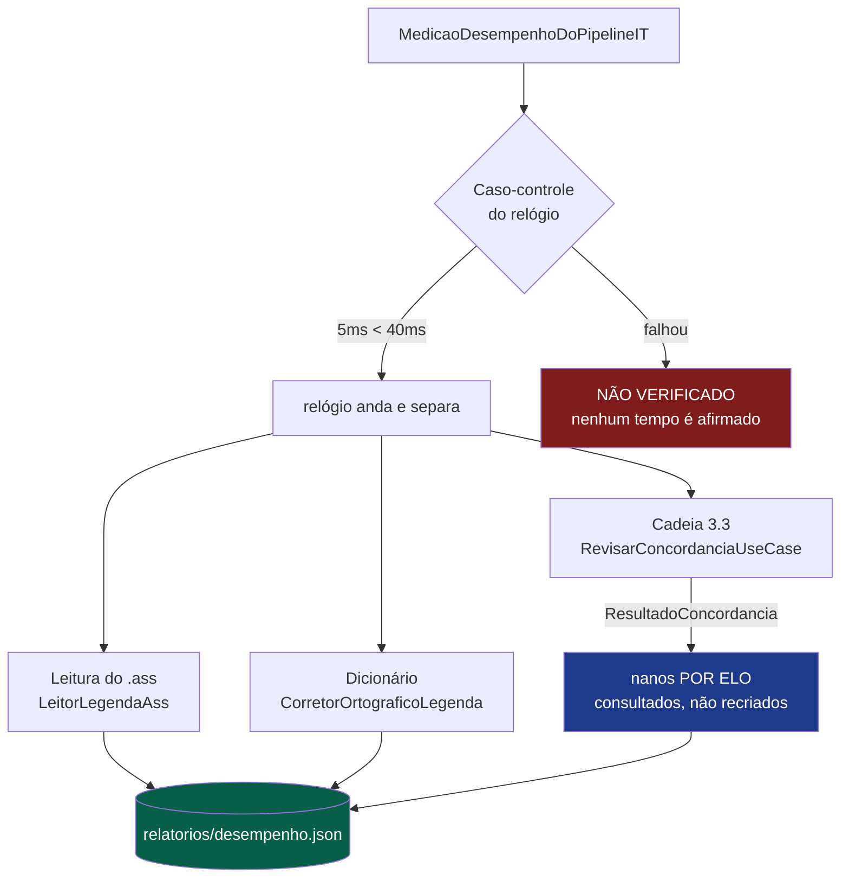
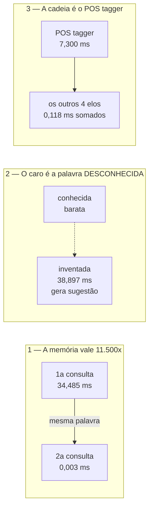

# ⚡ Ref — Desempenho do Pipeline

> Onde o KRONOS gasta o tempo, com **número por operação**, medido sobre fala real do acervo e com
> os objetos de produção. Esta página é a régua: explica como gerar a medição, como ler cada linha
> e quais são as três conclusões que os números permitem.

---

## Para que serve

O projeto pagou **três vezes** por não ter esta medição. Nas três, o custo apareceu em produção,
com o operador esperando na frente da tela:

| quando | o que aconteceu | o que faltava saber |
|--------|-----------------|---------------------|
| tela 3.3, uma passada | **291,1s → 14,4s** depois de descobrir que o elo do dicionário era 97% do tempo e corrigia ZERO falas | qual dos cinco elos custava |
| arquivo `CCA` | **15 minutos parados** num arquivo só, com um único aviso no log | que 2.743 formas distintas estouram o processo externo numa chamada só |
| seis arquivos | **5 minutos**, sem saber de onde vinha | idem — foi isto que fez o relógio entrar **por elo** |

Um total único não separa **operação cara** de **pasta grande**. Por isso toda linha da tabela traz
o custo **por unidade**.

---

## Arquitetura da medição

O harness **não cronometra por fora** o que a produção já cronometra: a cadeia da 3.3 devolve os
nanos de cada elo em `ResultadoConcordancia`, e é esse número que entra no relatório.



**Por que consultar e não recriar:** uma segunda cronometragem por fora divergiria da primeira — e
divergiria **em silêncio**, porque os dois números teriam a mesma cara.

---

## Como gerar uma medição

```bash
gradlew test --tests "*MedicaoDesempenhoDoPipelineIT*" \
  -Dkronos.medicao=true "-Dkronos.acervo=C:\animes\ANIMES-TESTES"
```

Grava `relatorios/desempenho.json` com máquina, versão do Java e número de processadores — sem
isso, dois relatórios de máquinas diferentes se parecem e a comparação entre eles não significa
nada.

> ⚠️ **Rode com a máquina livre.** A medição disputa CPU e disco com qualquer tradução em
> andamento, e o número sai contaminado justamente quando você quer confiar nele. Pior: ela roda
> pelo Gradle, e **compilar mata tradução em andamento** — rode antes o `pode-compilar.ps1`.

---

## Como ler a tabela

Números medidos em **31/08/2026**, sobre `ANIMES-TESTES`:

| operação | unidades | por unidade | o que isso quer dizer |
|----------|---------:|------------:|-----------------------|
| `classificar palavra · 1ª vez` | 300 | **34,485 ms** | não é só ortografia: são **6 idiomas** (pt/en/de/fr/ja/es) por palavra desconhecida |
| `classificar palavra · 2ª vez` | 300 | **0,003 ms** | as MESMAS palavras — a memória responde sem arrancar processo |
| `classificar palavra INVENTADA` | 60 | **38,897 ms** | o caso caro: o hunspell gera **sugestão** para cada uma |
| `cadeia 3.3 · TOTAL com arranque` | 400 | 27,680 ms | inclui **8,1s de custo FIXO** que não cresce por fala |
| `cadeia 3.3 · só os 5 elos` | 400 | **7,417 ms** | o custo que **realmente** cresce com o tamanho da pasta |
| ` elo · acento por POS tagger` | 400 | **7,300 ms** | **98% do custo real da cadeia** |
| ` elo · acento por padrão` | 400 | 0,038 ms | |
| ` elo · gênero (determinante)` | 400 | 0,033 ms | |
| ` elo · acento por dicionário` | 400 | 0,030 ms | |
| ` elo · caractere fora do português` | 400 | 0,017 ms | |
| `leitura do .ass` | 40 | 6,021 ms | por arquivo |

### As três leituras que os números permitem



**1. A memória vale 11.500×.** É este número, e não uma opinião sobre cache, que explica os 291,1s
virarem 14,4s.

**2. Palavra desconhecida é o caso caro — não a conhecida.** O hunspell gasta o tempo gerando
sugestão, não lendo. Por isso um arquivo com muitas formas inéditas (nome próprio, termo de
franquia) custa desproporcionalmente, e por isso a consulta vai em **lotes de 800**: sem lote, o
timeout derruba **todas** as palavras do arquivo, não só as lentas.

**3. Otimizar a cadeia é otimizar o POS tagger.** Ele é 7,3 dos 7,4 ms. Os outros quatro elos
somados custam 0,12 ms — mexer neles não muda nada perceptível.

### O que o total NÃO diz

`27,7 ms/fala` no total contra `7,4 ms/fala` nos elos: a diferença é **arranque** — subir o
LanguageTool, aquecer o dicionário do arquivo, ler e reescrever. Esse custo **se dilui** numa pasta
grande. Ler o total como custo por fala **superestima em quase 4×**.

---

## Guardas desta medição

| guarda | o que ela impede |
|--------|------------------|
| **Caso-controle do relógio** | cronometra 5 ms e 40 ms e exige que a segunda saia maior. Um cronômetro quebrado devolveria zero para tudo, e o relatório sairia com todas as operações "instantâneas" — o modo de falha mais convincente que uma medição de desempenho pode ter |
| **Relógio consultado, não recriado** | a cadeia já cronometra por elo; uma segunda medição por fora divergiria em silêncio |
| **Artefato sempre gravado** | harness que afirma número e não deixa artefato obriga a repetir a corrida para conferir |
| **Máquina e Java no relatório** | dois relatórios de máquinas diferentes se parecem; sem a identificação, comparar é inventar |
| **Amostra declarada** | 400 falas e 300 palavras, escritas no código. Amostra escondida vira número sem escala |

---

## Pontos de atenção

- **Não existe tela de Desempenho.** A medição é um **teste**, não um painel: medir de dentro da
  aplicação disputaria a máquina com uma tradução em andamento e contaminaria o próprio número.
- Os valores desta página são de **uma máquina** (notebook, Java 25, G1). Em outra, a ordem de
  grandeza se mantém, os números não.
- A medição **não cobre** o custo do LLM: aquele é I/O para o LM Studio, e depende do modelo
  carregado, não do KRONOS. Medido à parte: ~640 ms por lote com `aya-expanse-8b`.

---

## Navegação

| Anterior | Próximo |
|----------|---------|
| [← Telemetria](modulo-telemetria.md) | [Metadados de Anime →](modulo-metadados-anime.md) |

- 🔤 [Etapa 3.3 — Revisão de Concordância](etapa-3.3-revisao-concordancia.md) — a cadeia medida aqui
- 🛡️ [Catracas e Fronteiras](catracas-e-fronteiras.md)
- 🏠 [README](../README.md)
