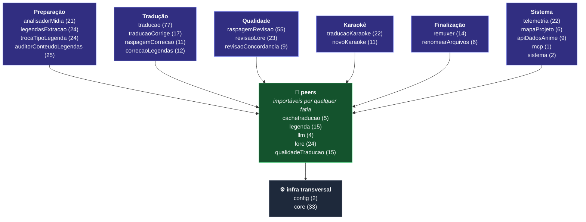

# 🧬 Esqueleto do Projeto

[← Catracas & Fronteiras](catracas-e-fronteiras.md) | [Arquitetura →](arquitetura.md)

---

## O que esta página é

A árvore **completa** do código: todo pacote, toda pasta e o nome de **todas as classes**.

> **Ela é gerada do disco, nunca digitada.** A catraca
> `CatracaEsqueletoDoProjetoAtualizadoTest` é o gerador **e** a guarda: se alguém criar,
> apagar, mover ou renomear uma classe sem regravar esta página, o build reprova apontando
> a primeira linha divergente. Documento que descreve estrutura envelhece em silêncio —
> nada quebra quando ele mente, e por isso ele precisa de teste, não de confiança.

Para regravar depois de mexer no código:

```shell
gradlew test --tests "*CatracaEsqueletoDoProjetoAtualizadoTest*" -Dkronos.esqueleto.regravar=true
```

| | quantidade |
|---|---:|
| pacotes de topo | **27** |
| fatias funcionais | **20** |
| peers | **5** |
| infra transversal | **2** |
| classes em `src/main` | **489** |
| classes em `src/test` | **409** |

---

## Mapa de um olhar



---

## Fatias funcionais

Uma etapa do pipeline cada. **Fatia não importa fatia** — quem prova são os
`Fronteira*ArchTest` ([Catracas & Fronteiras](catracas-e-fronteiras.md)).

### Preparação

#### `analisadorMidia` — 21 classes

```text
analisadorMidia/
├── application/
│   ├── AnalisarMidiaUseCase.java
│   ├── BarraProgressoAnalise.java
│   ├── ClassificadorLegendaService.java
│   ├── LocalizadorVideosService.java
│   ├── RelatorioMidiaTextoFormatter.java
│   └── TelemetriaMidiaMapper.java
├── domain/
│   ├── exceptions/
│   │   └── AnaliseStreamException.java
│   ├── AnalisadorException.java
│   ├── AnexoInfo.java
│   ├── AudioInfo.java
│   ├── AuditoriaResultado.java
│   ├── CapituloInfo.java
│   ├── ContainerInfo.java
│   ├── FalhaAnalise.java
│   ├── LegendaInfo.java
│   ├── ResultadoAnaliseLote.java
│   └── VideoInfo.java
├── infrastructure/
│   └── adapters/
│       └── FfprobeAdapter.java
└── presentation/
    ├── ui/
    │   └── ConsoleAnalisadorLogger.java
    ├── web/
    │   └── AnaliseMidiaController.java
    └── AnalisadorMidiaCLI.java
```

#### `legendasExtracao` — 24 classes

```text
legendasExtracao/
├── application/
│   ├── strategy/
│   │   ├── ExtratorAssStrategy.java
│   │   ├── ExtratorPgsStrategy.java
│   │   ├── ExtratorSrtStrategy.java
│   │   └── ExtratorStrategy.java
│   ├── ExtrairLegendaUseCase.java
│   └── ValidadorSaidaExtracao.java
├── domain/
│   ├── exceptions/
│   │   ├── ExtracaoTimeoutException.java
│   │   └── FormatoLegendaInvalidoException.java
│   ├── ports/
│   │   └── ExtratorVideoPort.java
│   ├── ExtratorException.java
│   ├── FaixaLegenda.java
│   ├── FormatoLegenda.java
│   ├── ItemExtracao.java
│   ├── RelatorioExtracao.java
│   └── StatusExtracao.java
├── infrastructure/
│   ├── adapters/
│   │   ├── FfmpegAdapter.java
│   │   └── MkvToolNixAdapter.java
│   └── config/
│       ├── ExtracaoBeansConfig.java
│       └── ExtratorProperties.java
└── presentation/
    ├── ui/
    │   ├── ConsoleExtratorLogger.java
    │   └── TabelaExtracaoRenderer.java
    ├── web/
    │   ├── ExtracaoLegendaController.java
    │   └── ExtracaoRequest.java
    └── ExtratorCLI.java
```

#### `trocaTipoLegenda` — 24 classes

```text
trocaTipoLegenda/
├── application/
│   ├── AchatadorEstilosDecorativosService.java
│   ├── AchatarEstilosUseCase.java
│   ├── AuditoriaFontesService.java
│   └── TrocaTipoLegendaUseCase.java
├── domain/
│   ├── exceptions/
│   │   └── TrocaTipoLegendaException.java
│   ├── ports/
│   │   ├── ArmazenamentoBackupPort.java
│   │   ├── AuditoriaTrocaFontePort.java
│   │   ├── ClassificadorCamadaMusicalPort.java
│   │   ├── ConsoleTrocaPort.java
│   │   ├── LegendaIoPort.java
│   │   └── TelemetriaTrocaPort.java
│   ├── AuditoriaFonteInfo.java
│   ├── AuditoriaLegendaResultado.java
│   ├── ClassificacaoCamadas.java
│   ├── EntradaAuditoriaTrocaFonte.java
│   ├── ResultadoGeralAuditoria.java
│   └── ResultadoTrocaFonte.java
├── infrastructure/
│   ├── ArmazenamentoBackupKronosAdapter.java
│   ├── ClassificadorCamadaMusicalLegendaAdapter.java
│   ├── ConsoleTrocaAnsiAdapter.java
│   ├── LegendaIoAssAdapter.java
│   ├── TelemetriaTrocaAdapter.java
│   └── TrocaTipoLegendaAuditoriaCache.java
└── presentation/
    └── TrocaTipoLegendaController.java
```

#### `auditorConteudoLegendas` — 25 classes

```text
auditorConteudoLegendas/
├── application/
│   ├── regras/
│   │   ├── arquivounico/
│   │   │   ├── RegraEfeitoComTextoLongo.java
│   │   │   ├── RegraEventoDialogoVazio.java
│   │   │   ├── RegraQuebrasLinhaExcessivas.java
│   │   │   ├── RegraSobreposicaoTempo.java
│   │   │   ├── RegraTagOverrideNaoFechada.java
│   │   │   └── RegraTimestampInvalido.java
│   │   ├── RegraAlucinacaoQuebraLinha.java
│   │   ├── RegraDanoKaraoke.java
│   │   ├── RegraEfeitoVazado.java
│   │   ├── RegraIntegridadePareamento.java
│   │   ├── RegraMetadadosAss.java
│   │   └── RegraSincroniaEstilos.java
│   ├── AuditorConteudoUseCase.java
│   ├── TelemetriaAuditoriaService.java
│   └── ValidadorParsingLegenda.java
├── domain/
│   ├── AnomaliaConteudo.java
│   ├── AuditoriaConteudoRelatorioJson.java
│   ├── AuditoriaException.java
│   ├── ModoAuditoria.java
│   ├── RegraAuditoriaArquivoUnico.java
│   ├── RegraAuditoriaConteudo.java
│   ├── RelatorioAuditoriaConteudo.java
│   └── TempoEventoUtil.java
├── infrastructure/
│   └── AuditoriaConteudoPersistencia.java
└── presentation/
    └── AuditorConteudoController.java
```

### Tradução

#### `traducao` — 77 classes

```text
traducao/
├── application/
│   ├── AvaliadorTraducaoCache.java
│   ├── ClassificadorPendenciaTelemetria.java
│   ├── ContextoCongeladoDaExecucao.java
│   ├── DescarteItalicoUltimoRecurso.java
│   ├── DetectorCorrenteFrasePartida.java
│   ├── DetectorIdiomaFonteService.java
│   ├── EnforcadorGlossarioFala.java
│   ├── GuardaContextoObraTraducao.java
│   ├── GuardaCorrenteTraduzida.java
│   ├── MontadorTelemetriaTraducao.java
│   ├── NormalizadorAspasService.java
│   ├── NormalizadorCartaoDataService.java
│   ├── PoliticaBackupTraducao.java
│   ├── ProcessarArquivoUseCase.java
│   ├── ProcessarEpisodioUseCase.java
│   ├── RecuperarPendenciaFallbackService.java
│   ├── ReparadorMarcadoresLlm.java
│   ├── ResolvedorCacheTraducao.java
│   ├── ResolvedorSaidaLegenda.java
│   ├── RestauradorFalaIdenticaSemItalico.java
│   ├── SeletorEventosTraduziveis.java
│   ├── SimplificadorItalicoRedundante.java
│   ├── TradutorLotesService.java
│   └── VerificadorIdentificadorNumerico.java
├── domain/
│   ├── exceptions/
│   │   ├── DivergenciaLinhasException.java
│   │   ├── EntradaJaTraduzidaException.java
│   │   ├── LlmFalhaComunicacaoException.java
│   │   ├── LmStudioOfflineException.java
│   │   ├── MarcadorCorrompidoException.java
│   │   ├── ObraDivergenteDoContextoException.java
│   │   ├── RequisicaoRecusadaPeloLlmException.java
│   │   ├── RespostaLlmVaziaException.java
│   │   ├── TraducaoParcialException.java
│   │   └── TradutorException.java
│   ├── fallback/
│   │   ├── ProvedorFallback.java
│   │   ├── ResultadoFallback.java
│   │   ├── ResultadoRecuperacao.java
│   │   └── StatusFallback.java
│   ├── ports/
│   │   ├── FallbackTraducaoMaquinaPort.java
│   │   └── TelemetriaTraducaoPort.java
│   ├── CategoriaConteudo.java
│   ├── CausaRaizPendencia.java
│   ├── FalaNaoTraduzida.java
│   ├── NormalizadorNomeEpisodio.java
│   ├── ResultadoTraducaoArquivo.java
│   ├── ResumoPendencia.java
│   ├── SaneadorEnfaseDegenerada.java
│   ├── StatusArquivoTraducao.java
│   ├── StatusLoteTraducao.java
│   ├── TelemetriaTraducao.java
│   └── TelemetriaTraducaoDocumento.java
├── infrastructure/
│   ├── adapters/
│   │   ├── GoogleFallbackAdapter.java
│   │   ├── LlmClientAdapter.java
│   │   └── LoreAtivaContextoAdapter.java
│   ├── config/
│   │   ├── FallbackOnlineProperties.java
│   │   ├── LlmProperties.java
│   │   ├── RestClientConfig.java
│   │   └── TradutorProperties.java
│   ├── dtos/
│   │   └── RecordsLlm.java
│   ├── telemetria/
│   │   └── TelemetriaTraducaoAdapter.java
│   └── AvisoSonoroSistema.java
└── presentation/
    ├── bootstrap/
    │   └── TraducaoStartup.java
    ├── ui/
    │   ├── ConsoleUILogger.java
    │   ├── PastasExecucao.java
    │   ├── RelatorioLoteRenderer.java
    │   └── TabelaTraducaoRenderer.java
    ├── web/
    │   ├── BrowserLauncher.java
    │   ├── CatalogoObras.java
    │   ├── ConsoleRedirector.java
    │   ├── ContextoResponse.java
    │   ├── DialogoArquivoController.java
    │   ├── DocumentacaoController.java
    │   ├── LlmStatusResponse.java
    │   ├── LogStreamResource.java
    │   ├── PipelineController.java
    │   └── TraducaoController.java
    └── TradutorCLI.java
```

#### `traducaoCorrige` — 17 classes

```text
traducaoCorrige/
├── application/
│   ├── ClassificadorEntradaCacheService.java
│   ├── ContextoManutencaoCacheService.java
│   ├── LimparCacheUseCase.java
│   └── ReforcarTerminologiaCacheUseCase.java
├── domain/
│   ├── exceptions/
│   │   └── CorretorCacheException.java
│   ├── ports/
│   │   ├── AuditoriaCorrecaoCachePort.java
│   │   └── TelemetriaCorrecaoPort.java
│   ├── ContextoDoCache.java
│   ├── EntradaAuditoriaCorrecaoCache.java
│   ├── ModoReforcoTerminologia.java
│   ├── ResultadoManutencaoCache.java
│   └── ResultadoReforcoTerminologia.java
├── infrastructure/
│   ├── config/
│   │   └── CorrecaoCacheProperties.java
│   ├── CorrecaoCacheAuditoria.java
│   └── TelemetriaCorrecaoAdapter.java
├── presentation/
│   └── web/
│       └── CorrecaoCacheController.java
└── CorretorCacheCLI.java
```

#### `raspagemCorrecao` — 11 classes

```text
raspagemCorrecao/
├── application/
│   ├── CorrigirComGoogleUseCase.java
│   └── ProtetorTermosLoreService.java
├── domain/
│   ├── exceptions/
│   │   └── RaspagemCorrecaoException.java
│   ├── ports/
│   │   ├── RecuperacaoExternaPort.java
│   │   └── TelemetriaRaspagemCorrecaoPort.java
│   ├── ResultadoRaspagem.java
│   └── StatusRaspagem.java
├── infrastructure/
│   ├── GoogleTranslateScraper.java
│   └── TelemetriaRaspagemCorrecaoAdapter.java
├── presentation/
│   └── web/
│       └── CorrecaoRaspagemController.java
└── CorretorRaspagemCLI.java
```

#### `correcaoLegendas` — 12 classes

```text
correcaoLegendas/
├── application/
│   ├── CorretorTraducaoLlmService.java
│   ├── CorrigirLegendasUseCase.java
│   └── SanitizadorTagsService.java
├── domain/
│   ├── ports/
│   │   ├── RelatorioCorrecaoLegendasPort.java
│   │   └── TelemetriaCorrecaoLegendasPort.java
│   ├── CorrecaoLegendasRelatorioJson.java
│   ├── LogEventoCorrecaoLegendas.java
│   ├── ResultadoCorrecaoLegendas.java
│   └── ResumoOperacaoCorrecaoLegendas.java
├── infrastructure/
│   ├── CorrecaoLegendasLogPersistencia.java
│   └── TelemetriaCorrecaoLegendasAdapter.java
└── presentation/
    └── CorrecaoLegendasController.java
```

### Qualidade

#### `raspagemRevisao` — 55 classes

```text
raspagemRevisao/
├── application/
│   ├── concordancia/
│   │   ├── DetectorAgressividadeIntroduzida.java
│   │   ├── DetectorConcordanciaNominal.java
│   │   ├── DetectorParentescoInvertido.java
│   │   ├── LexicoGenero.java
│   │   └── RegraDeRevisao.java
│   ├── ApresentacaoFalaSuspeita.java
│   ├── AtivadorContextoRevisao.java
│   ├── AuditorProblemasLegendaService.java
│   ├── CadeiaCorrecaoFala.java
│   ├── CorretorDeterministicoConcordanciaService.java
│   ├── DetectorConcordanciaService.java
│   ├── DetectorRetraducaoEmMassaService.java
│   ├── FiltroAuditoriaLinha.java
│   ├── GuardaCorrecaoSegura.java
│   ├── LeitorCacheReferenciaService.java
│   ├── MemoriaCorrecaoArquivo.java
│   ├── PersistenciaLegendaRevisada.java
│   ├── PreparadorFalaRevisao.java
│   ├── PreparadorReferenciaRevisao.java
│   ├── ProvedorCorrecaoFala.java
│   ├── RelatorioRevisaoService.java
│   ├── ResolvedorArtefatosRevisao.java
│   ├── ResultadoRevisaoLegendas.java
│   ├── ResumoAlteracaoPorEstilo.java
│   ├── RevisarCacheUseCase.java
│   ├── RevisarLegendasUseCase.java
│   ├── RevisorPtOnlyService.java
│   ├── RevisorPtOnlyUseCase.java
│   ├── SessaoRevisaoArquivo.java
│   ├── SincronizacaoPreviaRevisao.java
│   ├── SincronizadorLegendaCacheService.java
│   ├── TotaisLoteRevisao.java
│   └── TriagemFalaSuspeita.java
├── domain/
│   ├── exceptions/
│   │   └── RaspagemRevisaoException.java
│   ├── ports/
│   │   ├── RecuperacaoExternaRevisaoPort.java
│   │   └── TelemetriaRevisaoPort.java
│   ├── ContextoRevisao.java
│   ├── DecisaoFala.java
│   ├── DetalheRevisao.java
│   ├── DiagnosticoRetraducao.java
│   ├── FrescorCache.java
│   ├── ModoReferenciaRevisao.java
│   ├── ModoRevisaoLegendas.java
│   ├── PoliticaRetraducao.java
│   ├── PreparacaoReferencia.java
│   ├── ReferenciaCacheSegura.java
│   ├── ResultadoDeteccaoConcordancia.java
│   ├── ResultadoRecuperacaoExterna.java
│   └── StatusRecuperacaoExterna.java
├── infrastructure/
│   ├── GoogleRecuperacaoExternaAdapter.java
│   └── TelemetriaRevisaoAdapter.java
├── presentation/
│   └── web/
│       ├── RevisaoCacheController.java
│       └── RevisaoLegendasController.java
├── RevisorLegendasCLI.java
└── RevisorRaspagemCLI.java
```

#### `revisaoLore` — 23 classes

```text
revisaoLore/
├── application/
│   ├── AlcanceRevisaoLore.java
│   ├── CorretorLoreDeterministico.java
│   ├── DetectorTermosLoreService.java
│   ├── GerenciadorPromptRevisaoLore.java
│   ├── RevisarLoreUseCase.java
│   └── ValidadorCandidatoLoreService.java
├── domain/
│   ├── exceptions/
│   │   └── RevisaoLoreException.java
│   ├── ports/
│   │   └── RevisorLoreLlmPort.java
│   ├── EntradaAuditoriaRevisaoLore.java
│   ├── LogEventoRevisaoLore.java
│   ├── ResultadoDeteccaoLore.java
│   ├── ResultadoRevisaoLore.java
│   ├── RevisaoLoreRelatorioJson.java
│   ├── StatusRevisaoLore.java
│   └── StatusRevisaoLoreLlm.java
├── infrastructure/
│   ├── adapters/
│   │   ├── NormalizadorRespostaRevisaoLore.java
│   │   └── RevisorLoreLlmAdapter.java
│   ├── config/
│   │   └── RevisaoLoreLlmProperties.java
│   ├── dtos/
│   │   └── RevisaoLoreLlmDtos.java
│   ├── http/
│   │   └── RevisaoLoreHttpClient.java
│   ├── RevisaoLoreAuditoriaCache.java
│   └── RevisaoLoreLogPersistencia.java
└── presentation/
    └── RevisaoLoreController.java
```

#### `revisaoConcordancia` — 9 classes

```text
revisaoConcordancia/
├── application/
│   ├── CorretorAcentoDeDicionarioNaFalaService.java
│   ├── CorretorAcentoPorPadraoService.java
│   ├── CorretorAcentoQueColideComVerboService.java
│   ├── CorretorCaractereForaDoPortuguesService.java
│   ├── CorretorConcordanciaGeneroService.java
│   └── RevisarConcordanciaUseCase.java
├── domain/
│   ├── ContagemCorretor.java
│   └── ResultadoConcordancia.java
└── presentation/
    └── RevisaoConcordanciaController.java
```

### Karaokê

#### `traducaoKaraoke` — 22 classes

```text
traducaoKaraoke/
├── application/
│   ├── CacheDoArquivo.java
│   ├── ClassificadorLetraKaraokeService.java
│   ├── MontadorEventoFinal.java
│   ├── PlanoDeClassificacao.java
│   ├── RegistroDaExecucao.java
│   ├── TradutorDeLetraKaraoke.java
│   └── TraduzirKaraokeUseCase.java
├── domain/
│   ├── AcentosLetraKaraoke.java
│   ├── ClasseLinhaKaraoke.java
│   ├── DesfechoKaraoke.java
│   ├── FalhaArquivoKaraoke.java
│   ├── GradienteKaraoke.java
│   ├── ResultadoTraducaoKaraoke.java
│   ├── SinaisDeKaraoke.java
│   ├── StatusExecucaoKaraoke.java
│   ├── TelemetriaKaraoke.java
│   └── TraducaoKaraokeException.java
├── infrastructure/
│   ├── ImportadorManifestoKaraoke.java
│   ├── TelemetriaKaraokeDataset.java
│   └── TraducaoKaraokePersistencia.java
└── presentation/
    ├── TraducaoKaraokeController.java
    └── TraducaoKaraokeRequest.java
```

#### `novoKaraoke` — 11 classes

```text
novoKaraoke/
├── application/
│   └── ConversorKaraokeUseCase.java
├── domain/
│   ├── ports/
│   │   └── TelemetriaKaraokePort.java
│   ├── EventoAss.java
│   ├── LinhaSimplesKaraoke.java
│   ├── MedicaoEstiloKaraoke.java
│   ├── NovoKaraokeException.java
│   └── ResultadoConversaoKaraoke.java
├── infrastructure/
│   ├── NovoKaraokePersistencia.java
│   └── TelemetriaKaraokeAdapter.java
└── presentation/
    ├── NovoKaraokeController.java
    └── NovoKaraokeRequest.java
```

### Finalização

#### `remuxer` — 14 classes

```text
remuxer/
├── application/
│   ├── MapeadorMidiaService.java
│   └── RemuxarLoteUseCase.java
├── domain/
│   ├── MkvToolNixNaoEncontradoException.java
│   ├── PlanoRemux.java
│   ├── RelatorioRemux.java
│   ├── RemuxTarefa.java
│   ├── RemuxerException.java
│   └── SaidaRemuxJaExisteException.java
├── infrastructure/
│   ├── adapters/
│   │   └── MkvmergeAdapter.java
│   └── config/
│       └── RemuxerProperties.java
└── presentation/
    ├── ui/
    │   └── ConsoleRemuxerLogger.java
    ├── web/
    │   ├── RemuxRequest.java
    │   └── RemuxerController.java
    └── RemuxerCLI.java
```

#### `renomearArquivos` — 6 classes

```text
renomearArquivos/
├── application/
│   ├── OperacaoRenomeacaoEmAndamentoException.java
│   └── RenomeadorUseCase.java
├── domain/
│   ├── OperacaoRenomeacao.java
│   └── ResultadoRenomeacao.java
└── presentation/
    └── web/
        ├── RenomearArquivosController.java
        └── RenomearArquivosRequest.java
```

### Sistema

#### `telemetria` — 22 classes

```text
telemetria/
├── infrastructure/
│   └── RedisFluxoTelemetriaAdapter.java
├── presentation/
│   └── web/
│       ├── FluxoTelemetriaController.java
│       ├── TelemetriaController.java
│       └── TelemetriaStreamResource.java
├── AmbienteExecucaoDataset.java
├── AmbienteExecucaoDatasetService.java
├── ConsolidadorTelemetriaPorFatia.java
├── FatiaTelemetria.java
├── FluxoTelemetriaPort.java
├── LlmTelemetria.java
├── MidiaTelemetria.java
├── OperacaoHistorico.java
├── OperacaoTelemetria.java
├── RevisaoLoreTelemetriaResumo.java
├── SanitizadorTelemetria.java
├── StatusFluxoTelemetria.java
├── TelemetriaDatasetCsv.java
├── TelemetriaDatasetProperties.java
├── TelemetriaDatasetService.java
├── TelemetriaResumo.java
├── TelemetriaService.java
└── TelemetriaTraducaoLeitura.java
```

#### `mapaProjeto` — 6 classes

```text
mapaProjeto/
├── application/
│   ├── GeradorMapaProjetoUseCase.java
│   └── MapeadorDiretorioUseCase.java
├── domain/
│   └── exceptions/
│       └── MapaProjetoException.java
└── presentation/
    ├── web/
    │   ├── MapaController.java
    │   └── MapaResponse.java
    └── MapaProjetoCLI.java
```

#### `apiDadosAnime` — 9 classes

```text
apiDadosAnime/
├── application/
│   └── ObterMetadataAnimeUseCase.java
├── domain/
│   ├── exceptions/
│   │   ├── AnimeNaoEncontradoException.java
│   │   └── ApiDadosAnimeException.java
│   └── model/
│       └── AnimeMetadata.java
├── infrastructure/
│   ├── adapters/
│   │   ├── AniListApiClientAdapter.java
│   │   ├── JikanApiClientAdapter.java
│   │   └── TmdbApiClientAdapter.java
│   └── config/
│       └── ApiDadosAnimeHttpProperties.java
└── presentation/
    └── web/
        └── AnimeMetadataController.java
```

#### `mcp` — 1 classes

```text
mcp/
└── KronosMcpTools.java
```

#### `sistema` — 2 classes

```text
sistema/
├── application/
│   └── EncerrarAplicacaoUseCase.java
└── presentation/
    └── SistemaController.java
```

---

## Peers — importáveis por qualquer fatia

Superfície pública **congelada por tipo exato**: cada peer tem o próprio
`Fronteira<Peer>ArchTest`, e um tipo novo cruzando a fronteira reprova o build.

#### `cachetraducao` — 5 classes

```text
cachetraducao/
├── domain/
│   ├── CacheDocumento.java
│   ├── EntradaCache.java
│   └── ProvenienciaCache.java
└── infrastructure/
    ├── CacheManutencaoService.java
    └── CacheTraducaoService.java
```

#### `legenda` — 15 classes

```text
legenda/
├── application/
│   ├── DetectorEfeitoKaraokeService.java
│   └── ProtecaoCamadasMusicaisService.java
├── domain/
│   ├── ArquivoLegendaException.java
│   ├── CarimboCabecalhoLegenda.java
│   ├── DocumentoLegenda.java
│   ├── EventoLegenda.java
│   ├── ExcecaoLegenda.java
│   ├── PadraoEstiloMusical.java
│   ├── PareamentoCamadasMusicais.java
│   └── PoliticaEstiloMusical.java
└── infrastructure/
    ├── config/
    │   └── PoliticaEstiloMusicalProducer.java
    ├── EscritorLegendaAss.java
    ├── EscritorLegendaSrt.java
    ├── LeitorLegendaAss.java
    └── LeitorLegendaSrt.java
```

#### `llm` — 4 classes

```text
llm/
└── domain/
    ├── LlmPort.java
    ├── Lote.java
    ├── StatusLlm.java
    └── TraducaoLote.java
```

#### `lore` — 24 classes

```text
lore/
├── application/
│   └── ValidadorCompatibilidadeObraContexto.java
├── domain/
│   ├── ContextoNaoEncontradoException.java
│   ├── ContextoPrompt.java
│   ├── ExcecaoContexto.java
│   ├── IdentidadeObra.java
│   ├── PromptRevisaoLore.java
│   ├── ProvedorContexto.java
│   ├── ProvedorPromptRevisaoLore.java
│   ├── RegrasConcordanciaPtBr.java
│   ├── SnapshotContexto.java
│   └── VeredictoObraContexto.java
├── infrastructure/
│   ├── config/
│   │   └── ContextoBeansConfig.java
│   ├── CatalogoLoreYaml.java
│   └── GerenciadorContexto.java
├── macross/
│   ├── ContextoMacross7Filmes.java
│   ├── ContextoMacrossDeltaFilmes.java
│   ├── ContextoMacrossFrontierFilmes.java
│   ├── CorrecoesTerminologiaMacross.java
│   └── CorrecoesTerminologiaMacrossDelta.java
└── revisao/
    ├── ContextoRevisaoLoreMacross7Filmes.java
    ├── ContextoRevisaoLoreMacrossDeltaFilmes.java
    ├── ContextoRevisaoLoreMacrossFrontierFilmes.java
    ├── CorrecoesTerminologiaMacrossDeltaRevisao.java
    └── CorrecoesTerminologiaMacrossRevisao.java
```

#### `qualidadeTraducao` — 15 classes

```text
qualidadeTraducao/
├── application/
│   ├── nomeProprio/
│   │   ├── DetectorNomeProprioTraduzido.java
│   │   ├── ExtratorCandidatosNomeProprio.java
│   │   └── VeredictoNomeProprio.java
│   ├── DetectorTraducaoIdenticaService.java
│   ├── EnforcadorTermosLore.java
│   ├── IsoladorQuebraDialogo.java
│   ├── MascaradorTags.java
│   ├── NormalizadorAcentosComuns.java
│   ├── ProtecaoLegendaAssService.java
│   ├── RemovedorItalico.java
│   └── ValidadorTraducaoService.java
└── domain/
    ├── AlucinacaoDetectadaException.java
    ├── ExcecaoQualidadeTraducao.java
    ├── LoreAtivaPort.java
    └── MarcadorPerdidoException.java
```

---

## Infra transversal

`core` é proibido, por regra permanente, de depender de qualquer fatia funcional.

#### `config` — 2 classes

```text
config/
├── AppConfig.java
└── ModoExecucaoStartup.java
```

#### `core` — 33 classes

```text
core/
├── exception/
│   ├── web/
│   │   └── BasePipelineExceptionMapper.java
│   └── BasePipelineException.java
├── execucao/
│   ├── ExecucaoCli.java
│   └── FilaExecucaoPipeline.java
├── infrastructure/
│   └── http/
│       └── JsonHttpClient.java
├── io/
│   ├── DiretorioBaseKronos.java
│   ├── FaxinaLogExecucao.java
│   ├── FaxinaLogNoBoot.java
│   ├── GuardaCaminhoEntrada.java
│   ├── GuardaRaizNavegacao.java
│   └── NavegacaoProperties.java
├── presentation/
│   ├── ui/
│   │   ├── AnsiCores.java
│   │   └── ConsoleEntrada.java
│   └── web/
│       ├── LogStreamService.java
│       ├── NavegadorPastasController.java
│       ├── OperacaoRequest.java
│       ├── PipelineWebSupport.java
│       └── RespostaPadrao.java
├── texto/
│   ├── dicionarioOrtografia/
│   │   ├── ClassificadorQuatroIdiomas.java
│   │   ├── CorretorAcentoPorDicionario.java
│   │   ├── CorretorOrtograficoLegenda.java
│   │   ├── DicionarioOrtograficoPort.java
│   │   ├── HunspellDicionarioAdapter.java
│   │   └── VeredictoPalavra.java
│   ├── gramatica/
│   │   ├── AchadoGramatical.java
│   │   ├── LanguageToolRevisorAdapter.java
│   │   └── RevisorGramaticalPort.java
│   ├── FronteiraTermoAss.java
│   ├── TextoSemTags.java
│   └── TokenDeControleLlm.java
└── util/
    ├── ArquivoAtomicoUtil.java
    ├── DuracaoUtil.java
    └── ProcessoExternoUtil.java
```

---

## Testes — 409 classes

O teste pesa quase tanto quanto o código. As `Catraca*` e `Fronteira*` moram aqui.

#### `(raiz do pacote)` — 4 classes

```text
(raiz do pacote)/
├── ApiControllerTest.java
├── ApiEndpointsTest.java
├── SseConsoleDinamicoTest.java
└── WebInterfaceTest.java
```

#### `analisadorMidia` — 8 classes

```text
analisadorMidia/
├── application/
│   ├── AnalisarMidiaClassificacaoTest.java
│   ├── AnalisarMidiaLoteTest.java
│   ├── AnalisarMidiaTelemetriaTest.java
│   ├── LocalizadorVideosServiceTest.java
│   └── TelemetriaMidiaMapperTest.java
├── domain/
│   └── ResultadoAnaliseLoteSerializacaoTest.java
├── infrastructure/
│   └── adapters/
│       └── FfprobeAdapterTest.java
└── presentation/
    └── AnalisadorMidiaCLITest.java
```

#### `apiDadosAnime` — 4 classes

```text
apiDadosAnime/
├── application/
│   ├── GuardaIdentidadeMetadataTest.java
│   └── ObterMetadataAnimeUseCaseTest.java
└── infrastructure/
    ├── adapters/
    │   └── AniListApiClientAdapterTest.java
    └── config/
        └── ApiDadosAnimeHttpPropertiesIT.java
```

#### `arquitetura` — 26 classes

```text
arquitetura/
├── CatracaAvisoSonoroNasTelasLongasTest.java
├── CatracaBannerNomeiaOAlvoTest.java
├── CatracaBordaAssincronaConfereCaminhoTest.java
├── CatracaCartaoDoAlvoTemDonoUnicoTest.java
├── CatracaCoberturaFatiaTelemetriaTest.java
├── CatracaConsoleOrfaoNaUiTest.java
├── CatracaContainerPreparadoTest.java
├── CatracaEscritaDeFalaVetaMusicaConcordanciaTest.java
├── CatracaEscritaDeFalaVetaMusicaLoreTest.java
├── CatracaEscritaDeFalaVetaMusicaTest.java
├── CatracaEsqueletoDoProjetoAtualizadoTest.java
├── CatracaFerramentaDeAcervoVetaMusicaTest.java
├── CatracaFerramentaDeMedicaoTest.java
├── CatracaFronteiraQuebraAssTest.java
├── CatracaHarnessDeMedicaoTest.java
├── CatracaOrdemDocumentacaoTest.java
├── CatracaPadraoMusicalTemDonoUnicoTest.java
├── CatracaPaginaDeDocumentacaoAbreTest.java
├── CatracaRegraDuplicadaEntreFatiasTest.java
├── CatracaSeletorDeObraRegistradoTest.java
├── CatracaSuiteSemDriveWindowsTest.java
├── CatracaTelaDestrutivaNasceEmDryRunTest.java
├── CatracaTokenDeControleEmTodaPortaLlmTest.java
├── ContextoInvalidoC2CaracterizacaoTest.java
├── ContratoJsonRecordsE1Test.java
└── FronteiraCorretorCacheArchTest.java
```

#### `auditorConteudoLegendas` — 8 classes

```text
auditorConteudoLegendas/
├── application/
│   ├── regras/
│   │   ├── RegraAlucinacaoQuebraLinhaTest.java
│   │   ├── RegraDanoKaraokeTest.java
│   │   ├── RegraEfeitoVazadoTest.java
│   │   ├── RegraMetadadosAssTest.java
│   │   └── RegraSincroniaEstilosTest.java
│   ├── AuditorConteudoIntegridadeTest.java
│   └── AuditorConteudoUseCaseTest.java
└── support/
    └── AssAuditoriaFixtures.java
```

#### `auditoria` — 11 classes

```text
auditoria/
├── GoldSetLeituraHumanaIT.java
├── MedicaoAcentuacaoFaltanteIT.java
├── MedicaoAdverbioEntreVerboEParticipioIT.java
├── MedicaoCegueiraQuebraLinhaIT.java
├── MedicaoGeneroImplicitoIT.java
├── MedicaoGeneroTrocadoIT.java
├── MedicaoNegacaoPerdidaIT.java
├── MedicaoPerguntaQueViraAfirmacaoIT.java
├── MedicaoUnicornMistralXAyaIT.java
├── MedicaoZetaMistralXAyaIT.java
└── OndeOAchatamentoValeriaIT.java
```

#### `cachetraducao` — 7 classes

```text
cachetraducao/
├── arquitetura/
│   └── FronteiraCacheTraducaoArchTest.java
├── domain/
│   └── ProvenienciaCacheTest.java
└── infrastructure/
    ├── CacheLegadoPreservaCorrompidoTest.java
    ├── CacheManutencaoServiceTest.java
    ├── CacheTraducaoServiceTest.java
    ├── CompatibilidadeCacheJsonLegadoTest.java
    └── ManutencaoCacheEscopoPorObraTest.java
```

#### `config` — 1 classes

```text
config/
└── ModoExecucaoDispatcherTest.java
```

#### `core` — 28 classes

```text
core/
├── exception/
│   └── BasePipelineExceptionTest.java
├── execucao/
│   └── FilaExecucaoPipelineTest.java
├── io/
│   ├── DiretorioBaseKronosTest.java
│   ├── FaxinaLogExecucaoTest.java
│   ├── GuardaRaizNavegacaoTest.java
│   └── GuardaSaidaComoEntradaTest.java
├── presentation/
│   └── ui/
│       └── ConsoleEntradaCaracterizacaoTest.java
├── texto/
│   ├── dicionarioOrtografia/
│   │   ├── AquecimentoDoDicionarioTest.java
│   │   ├── ClassificadorQuatroIdiomasTest.java
│   │   ├── CorretorNoKaraokePreservaTest.java
│   │   ├── CorretorOrtograficoLegendaMemoriaTest.java
│   │   ├── CorretorPropriedadesTest.java
│   │   ├── DicionarioNaoAcentuaTermoDeLoreTest.java
│   │   ├── FrancesNaoEhNomeProprioTest.java
│   │   ├── HunspellDicionarioAdapterTest.java
│   │   ├── MedicaoReparoDeDiacriticoIT.java
│   │   ├── MedicaoSugestaoParaPalavraQuebradaIT.java
│   │   ├── PalavraDeTresLetrasTest.java
│   │   ├── PortaoDeIdiomaEcandidataUnicaTest.java
│   │   ├── ReparoDeTerminacaoAoTest.java
│   │   └── RomajiRotulaMasNaoIsentaTest.java
│   ├── gramatica/
│   │   ├── LanguageToolRevisorAdapterTest.java
│   │   └── RevisorGramaticalMudo.java
│   ├── FronteiraTermoAssTest.java
│   ├── TextoSemTagsTest.java
│   └── TokenDeControleLlmTest.java
└── util/
    ├── DrenagemTimeoutNaoViraSaidaVaziaTest.java
    └── ProcessoExternoUtilTest.java
```

#### `correcaoLegendas` — 1 classes

```text
correcaoLegendas/
└── application/
    └── CorrigirLegendasUseCaseTest.java
```

#### `legenda` — 14 classes

```text
legenda/
├── application/
│   ├── ConjuntoOuroRomajiCaracterizacaoTest.java
│   ├── DetectorEfeitoKaraokeServiceTest.java
│   ├── EstiloMusicalDoAcervoTest.java
│   ├── PadraoMusicaAmploNaoCapturaDialogoTest.java
│   └── ProtecaoCamadasMusicaisServiceTest.java
├── arquitetura/
│   └── FronteiraLegendaArchTest.java
├── domain/
│   ├── CarimboCabecalhoLegendaTest.java
│   ├── HierarquiaExcecaoLegendaTest.java
│   ├── PadraoEstiloMusicalTest.java
│   ├── PareamentoCamadasMusicaisTest.java
│   └── PoliticaEstiloMusicalTest.java
└── infrastructure/
    ├── config/
    │   └── PoliticaEstiloMusicalProducerIT.java
    ├── EscritorLegendaAssTest.java
    └── LeitorEscritorSrtTest.java
```

#### `legendasExtracao` — 7 classes

```text
legendasExtracao/
├── application/
│   ├── strategy/
│   │   └── ExtratorAssStrategyTest.java
│   ├── ExtrairLegendaUseCaseTest.java
│   └── ValidadorSaidaExtracaoTest.java
├── infrastructure/
│   ├── adapters/
│   │   ├── FfmpegAdapterTest.java
│   │   └── MkvToolNixAdapterTest.java
│   └── config/
│       └── ExtratoresInjecaoIT.java
└── presentation/
    └── ExtratorCLITest.java
```

#### `llm` — 1 classes

```text
llm/
└── arquitetura/
    └── FronteiraLlmArchTest.java
```

#### `lore` — 38 classes

```text
lore/
├── application/
│   ├── PastaGenericaNaoIdentificaObraTest.java
│   └── ValidadorCompatibilidadeObraContextoTest.java
├── arquitetura/
│   └── FronteiraContextoArchTest.java
├── domain/
│   ├── HierarquiaExcecaoContextoTest.java
│   ├── IdentidadeObraTest.java
│   └── SnapshotContextoTest.java
├── eightsix/
│   └── SpearheadMinusculoContinuaTraduzidoTest.java
├── gundam/
│   ├── chars/
│   │   └── TerminologiaCcaFormasMedidasTest.java
│   ├── msteam/
│   │   └── Terminologia08thFormasMedidasTest.java
│   ├── zeta/
│   │   ├── ContextoGundamZetaLoreTest.java
│   │   └── TerminologiaZetaFormasMedidasTest.java
│   ├── CatalogoSegueOReleaseInglesTest.java
│   ├── CorrecoesTerminologiaGundamUcTest.java
│   ├── FourMurasameProtegidaNoZetaTest.java
│   ├── TerminologiaF91FormasMedidasTest.java
│   └── TerminologiaUnicornFormasMedidasTest.java
├── infrastructure/
│   └── GerenciadorContextoReconhecimentoObraTest.java
├── revisao/
│   ├── ContextosRevisaoLoreCatalogoTest.java
│   └── ContextosRevisaoLoreMapaTerminologiaTest.java
├── ApelidoPastaPorTemporadaTest.java
├── BaselineCamposDeLoreIT.java
├── BaselineTerminologiaLoreIT.java
├── CatalogoIdentidadeObraTest.java
├── CatracaAgregadorasForaDoCdiTest.java
├── CatracaCicatrizNoLoreYamlTest.java
├── CatracaTerminologiaDeLoreUnificadaTest.java
├── CorrecaoFaEMobileSuitTest.java
├── EquivalenciaLoreYamlIT.java
├── EquivalenciasChegamDoYamlIT.java
├── GeradorLoreYamlIT.java
├── LoreDeTeste.java
├── MedicaoDivergenciaEntreCatalogosDeLoreIT.java
├── MedicaoNomeProprioAusenteNaLoreIT.java
├── ParesInconfundiveisDeclaradosTest.java
├── ParidadeMapasTerminologiaTest.java
├── ProtecaoConteudoLoreTest.java
├── RegistroProvedoresContextoIT.java
└── SeculoUniversalNaLoreUcTest.java
```

#### `mapaProjeto` — 1 classes

```text
mapaProjeto/
└── application/
    └── GeradorMapaProjetoUseCaseTest.java
```

#### `mcp` — 1 classes

```text
mcp/
└── KronosMcpToolsTest.java
```

#### `medicao` — 29 classes

```text
medicao/
├── AlcanceDaMedicao.java
├── AplicarAcentosNoAcervoIT.java
├── AplicarReforcoTerminologiaIT.java
├── ComparacaoModeloLlmIT.java
├── CorretorLoreEhIdempotenteIT.java
├── EnsaioReforcoTerminologiaIT.java
├── LeitorAcervoCache.java
├── MedicaoAcentoQueColideComVerboIT.java
├── MedicaoAnomaliaIntroduzidaIT.java
├── MedicaoAuditoriaAcervoIT.java
├── MedicaoCamadaRepetidaIT.java
├── MedicaoCartazNoAlcanceDaLoreIT.java
├── MedicaoConcordanciaAcervoPtIT.java
├── MedicaoConcordanciaIT.java
├── MedicaoConcordanciaPorDicionarioIT.java
├── MedicaoDivergenciaPadraoMusicalIT.java
├── MedicaoEscopoDaRevisaoLoreIT.java
├── MedicaoFalasVaziasIT.java
├── MedicaoLinhaCurtaKaraokeIT.java
├── MedicaoLoreQuebraIT.java
├── MedicaoMusicaDivergenteDoEspelhoIT.java
├── MedicaoOriginalRepetidoIT.java
├── MedicaoPalavraQuebradaEidiomaVazadoIT.java
├── MedicaoQuebraAssIT.java
├── MedicaoResiduoNoAcervoIT.java
├── MedicaoTermoPerdidoIT.java
├── MineracaoGlossarioIT.java
├── ProvenienciaAindaValeIT.java
└── SpikeLanguageToolContraGoldSetIT.java
```

#### `novoKaraoke` — 2 classes

```text
novoKaraoke/
├── application/
│   └── ConversorKaraokeUseCaseTest.java
└── presentation/
    └── DestinoPadraoKaraokeSimplesTest.java
```

#### `qualidadeTraducao` — 31 classes

```text
qualidadeTraducao/
├── application/
│   ├── nomeProprio/
│   │   ├── DetectorNomeProprioTraduzidoTest.java
│   │   ├── ExtratorCandidatosNomeProprioTest.java
│   │   └── MedicaoNomeProprioAcervoIT.java
│   ├── ConectivoDeDiscursoNaoEhLocutorInventadoTest.java
│   ├── DetectorTraducaoIdenticaServiceTest.java
│   ├── EnforcadorTermosLoreQuebraAssTest.java
│   ├── EnforcadorTermosLoreTest.java
│   ├── IsoladorQuebraDialogoTest.java
│   ├── LoreAtivaFake.java
│   ├── MascaradorLinhaSemLetraTest.java
│   ├── MascaradorTagsTest.java
│   ├── MedicaoDiscursoCitadoAindaRecusadoIT.java
│   ├── MedicaoEfeitoDaUniaoDeLoreIT.java
│   ├── MedicaoLocutorInventadoNoAcervoIT.java
│   ├── MedicaoTermoDeLorePerdidoIT.java
│   ├── NormalizadorAcentosComunsTest.java
│   ├── OracaoNaoEhRotuloDeFalanteTest.java
│   ├── QuebraAssNaoEscondeTermoDeLoreTest.java
│   ├── QuebraAssPropriedadeTest.java
│   ├── QuebraDentroDoNomeNaoInventaTrocaTest.java
│   ├── RemovedorItalicoTest.java
│   ├── TerminacaoCedilhaSemTilTest.java
│   ├── ValidadorNaoCondenaNomeDaObraTest.java
│   ├── ValidadorParTraducaoTest.java
│   ├── ValidadorReparoTrocaDeEntidadeTest.java
│   ├── ValidadorResiduoOnlyJusteTest.java
│   ├── ValidadorTraducaoServiceTest.java
│   ├── ValidadorTrocaDeEntidadeTest.java
│   └── ValidadorVerboDeElocucaoTest.java
├── arquitetura/
│   └── FronteiraQualidadeTraducaoArchTest.java
└── domain/
    └── HierarquiaExcecaoQualidadeTraducaoTest.java
```

#### `raspagemCorrecao` — 4 classes

```text
raspagemCorrecao/
├── application/
│   ├── CorrigirComGoogleUseCaseTest.java
│   └── ProtetorTermosLoreServiceTest.java
└── infrastructure/
    ├── GoogleScraperAdjacenciaTagTest.java
    └── GoogleTranslateScraperTest.java
```

#### `raspagemRevisao` — 41 classes

```text
raspagemRevisao/
├── application/
│   ├── ApresentacaoFalaSuspeitaTest.java
│   ├── BloqueioRetraducaoEmMassaCaracterizacaoTest.java
│   ├── CadeiaCorrecaoFalaTest.java
│   ├── CegueiraDaPastaEnCaracterizacaoTest.java
│   ├── CorrecaoChegaAoArquivoTest.java
│   ├── CorrecaoViaLlmChegaAoArquivoTest.java
│   ├── CorretorDeterministicoConcordanciaServiceTest.java
│   ├── DetectorConcordanciaDuasReferenciasTest.java
│   ├── DetectorConcordanciaServiceTest.java
│   ├── DetectorRetraducaoEmMassaServiceTest.java
│   ├── DrenoLacoFalasCaracterizacaoTest.java
│   ├── FiltroAuditoriaLinhaEscopoMusicalTest.java
│   ├── GuardaCorrecaoSeguraTest.java
│   ├── GuardaIntegridadeRevisaoLegendasTest.java
│   ├── InterrupcaoRevisaoCaracterizacaoTest.java
│   ├── LeitorCacheReferenciaServiceTest.java
│   ├── LlmCorretorDublado.java
│   ├── MedicaoAlcanceRegraItalicoIT.java
│   ├── MedicaoColisaoCacheEntreObrasIT.java
│   ├── MedicaoFalaQueSobrouEmInglesTest.java
│   ├── MedicaoFalsoPositivoConcordanciaIT.java
│   ├── MedicaoPendenciaZzEscapaDaRevisaoTest.java
│   ├── MedicaoProntidaoTraducaoIT.java
│   ├── ProvedorCorrecaoFalaMarcadoresTest.java
│   ├── RecuperacaoExternaContadora.java
│   ├── RelatorioRevisaoServiceTest.java
│   ├── ResolvedorArtefatosRevisaoTest.java
│   ├── ResultadoRevisaoLegendasTest.java
│   ├── ResumoAlteracaoPorEstiloTest.java
│   ├── RevisaoComDicionarioTest.java
│   ├── RevisarCacheUseCaseTest.java
│   ├── RevisarLegendasCacheIntegracaoTest.java
│   ├── RevisarLegendasCacheSeguroTest.java
│   ├── RevisarLegendasContextoTest.java
│   ├── RevisarLegendasProtecaoMassaTest.java
│   ├── RevisorPtOnlyServiceTest.java
│   ├── RevisorPtOnlyUseCaseTest.java
│   ├── SessaoRevisaoArquivoTest.java
│   ├── SincronizadorLegendaCacheServiceTest.java
│   └── TriagemFalaSuspeitaTest.java
└── domain/
    └── PoliticaRetraducaoTest.java
```

#### `remuxer` — 4 classes

```text
remuxer/
├── application/
│   ├── MapeadorMidiaServiceTest.java
│   └── RemuxarLoteUseCaseTest.java
├── infrastructure/
│   └── adapters/
│       └── MkvmergeAdapterTest.java
└── presentation/
    └── RemuxerCLITest.java
```

#### `renomearArquivos` — 2 classes

```text
renomearArquivos/
└── application/
    ├── RenomeadorExclusaoMutuaTest.java
    └── RenomeadorUseCaseTest.java
```

#### `revisaoConcordancia` — 11 classes

```text
revisaoConcordancia/
└── application/
    ├── CadeiaEidempotenteTest.java
    ├── ConsoleDaRevisaoConcordanciaTest.java
    ├── CorretorAcentoDeDicionarioNaFalaServiceTest.java
    ├── CorretorAcentoPorPadraoServiceTest.java
    ├── CorretorAcentoQueColideComVerboServiceTest.java
    ├── CorretorCaractereForaDoPortuguesServiceTest.java
    ├── CorretorConcordanciaGeneroServiceTest.java
    ├── CorretorNaoAcentuaNomeProprioTest.java
    ├── DiagnosticoCorretorConcordanciaIT.java
    ├── RevisarConcordanciaUseCaseTest.java
    └── TelemetriaDaCadeiaDeCorretoresTest.java
```

#### `revisaoLore` — 25 classes

```text
revisaoLore/
├── application/
│   ├── ConsoleDaRevisaoLoreNaoCegaOPortaoTest.java
│   ├── CorrecaoPreservaTudoMenosOTermoTest.java
│   ├── CorretorLoreDeterministicoTest.java
│   ├── DetectorTermosLoreServiceTest.java
│   ├── EquivalenciaDaObraCalaAcusacaoTest.java
│   ├── EscopoDaRevisaoLoreTest.java
│   ├── LetreiroNaoEhFalaTest.java
│   ├── LlmEmFalaSemIndicioDeLoreEInerteTest.java
│   ├── MaiusculaDeInicioDeFraseNaoEhNomeTest.java
│   ├── NomesDaObraDecidemPalavraUnicaTest.java
│   ├── PastasIguaisNaoDaoVerdeTest.java
│   ├── PatenteMilitarNaoEhNomeProprioTest.java
│   ├── PossessivoInglesNaoEhNomeProprioTest.java
│   ├── ResiduoDeTransporteNaoVaiParaLegendaTest.java
│   ├── RevisarLoreUseCaseRevisorFakeIT.java
│   ├── RevisarLoreUseCaseTest.java
│   ├── RosterSolteiroEhEstreitoDePropositoTest.java
│   ├── SoAcusaOQueALoreConheceTest.java
│   └── ValidadorCandidatoLoreServiceTest.java
└── infrastructure/
    ├── adapters/
    │   ├── NormalizadorRespostaRevisaoLoreTest.java
    │   ├── RevisorLoreLlmAdapterCaracterizacaoTest.java
    │   ├── RevisorLoreLlmCdiIT.java
    │   ├── RevisorLoreLlmDisponibilidadeTest.java
    │   └── ServidorLlmDeTeste.java
    └── RevisaoLoreAuditoriaCacheTest.java
```

#### `telemetria` — 14 classes

```text
telemetria/
├── CatracaTelemetriaKaraokeCompletaTest.java
├── ConsolidadorTelemetriaPorFatiaTest.java
├── DatasetKaraokePublicadoTest.java
├── FixtureCaminhoWindows.java
├── IsolamentoArtefatosTest.java
├── PublicacaoNoFluxoPorFatiaTest.java
├── SanitizacaoNaFronteiraDoDatasetTest.java
├── SanitizadorTelemetriaTest.java
├── TelemetriaConsolidacaoTest.java
├── TelemetriaDatasetCsvTest.java
├── TelemetriaDatasetPropertiesTest.java
├── TelemetriaDatasetServiceTest.java
├── TelemetriaServiceCompactacaoTest.java
└── TelemetriaServiceRevisaoLoreTest.java
```

#### `traducao` — 60 classes

```text
traducao/
├── application/
│   ├── AvaliadorReparoRevalidaTest.java
│   ├── AvaliadorTraducaoCacheTest.java
│   ├── CatracaCorretorIndependeDeLoreTest.java
│   ├── CatracaPortaoDistinguePastaGenericaTest.java
│   ├── ClassificadorPendenciaTelemetriaTest.java
│   ├── DescarteItalicoUltimoRecursoTest.java
│   ├── DetectorCorrenteFrasePartidaTest.java
│   ├── DetectorIdiomaFonteServiceTest.java
│   ├── EnforcadorGlossarioFalaTest.java
│   ├── FonteFrancesaNaoEhPortuguesTest.java
│   ├── GlossarioNaoDevolveOriginalEmInglesTest.java
│   ├── GuardaCorrenteTraduzidaTest.java
│   ├── GuardaLoreNaoExigePalavraComumTest.java
│   ├── HorarioLocalizadoNaoEhNumeroTrocadoTest.java
│   ├── MedicaoFonteFrancesaIT.java
│   ├── MontadorTelemetriaTraducaoTest.java
│   ├── NormalizadorAspasServiceTest.java
│   ├── NormalizadorCartaoDataServiceTest.java
│   ├── ProcessarArquivoUseCaseCaracterizacaoTest.java
│   ├── ProcessarArquivoUseCaseGuardTest.java
│   ├── ProcessarEpisodioUseCaseAlucinacaoCaracterizacaoTest.java
│   ├── ProcessarEpisodioUseCaseRecusaDoLlmTest.java
│   ├── ProvenienciaNuncaGravaCurrentTest.java
│   ├── RecuperarPendenciaFallbackServiceTest.java
│   ├── ReparadorMarcadoresLlmTest.java
│   ├── ResolvedorCacheTraducaoProvenienciaTest.java
│   ├── RestauradorFalaIdenticaSemItalicoTest.java
│   ├── SegundaOpiniaoModeloRecuperacaoTest.java
│   ├── SimplificadorItalicoRedundanteTest.java
│   ├── TradutorLotesServiceTest.java
│   └── VerificadorIdentificadorNumericoTest.java
├── arquitetura/
│   ├── FronteiraInboundArchTest.java
│   ├── FronteiraTraducaoArchTest.java
│   └── GrafoCdiTraducaoIT.java
├── domain/
│   ├── NormalizadorNomeEpisodioTest.java
│   ├── SaneadorEnfaseDegeneradaTest.java
│   ├── StatusLoteTraducaoTest.java
│   └── TelemetriaTraducaoTest.java
├── infrastructure/
│   ├── adapters/
│   │   ├── BenchmarkFallbackProvedoresIT.java
│   │   ├── GoogleFallbackAdapterTest.java
│   │   ├── GoogleFallbackAdjacenciaTagTest.java
│   │   ├── LimpezaTokenDeControleTest.java
│   │   ├── LlmClientAdapterRespostaRevisaoTest.java
│   │   └── LoreAtivaContextoAdapterTest.java
│   ├── config/
│   │   ├── ConfiguracaoSimplesE3bIT.java
│   │   ├── ParidadeBindingEstilosIT.java
│   │   ├── ParidadeBindingVazioIT.java
│   │   └── ParidadeResolucaoCaminhoE4bTest.java
│   └── telemetria/
│       ├── BloqueioNaoApagaTrabalhoTelemetriaTest.java
│       ├── DatasetFalasNaoTraduzidasTest.java
│       ├── HistoricoExecucoesTelemetriaTest.java
│       └── TelemetriaTraducaoAdapterTest.java
└── presentation/
    ├── ui/
    │   └── RelatorioLoteRendererTest.java
    ├── web/
    │   ├── AvisoFimDeLoteTest.java
    │   ├── CatalogoObrasTest.java
    │   ├── CatracaSlotsReservadosLoreTest.java
    │   ├── ConsoleRedirectorNaoEmpilhaTest.java
    │   ├── ConsoleRedirectorTest.java
    │   └── LogStreamServiceTest.java
    └── TradutorCLIAlucinacaoCaracterizacaoTest.java
```

#### `traducaoCorrige` — 5 classes

```text
traducaoCorrige/
├── application/
│   ├── ClassificadorEntradaCacheServiceTest.java
│   ├── ContextoManutencaoCacheServiceGuardaObraTest.java
│   ├── LimparCacheUseCaseTest.java
│   └── ReforcarTerminologiaCacheUseCaseTest.java
└── domain/
    └── ResultadoManutencaoCacheTest.java
```

#### `traducaoKaraoke` — 15 classes

```text
traducaoKaraoke/
├── application/
│   ├── AcervoKaraokeCapturado.java
│   ├── ClassificadorLetraKaraokeServiceTest.java
│   ├── CorretorNaoAlcancaRomajiDoKaraokeTest.java
│   ├── CriterioDeMusicaCaracterizacaoTest.java
│   ├── JamaisMexerNoJaponesTest.java
│   ├── PlanoDeClassificacaoTest.java
│   ├── PreservacaoCamadaUnicaTest.java
│   ├── RegistroDaExecucaoDatasetTest.java
│   ├── SilabaDeFraseIrmaTest.java
│   ├── TemperaturaDeterministicaKaraokeTest.java
│   └── TraduzirKaraokeUseCaseTest.java
├── domain/
│   ├── AcentosLetraKaraokeTest.java
│   └── GradienteKaraokeTest.java
└── infrastructure/
    ├── ImportadorManifestoKaraokeTest.java
    └── TelemetriaKaraokeDatasetTest.java
```

#### `trocaTipoLegenda` — 6 classes

```text
trocaTipoLegenda/
├── application/
│   ├── AchatadorDescartaSilabaKaraokeTest.java
│   ├── AchatadorEstilosDecorativosServiceTest.java
│   ├── AuditoriaFontesServiceTest.java
│   └── TrocaTipoLegendaUseCaseTest.java
├── arquitetura/
│   └── FronteiraTrocaTipoLegendaArchTest.java
└── infrastructure/
    └── ClassificadorCamadaMusicalLegendaAdapterTest.java
```

---

## Navegação

| Anterior | Próximo |
|----------|---------|
| [← Catracas & Fronteiras](catracas-e-fronteiras.md) | [Arquitetura →](arquitetura.md) |
